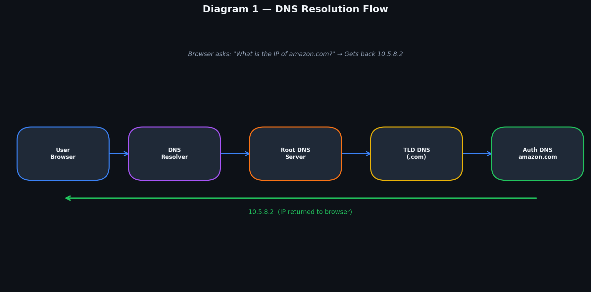
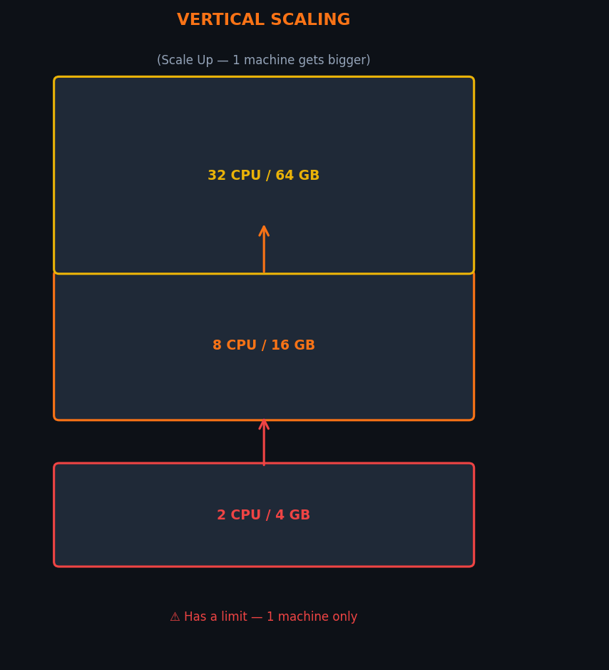
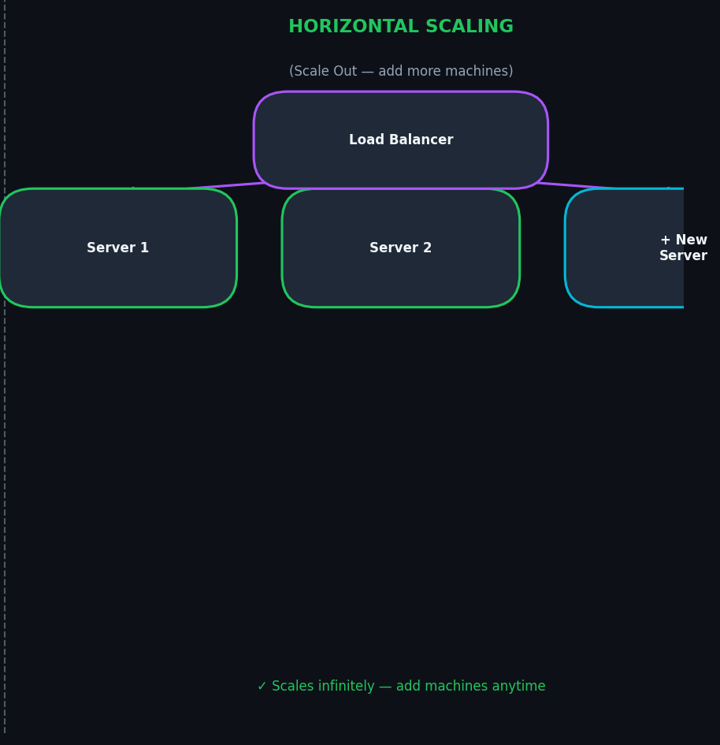
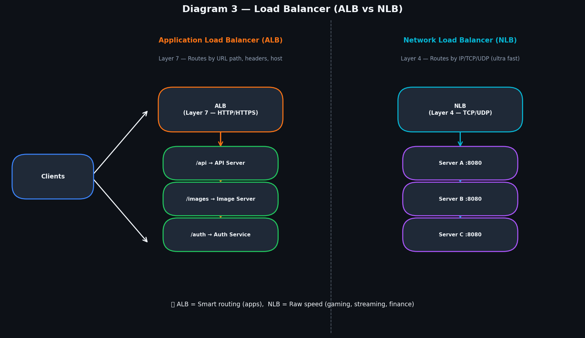
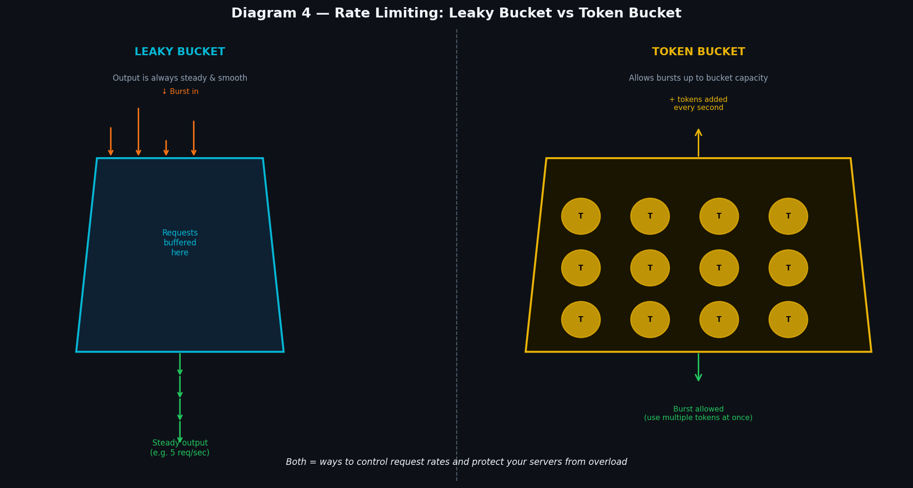
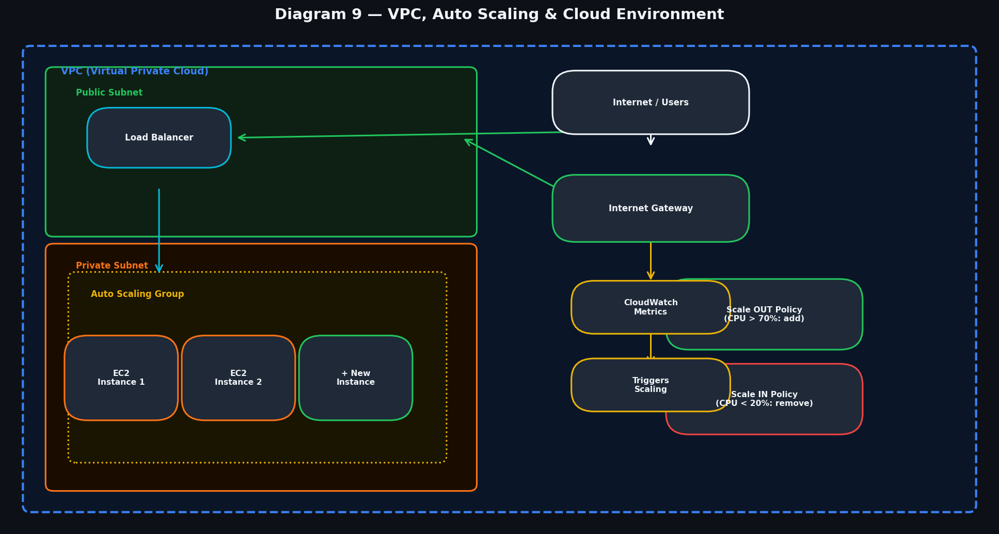
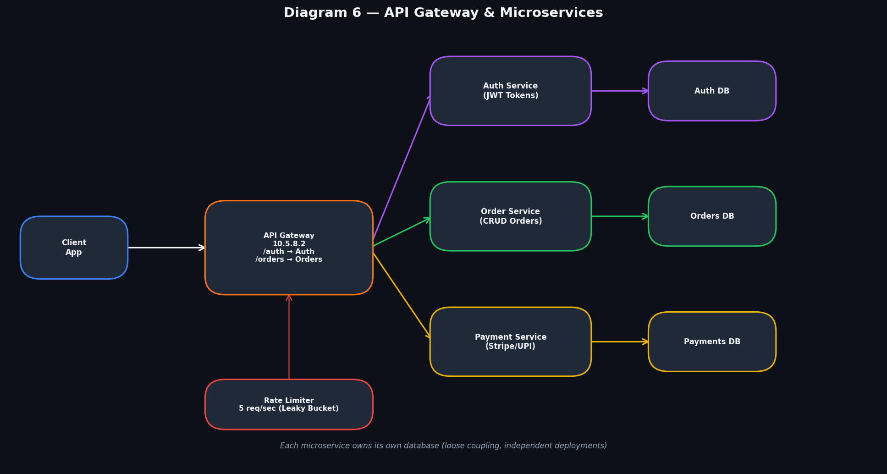
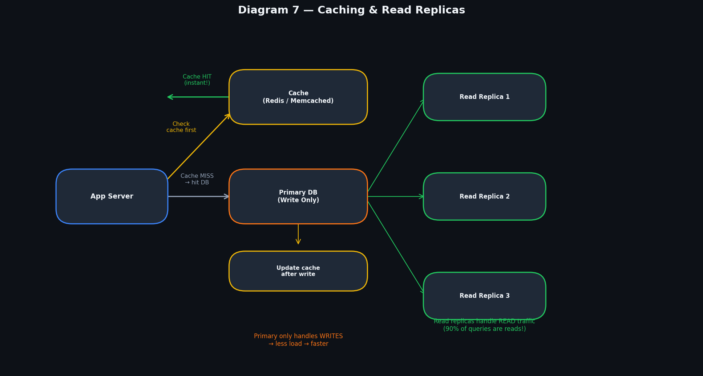
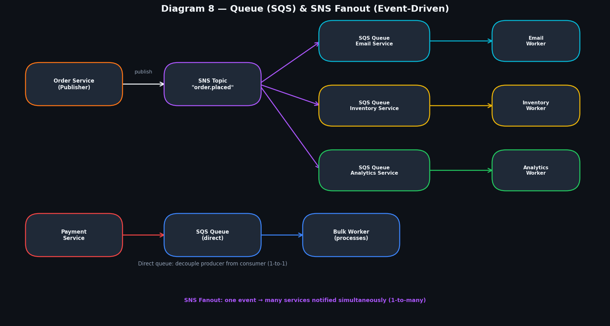
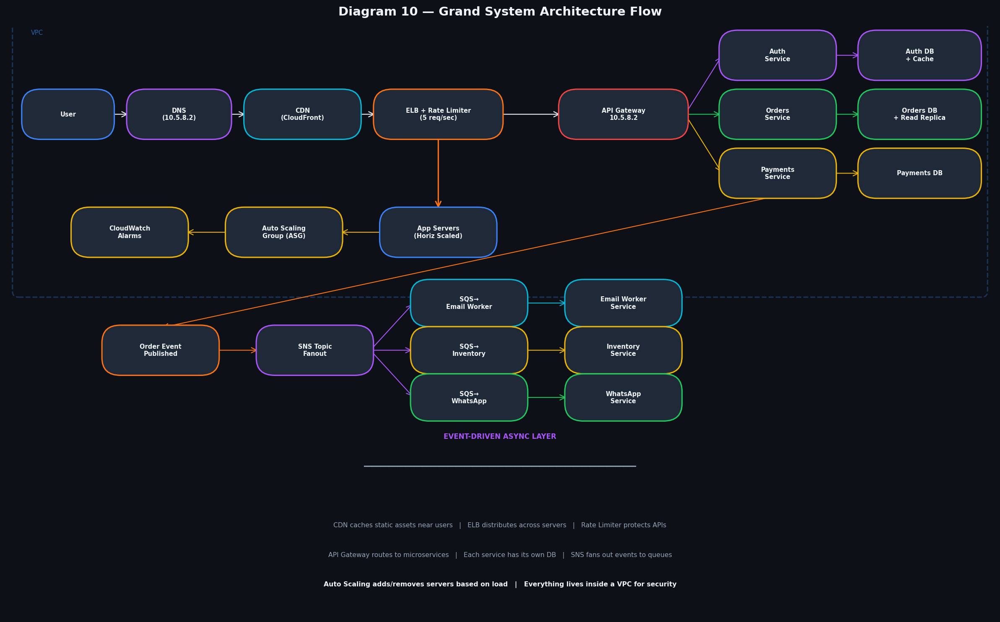

# System Design — Complete Beginner-to-Revision Guide

> **Covers every component from DNS to Event-Driven Architecture, in order, with simple English explanations and connection reasoning.**

---

## Table of Contents

| # | Component | Quick Summary |
|---|-----------|--------------|
| 01 | [DNS Resolution](#01-dns-resolution) | Translates domain names to IP addresses |
| 02 | [Vertical Scaling](#02-vertical-scaling) | Making one machine bigger |
| 03 | [Horizontal Scaling](#03-horizontal-scaling) | Adding more machines |
| 04 | [Load Balancer — ALB & NLB](#04-load-balancer) | Distributes traffic across servers |
| 05 | [Rate Limiting](#05-rate-limiting) | Controls request rates to protect servers |
| 06 | [CDN & Anycast](#06-cdn--anycast) | Serves content from nearest location |
| 07 | [VPC](#07-vpc--virtual-private-cloud) | Isolated private network in cloud |
| 08 | [API Gateway](#08-api-gateway) | Single entry point for all client requests |
| 09 | [Microservice Architecture](#09-microservice-architecture) | Small independent services |
| 10 | [Container Orchestration](#10-container-orchestration) | Manages containers at scale |
| 11 | [Cloud Environment](#11-cloud-environment) | AWS services overview |
| 12 | [Auto Scaling Policies](#12-auto-scaling-policies) | Automatic scale-out and scale-in |
| 13 | [Caching & Read Replicas](#13-caching--read-replicas) | Fast data access patterns |
| 14 | [SQS — Queue System](#14-sqs--simple-queue-service) | Reliable message queuing |
| 15 | [SNS — Notification System](#15-sns--simple-notification-service) | Broadcast events to many services |
| 16 | [Event-Driven & Fanout Architecture](#16-event-driven--fanout-architecture) | Async event-based systems |
| 17 | [Grand Architecture Flow](#17-grand-architecture-flow) | Everything connected together |

---

## 01. DNS Resolution

  

### What is DNS?

DNS (Domain Name System) is the **phone book of the internet**. When you type `amazon.com` in your browser, your computer does not know where that server is located. DNS translates the human-readable name `amazon.com` into a machine-readable IP address like `10.5.8.2`.

### How DNS Resolution Works (Step by Step)

```
Browser → DNS Resolver → Root DNS → .com TLD DNS → Authoritative DNS → 10.5.8.2
```

1. **Browser** asks your ISP's DNS Resolver: *"What is the IP for amazon.com?"*
2. **DNS Resolver** checks its cache. If not found, asks the **Root DNS Server**
3. **Root DNS** says: *"I don't know, but ask the .com TLD server"*
4. **TLD .com Server** says: *"Ask Amazon's Authoritative DNS"*
5. **Authoritative DNS** (Amazon's own) returns: `10.5.8.2`
6. Browser connects directly to `10.5.8.2`

### Why it connects to the next component

> DNS is the **first step** in every request. Once we have the IP, traffic goes to the CDN or Load Balancer next. DNS can also return CDN edge node IPs to route users to the geographically nearest server.

---

## 02. Vertical Scaling

 

### What is Vertical Scaling?

Vertical scaling means **making your single machine bigger** — adding more CPU, RAM, or faster storage. Like upgrading your laptop from 8GB to 64GB RAM.

```
Before:  [Server: 2 CPU, 4 GB RAM]
After:   [Server: 32 CPU, 128 GB RAM]  ← same machine, just bigger
```

### Pros and Cons

| Pros | Cons |
|------|------|
| Simple — no code changes needed | Has a hard limit (can't add infinite RAM) |
| No load balancer needed | Downtime during upgrade |
| Great for databases | Expensive at high end |
| Easy to manage | Single point of failure |

### Why it connects to Horizontal Scaling

> When vertical scaling hits its limit (you can't make the machine any bigger, or it costs too much), you need Horizontal Scaling. They are complementary strategies.

---

## 03. Horizontal Scaling

>  

### What is Horizontal Scaling?

Horizontal scaling means **adding more machines** to share the load. Instead of one giant server, you have many identical servers all running the same application.

```
Before:  [Server 1]
After:   [Server 1] [Server 2] [Server 3] [Server 4] ← more machines
```

### Why it connects to Load Balancer

> Once you have multiple servers, you need something to direct traffic between them. A **Load Balancer** is the essential next component. Without it, users wouldn't know which server to connect to.

---

## 04. Load Balancer

>  

### What is a Load Balancer?

A Load Balancer is a **traffic cop** that sits between users and your servers. It receives all incoming requests and distributes them across multiple servers so no single server gets overwhelmed.

```
Users → [Load Balancer] → Server 1
                       → Server 2
                       → Server 3
```

If Server 2 crashes, the load balancer detects this via **health checks** and stops sending traffic there.

### Application Load Balancer (ALB) — Layer 7

ALB is **smart**. It understands HTTP/HTTPS and can route based on:
- **URL path**: `/api/*` → API servers, `/images/*` → Image servers
- **Host**: `api.amazon.com` → API cluster, `admin.amazon.com` → Admin cluster
- **Headers**: mobile users → mobile servers, desktop → desktop servers

**Best for**: Web apps, REST APIs, microservices routing

### Network Load Balancer (NLB) — Layer 4

NLB is **fast**. It works at the raw TCP/UDP level — it doesn't inspect the content of packets, just routes based on IP and port. Handles **millions of requests per second** with microsecond latency.

**Best for**: Gaming, video streaming, financial trading

### Load Balancing Algorithms

| Algorithm | How it works | Best for |
|-----------|-------------|----------|
| Round Robin | Takes turns: S1, S2, S3, S1, S2... | Uniform requests |
| Least Connections | Send to server with fewest active connections | Long-running requests |
| IP Hash | Same user always goes to same server | Sessions, cart |
| Weighted | Server 1 gets 70%, Server 2 gets 30% | Unequal hardware |

### Why it connects to Rate Limiting

> The Load Balancer is the perfect choke point to add Rate Limiting — before requests even reach your backend servers.

---

## 05. Rate Limiting

>  

### Why Rate Limiting?

Without rate limiting, a bot can send 100,000 requests/second and crash your server (DDoS attack). Rate limiting says: **"You can only send 5 requests per second."**

### Leaky Bucket Algorithm

Imagine a **bucket with a small hole at the bottom**:
- Water (requests) pours in at any speed (burst)
- Water drips out at a **fixed, constant rate** (e.g., 5 req/sec)
- If bucket overflows → request is **rejected**
- Output is always **smooth and predictable**

```
Burst input ↓↓↓↓↓↓  →  [   BUCKET   ]  →  steady output (5/sec) ↓↓↓↓
```

**Best for**: Payment APIs, financial transactions — consistency is critical

### Token Bucket Algorithm

Imagine a **bucket that fills with tokens** at a fixed rate (5 tokens/sec):
- Each request consumes 1 token
- If bucket has tokens → request **goes through immediately**
- Bucket can accumulate tokens when idle → allows **controlled bursts**
- If no tokens → request is rejected

```
+5 tokens/sec → [T T T T T T T T T T]  → consume tokens per request → allow burst
```

**Best for**: Most public APIs, social media — occasional spikes are OK

### In Our Diagram

> The ELB (10.2.3.7) enforces **5 req/sec** using Leaky Bucket. This sits between users and the app servers.

---

## 06. CDN & Anycast

> [cdn](../images/05_cdn_anycast.png)

### What is a CDN?

CDN (Content Delivery Network) stores **copies of your static content** (images, videos, CSS, JS) on servers all around the world called **edge nodes** or **Points of Presence (PoPs)**.

```
Without CDN:  User in India → US Server (200ms latency) 😢
With CDN:     User in India → India Edge Node (10ms latency) 😊
```

### What CDN Caches

✅ Images, videos, CSS, JavaScript files  
✅ HTML pages that don't change often  
✅ API responses that are same for all users (product catalog)  
❌ User-specific data (shopping carts, user profile)  
❌ Real-time data (stock prices, live scores)  

### AWS CloudFront

Amazon CloudFront is AWS's CDN. It has 400+ edge locations worldwide. When you upload an image to S3, CloudFront caches it at edge locations so users worldwide get it fast.

### Anycast

Anycast is a routing technique where **multiple servers share the same IP address**. When you connect to that IP, the internet automatically routes you to the **geographically nearest server**. Cloudflare's DNS `1.1.1.1` is the same IP worldwide — but you connect to your nearest Cloudflare server.

> In our diagram, **Anycast** is used at the CDN layer so that `10.5.8.2` resolves to different edge nodes depending on where the user is.

---

## 07. VPC (Virtual Private Cloud)

>  

### What is a VPC?

A VPC is your own **private, isolated section of the cloud**. Think of renting a private office floor in a shared skyscraper. Other companies are in the same building (AWS data center), but your floor is completely private — they can't walk in.

Everything in our system diagram lives inside a VPC.

### Key VPC Components

| Component | What it Does | Analogy |
|-----------|-------------|---------|
| Public Subnet | Resources accessible from internet | Office reception area |
| Private Subnet | No direct internet access | Back office (databases, app servers) |
| Internet Gateway | Door between VPC and public internet | Building front door |
| Security Groups | Firewall per resource | Lock on each room |
| NACLs | Firewall per subnet | Lock on the floor entrance |
| NAT Gateway | Private resources can reach internet for updates (outbound only) | Postbox in the lobby |
| Route Tables | Rules for where traffic should go | Floor directory map |

### IP Addresses in Our Diagram

```
10.2.3.4  — App servers (private subnet)
10.2.3.5  — More app servers (private subnet)
10.2.3.7  — ELB/Load Balancer (public subnet)
10.5.8.2  — API Gateway / public-facing IP
```

---

## 08. API Gateway

> 

### What is an API Gateway?

An API Gateway is a **single entry point** for all client requests. The client (browser, mobile app) only ever talks to the gateway — never directly to your internal services.

```
Client → [API Gateway: 10.5.8.2]
                    ↓ /auth      → Auth Service
                    ↓ /orders    → Order Service
                    ↓ /payments  → Payment Service
```

### What an API Gateway Does

| Feature | Description |
|---------|-------------|
| **Routing** | `/auth` → Auth Service, `/orders` → Order Service |
| **Authentication** | Validates JWT tokens before forwarding requests |
| **Rate Limiting** | Per-user or per-API-key limits |
| **SSL Termination** | Handles HTTPS; backend uses HTTP internally |
| **Request Transform** | Modify headers, combine responses |
| **Logging** | Single place to log all API calls |
| **Circuit Breaker** | Stop sending to a failing service temporarily |

### Why it connects to Microservices

> Without an API Gateway, the client would need to know the address of every microservice. When you add a new service or change an IP, every client breaks. The gateway **hides all internal complexity** — clients only know one address.

---

## 09. Microservice Architecture

### What are Microservices?

Microservices breaks your app into **small, independent services**, each responsible for one specific domain.

In our diagram:
- **Auth Service** — handles login, JWT tokens, sessions
- **Order Service** — creates and manages orders
- **Payment Service** — processes payments (Stripe/UPI)

Each service has its **own database**, its own deployment pipeline, and can be scaled independently.

### Monolith vs Microservices

| Feature | Monolith | Microservices |
|---------|----------|---------------|
| Deployment | Deploy whole app every change | Deploy only changed service |
| Scaling | Scale entire app | Scale only the bottleneck |
| Tech stack | One language/framework | Each service can differ |
| Failure isolation | One bug can crash all | Failures are isolated |
| Complexity | Simple to start | Complex networking |
| Team size | Small teams | Large, independent teams |

### The Golden Rule: Database per Service

Each microservice owns its **own database**. The Auth Service cannot directly query the Orders database. This ensures loose coupling.

---

## 10. Container Orchestration

### What are Containers?

Docker containers package your app + all dependencies into a portable box that runs identically everywhere — dev laptop, test server, production cloud.

### What is Orchestration?

When you run **hundreds of containers** across **dozens of servers**, you need something to manage them automatically. Kubernetes (K8s) is the most popular orchestrator.

| Kubernetes Feature | What it Does |
|-------------------|-------------|
| Scheduling | Decides which server runs which container |
| Self-healing | Auto-restarts crashed containers |
| Rolling Updates | Deploy new version one pod at a time (zero downtime) |
| Service Discovery | Containers find each other by name, not IP |
| Auto Scaling | HPA scales pods based on CPU/memory |

**AWS Equivalent**: ECS (Elastic Container Service) or EKS (Elastic Kubernetes Service)

---

## 11. Cloud Environment

### AWS Services in Our System

| Service | Role in System |
|---------|---------------|
| **EC2** | Virtual machines running our app servers |
| **ELB** | Elastic Load Balancer distributing traffic |
| **S3** | Storing static files (images, videos) |
| **RDS** | Managed relational databases (Auth DB, Orders DB) |
| **ElastiCache** | Managed Redis for our caching layer |
| **CloudFront** | CDN for static content delivery |
| **Route 53** | DNS service mapping amazon.com to our IPs |
| **SQS** | Message queues for async processing |
| **SNS** | Notification service for fanout events |
| **CloudWatch** | Monitoring metrics that trigger Auto Scaling |
| **IAM** | Access control — who can access what |

---

## 12. Auto Scaling Policies


### What is Auto Scaling?

Auto Scaling **automatically adjusts server count** based on real demand. More traffic → add servers. Less traffic → remove servers (and save money).

### How it Works

```
CloudWatch monitors CPU/Memory → Triggers alarm → ASG adds/removes EC2 instances → ELB registers/deregisters them
```

### Scale-Out Policy (Add Servers)

```
IF average CPU > 70% for 5 minutes THEN
    Add 2 new EC2 instances to the Auto Scaling Group
    Wait 5 minutes (cooldown) before checking again
```

### Scale-In Policy (Remove Servers)

```
IF average CPU < 20% for 15 minutes THEN
    Remove 2 EC2 instances (terminate gracefully)
    Wait 10 minutes before checking again
```

### ASG Limits

| Setting | Value | Meaning |
|---------|-------|---------|
| Min size | 2 | Always keep at least 2 instances running |
| Max size | 50 | Never exceed 50 instances |
| Desired | 4 | Target number under normal load |

---

## 13. Caching & Read Replicas

> 

### Caching

A cache is **ultra-fast temporary storage** (Redis, Memcached) that keeps frequently accessed data in memory (RAM).

```
DB read:    ~1-10ms
Cache read: ~0.1ms  ← 10-100x faster
```

**Cache-Aside Strategy (most common)**:
```
1. App checks cache for data
2. Cache HIT → return immediately ✅
3. Cache MISS → fetch from DB → store in cache → return 
```

### Read Replicas

A read replica is a **copy of your primary database** that handles only READ queries (SELECT).

```
App → Writes → Primary DB
App → Reads → Read Replica 1
           → Read Replica 2
           → Read Replica 3
```

**Why**: In most apps, **90% of queries are reads**. By routing reads to replicas, you massively reduce load on the primary DB.

| Concept | Detail |
|---------|--------|
| TTL (Time-To-Live) | How long cached data is valid (e.g., 5 min for product data) |
| Cache Invalidation | Must clear cache when DB data changes — famously hard problem |
| Replica lag | Replicas may be 10-100ms behind primary — acceptable for most reads |
| Write-through | Write to cache AND DB simultaneously (consistent but slower) |

---

## 14. SQS (Simple Queue Service)

### What is a Message Queue?

A message queue is a **buffer between two services**. The producer puts messages in and moves on. The consumer reads and processes at its own pace.

```
Order Service → [SQS Queue] → Email Worker (processes when ready)
```

**Analogy**: Restaurant tickets. Customers give orders to the waiter (producer). Waiter puts tickets on the kitchen rail (queue). Kitchen (consumer) processes at their own speed.

### Why Use Queues?

| Benefit | Example |
|---------|---------|
| **Decoupling** | Order Service doesn't wait for Email Service to finish |
| **Durability** | If Email Service crashes, messages stay in queue safely |
| **Retry** | Failed messages are retried automatically |
| **Backpressure** | Queue fills up → signals producer to slow down |

### SQS Types

| Type | Order | Delivery | Use Case |
|------|-------|----------|----------|
| Standard | Best-effort | At-least-once | High throughput, email notifications |
| FIFO | Guaranteed | Exactly-once | Financial transactions, order processing |

---

## 15. SNS (Simple Notification Service)

### What is SNS?

SNS is a **pub/sub (publish-subscribe)** service. One service publishes to an SNS Topic, and all subscribers receive it **simultaneously**.

```
Order Service → SNS Topic "order.placed" → Email Service
                                         → Inventory Service
                                         → Analytics Service
```

### SNS vs SQS

| Feature | SNS | SQS |
|---------|-----|-----|
| Pattern | Pub/Sub (1-to-many) | Queue (1-to-1) |
| Delivery | Push (SNS pushes) | Pull (consumer polls) |
| Persistence | No — ephemeral | Yes — stays until processed |
| Best for | Notify many services | Decouple two services |

---

## 16. Event-Driven & Fanout Architecture

> 

### Event-Driven Architecture

Instead of Service A directly calling Service B, Service A **emits an event** and moves on. Service B, C, D react to the event independently.

```
❌ Tight coupling:   Order Service → calls → Email Service (waits)
                                   → calls → Inventory Service (waits)

✅ Event-driven:    Order Service → publishes "order.placed" → done
                   Email Service reacts to event (independently)
                   Inventory Service reacts to event (independently)
```

### Fanout Pattern (SNS + SQS)

Fanout = **One SNS message fans out to multiple SQS queues**, each with its own worker:

```
"order.placed" → SNS Topic
                      ↓ → Email Queue       → Email Worker
                      ↓ → WhatsApp Queue    → WhatsApp Worker
                      ↓ → Inventory Queue   → Inventory Worker
                      ↓ → Analytics Queue   → Analytics Worker
```

**Why SQS after SNS?** SNS alone doesn't guarantee delivery (if subscriber is down, message is lost). SQS buffers the message safely until the worker is ready.

### In Our Diagram

- **Email Worker**: processes 1 email per 10 seconds (rate limited, so we don't spam)
- **Bulk Worker**: processes batch operations
- **WhatsApp Queue**: separate flow for WhatsApp notifications

---

## 17. Grand Architecture Flow

>  

### The Complete Request Journey

Let's trace **"User places an order on amazon.com"** through the entire system:

```
Step 1:  [User] → asks DNS for amazon.com → gets 10.5.8.2
Step 2:  [CDN] → serves homepage HTML/CSS/images from nearest edge node
Step 3:  [ELB + Rate Limiter] → checks 5 req/sec limit → distributes to app servers
Step 4:  [App Server] → inside VPC private subnet, horizontally scaled
Step 5:  [API Gateway: 10.5.8.2] → validates JWT → routes POST /orders to Order Service
Step 6:  [Order Service] → writes order to Primary DB, reads from Read Replica
Step 7:  [Cache] → product data served from Redis (0.1ms vs 5ms from DB)
Step 8:  [Payment Service] → processes payment
Step 9:  [SNS] → Order Service publishes "order.placed" event
Step 10: [Fanout] → SNS fans to Email Queue + WhatsApp Queue + Inventory Queue
Step 11: [Workers] → Email Worker sends receipt, WhatsApp Worker sends notification
Step 12: [Auto Scaling] → CloudWatch: CPU > 70% → ASG adds 3 EC2 → ELB registers them
```

### All Components and Their Role

| Component | What it Does in This System |
|-----------|---------------------------|
| DNS | Resolves amazon.com → 10.5.8.2 |
| CDN | Caches static content worldwide |
| ELB | Distributes traffic across horizontally scaled app servers |
| Rate Limiter | 5 req/sec per user via Leaky Bucket |
| VPC | Isolates all resources (public/private subnets) |
| Auto Scaling | Adds/removes EC2 instances based on CPU via CloudWatch |
| API Gateway | Routes /auth, /orders, /payments to correct microservice |
| Auth Service | Issues and validates JWT tokens |
| Order Service | Creates orders, writes to Primary DB |
| Payment Service | Processes payments |
| Caching (Redis) | Fast reads for product/user data |
| Read Replicas | Handle 90% of read queries |
| SNS | Broadcasts "order.placed" to 4 queues simultaneously |
| SQS | Buffers messages for Email, WhatsApp, Inventory, Analytics workers |
| Email Worker | Rate-limited email sending (1 per 10 sec) |

---

## Diagram Placement Guide

| Diagram File | Place After Section |
|-------------|-------------------|
| `01_dns_resolution.png` | Section 01 — DNS Resolution |
| `02_scaling.png` | Section 02 & 03 — Scaling |
| `03_load_balancer.png` | Section 04 — Load Balancer |
| `04_rate_limiting.png` | Section 05 — Rate Limiting |
| `05_cdn_anycast.png` | Section 06 — CDN & Anycast |
| `06_api_gateway_microservices.png` | Section 08 — API Gateway |
| `07_caching_replicas.png` | Section 13 — Caching |
| `08_queue_sns_fanout.png` | Section 16 — Event-Driven & Fanout |
| `09_vpc_autoscaling.png` | Section 07 — VPC (or 12 — Auto Scaling) |
| `10_grand_flow.png` | **Section 17 — Grand Flow (LAST!)** |

---

## Quick Reference Cheatsheet

| Concept | One Line | When to Use |
|---------|----------|-------------|
| DNS | Maps names to IPs | Always — first step for any website |
| Vertical Scaling | Bigger machine | Small scale, DBs, quick fix |
| Horizontal Scaling | More machines | Web servers, HA, large scale |
| ALB | Smart HTTP routing | Web apps, REST APIs, microservices |
| NLB | Fast TCP routing | Gaming, real-time, millions of connections |
| Leaky Bucket | Smooth fixed-rate | Strict APIs, payment endpoints |
| Token Bucket | Allows controlled bursts | Most APIs, AWS default |
| CDN | Static content from nearest node | Images, videos, JS/CSS |
| Anycast | Same IP, nearest server | Global DNS, CDN edge routing |
| VPC | Isolated private cloud network | All production systems |
| API Gateway | Single entry point, routes | Any microservice architecture |
| Microservices | Small independent services | Large teams, complex domains |
| Container/K8s | Manage containers at scale | Microservices in production |
| Auto Scaling | Add/remove servers automatically | Variable traffic patterns |
| Caching | Frequent data in fast memory | High read load, slow DB |
| Read Replica | DB copy for reads only | Read-heavy applications |
| SQS | Reliable queue (1-to-1) | Decouple two services |
| SNS | Broadcast (1-to-many) | Notify many services of event |
| Event-Driven | React to events, not calls | Loose coupling, async workflows |
| Fanout | SNS + multiple SQS queues | One event, many processors |

---

*Generated as part of a complete System Design study guide. Diagrams available as separate PNG files.*
