# Event-Driven Architecture, CQRS, Event Sourcing & Back-of-Envelope Estimation
## Complete Beginner-to-Revision Guide

> **Simple English. Real examples. No fluff.**  
> After reading this you will not need any other resource.

---

## Table of Contents

| # | Topic |
|---|-------|
| **PART 1: Event-Driven Architecture** | |
| 1 | [Problems with Traditional CRUD](#1-problems-with-traditional-crud) |
| 2 | [What is Event-Driven Architecture?](#2-what-is-event-driven-architecture) |
| 3 | [Event Log / Append-Only Log](#3-event-log--append-only-log) |
| 4 | [Hydration and State Reconstruction](#4-hydration-and-state-reconstruction) |
| 5 | [Auditing and Time Travel](#5-auditing-and-time-travel) |
| 6 | [Video Processing Case Study](#6-video-processing-case-study) |
| 7 | [Kafka and Scaling](#7-kafka-and-scaling) |
| **PART 2: CQRS** | |
| 8 | [Traditional Architecture Bottlenecks](#8-traditional-architecture-bottlenecks) |
| 9 | [What is CQRS?](#9-what-is-cqrs) |
| 10 | [CQRS Component Breakdown](#10-cqrs-component-breakdown) |
| 11 | [Database Segregation & Eventual Consistency](#11-database-segregation--eventual-consistency) |
| 12 | [Trade-offs of Eventual Consistency](#12-trade-offs-of-eventual-consistency) |
| **PART 3: Event Sourcing + CQRS** | |
| 13 | [Event Sourcing with CQRS](#13-event-sourcing-with-cqrs) |
| 14 | [CQRS in AWS Context](#14-cqrs-in-aws-context) |
| 15 | [Caching & Optimization](#15-caching--optimization) |
| **PART 4: Back of Envelope** | |
| 16 | [What is Back-of-Envelope Calculation?](#16-what-is-back-of-envelope-calculation) |
| 17 | [Essential Conversion Knowledge](#17-essential-conversion-knowledge) |
| 18 | [Latency Numbers](#18-latency-numbers) |
| 19 | [Assumptions](#19-assumptions) |
| 20 | [QPS Estimation](#20-qps-estimation) |
| 21 | [Storage Estimation](#21-storage-estimation) |
| — | [Grand Flow Diagram](#grand-flow-diagram) |
| — | [Diagram Placement Guide](#diagram-placement-guide) |

---

# PART 1 — Event-Driven Architecture

---

## 1. Problems with Traditional CRUD

> 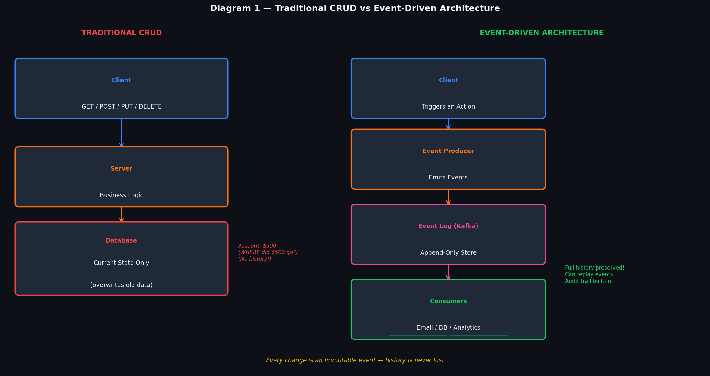

### What is Traditional CRUD?

CRUD stands for **Create, Read, Update, Delete**. In a traditional application:

1. Client sends a request (POST, PUT, DELETE)
2. Server runs business logic
3. Server **overwrites** the current row in the database

```
User Action: "Transfer $200 from Alice to Bob"

Before: Alice = $1000, Bob = $500
After:  Alice = $800,  Bob = $700

The old values ($1000, $500) are GONE FOREVER.
```

### The Core Problem: You Only Know the PRESENT

Traditional CRUD stores only the **latest state**. It throws away the journey. This creates several problems:

| Problem | Description | Example |
|---------|-------------|---------|
| **No audit trail** | Cannot prove what happened | "Who deleted this order?" → Unknown |
| **No time travel** | Cannot see past state | "What was Alice's balance on Jan 3?" → Gone |
| **No replay** | Cannot reconstruct events | If DB corrupts, data is lost |
| **Bug consequences** | A bug that overwrites data is catastrophic | One bad UPDATE = permanent damage |
| **Concurrency issues** | Multiple writes fight over same row | Race conditions, lost updates |

### Why This Fails at Scale

Imagine you're building a **bank system** with CRUD:
- A bug in the payment service runs and sets everyone's balance to $0
- The database now says everyone has $0
- There is **no way to recover** because the history is gone

With events: just roll back by replaying all events except the buggy one. Problem solved.

---

## 2. What is Event-Driven Architecture?

### Definition

In **Event-Driven Architecture (EDA)**, instead of directly modifying data, the system **emits events** describing what happened. Other parts of the system react to these events.

> An event is something that **has already happened** — it is immutable (cannot be changed).

```
Traditional: "Set Alice's balance to $800"  ← a command that overwrites
Event-Driven: "MoneyWithdrawn: Alice, $200"  ← a fact that describes what happened
```

### How It Works

```
User Action
    ↓
Event Producer  →  "UserPurchased { userId: 123, item: 'Phone', price: 999 }"
    ↓
Event Broker (Kafka / SNS)
    ↓ (fans out to all subscribers)
Email Service   → sends receipt email
Inventory Svc   → decrements stock count
Analytics Svc   → records purchase for reports
Fraud Detector  → checks for unusual patterns
```

### Key Properties of Events

```
1. Immutable      — Events cannot be changed once written
2. Ordered        — Events happen in sequence (append-only)
3. Past tense     — "OrderPlaced", "UserRegistered", "PaymentFailed"
4. Self-contained — Event carries all data needed to process it
5. Decoupled      — Producer doesn't know who listens
```

---

## 3. Event Log / Append-Only Log

> 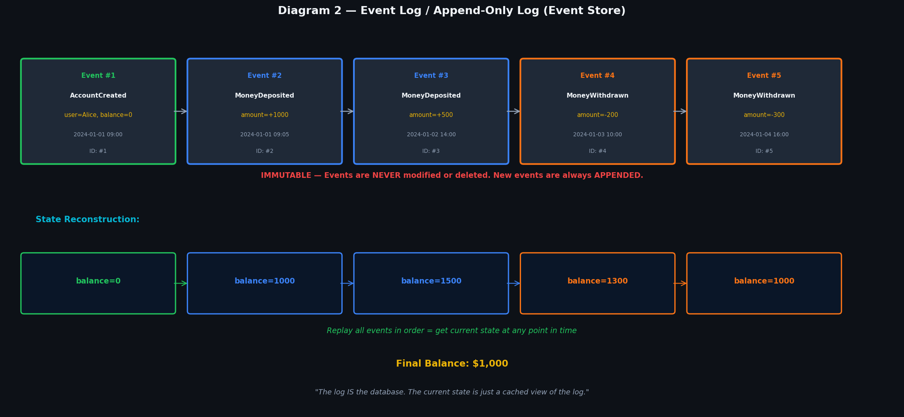

### What is an Event Log?

An event log is a **sequence of immutable records** stored in append-only fashion. Think of it like a bank passbook — every transaction is written down in order. Nothing is ever erased.

```
EventStore (like a ledger):
┌────┬──────────────────┬──────────────┬─────────────────────┐
│ #  │ Event Name       │ Data         │ Timestamp           │
├────┼──────────────────┼──────────────┼─────────────────────┤
│ 1  │ AccountCreated   │ user=Alice   │ 2024-01-01 09:00   │
│ 2  │ MoneyDeposited   │ amount=+1000 │ 2024-01-01 09:05   │
│ 3  │ MoneyDeposited   │ amount=+500  │ 2024-01-02 14:00   │
│ 4  │ MoneyWithdrawn   │ amount=-200  │ 2024-01-03 10:00   │
│ 5  │ MoneyWithdrawn   │ amount=-300  │ 2024-01-04 16:00   │
└────┴──────────────────┴──────────────┴─────────────────────┘
       NEVER MODIFIED. NEVER DELETED. Only new rows added.
```

### What is the Current State?

The current state is just the **result of replaying all events from the beginning**:

```
Start:  balance = 0
+1000   balance = 1000
+500    balance = 1500
-200    balance = 1300
-300    balance = 1000  ← CURRENT STATE
```

> **The log IS the database.** The "current balance" is just a cached projection of the log.

### Append-Only Rule

Events are **never updated or deleted**. To "undo" an action, you add a **new compensating event**:

```
# Mistake: Withdrew $300 when should have been $200
Event #5: MoneyWithdrawn {amount: -300}    ← original (stays!)
Event #6: MoneyRefunded  {amount: +100}    ← compensation added
```

---

## 4. Hydration and State Reconstruction

> 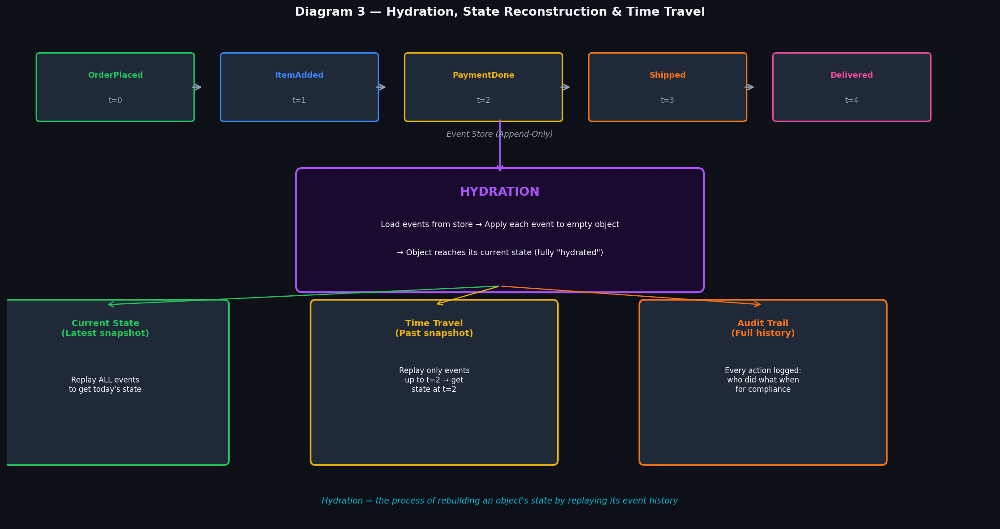

### What is Hydration?

**Hydration** is the process of rebuilding an object's current state by loading and replaying its events from the event store.

Think of it like re-watching a movie from the beginning to know where you currently are — rather than jumping to a random frame.

```
Step 1: Load all events for OrderId=123 from EventStore
Step 2: Create empty Order object  {status: null, items: [], total: 0}
Step 3: Apply event 1: OrderCreated     → {status: "pending", items: [], total: 0}
Step 4: Apply event 2: ItemAdded(Phone) → {status: "pending", items: ["Phone"], total: 999}
Step 5: Apply event 3: PaymentDone      → {status: "paid", items: ["Phone"], total: 999}
Step 6: Apply event 4: Shipped          → {status: "shipped", ...}
Result: Fully hydrated Order object ✓
```

### Code Concept

```javascript
class Order {
    constructor() {
        this.status = null;
        this.items = [];
        this.total = 0;
    }

    // Hydration: apply each event
    apply(event) {
        switch(event.type) {
            case 'OrderCreated':  this.status = 'pending'; break;
            case 'ItemAdded':     this.items.push(event.item); this.total += event.price; break;
            case 'PaymentDone':   this.status = 'paid'; break;
            case 'Shipped':       this.status = 'shipped'; break;
        }
    }
}

// Hydrate from events
const events = eventStore.getEvents('order-123');
const order = new Order();
events.forEach(e => order.apply(e));   // order is now fully reconstructed
```

### Snapshots (Optimization)

If an entity has 10,000 events, replaying all of them every time is slow. We use **snapshots**:

```
Every 100 events → save a snapshot of the current state
On next hydration: load latest snapshot + only events AFTER that snapshot
→ Much faster!
```

---

## 5. Auditing and Time Travel

### Auditing — Who Did What, When

Because every change is an immutable event, you automatically get a **complete audit trail**:

```
EventStore for Account #456:
│ 2024-01-01 09:00 │ AccountOpened    │ by: manager@bank.com      │
│ 2024-01-05 14:22 │ MoneyDeposited   │ by: alice@gmail.com       │
│ 2024-01-10 11:05 │ BalanceFrozen    │ by: compliance@bank.com   │
│ 2024-01-10 11:06 │ FraudFlagged     │ by: fraud-detection-bot   │
└──────────────────────────────────────────────────────────────────┘
Every action is traceable. Perfect for compliance, legal, debugging.
```

### Time Travel — What Was the State at Time T?

With event sourcing, you can replay events only **up to a specific point in time** to see historical state:

```
"What was Alice's account balance on January 3rd at noon?"

Replay events:
  Event #1 (Jan 1, 09:00) ✓ include
  Event #2 (Jan 1, 09:05) ✓ include
  Event #3 (Jan 2, 14:00) ✓ include
  Event #4 (Jan 3, 10:00) ✓ include
  Event #5 (Jan 4, 16:00) ✗ STOP — after Jan 3 noon

Result: balance at that exact moment = $1,300
```

### Real-World Use Cases

| Use Case | How Event Sourcing Helps |
|----------|--------------------------|
| **Banking compliance** | Show regulators every transaction ever made |
| **E-commerce disputes** | "The price was $50 when I added to cart, not $70" → provable |
| **Bug fixes** | Replay events without the buggy one to restore correct state |
| **A/B testing** | Replay same events through different logic to compare outcomes |
| **Analytics** | Re-process historical events with new analysis logic |

---

## 6. Video Processing Case Study

> 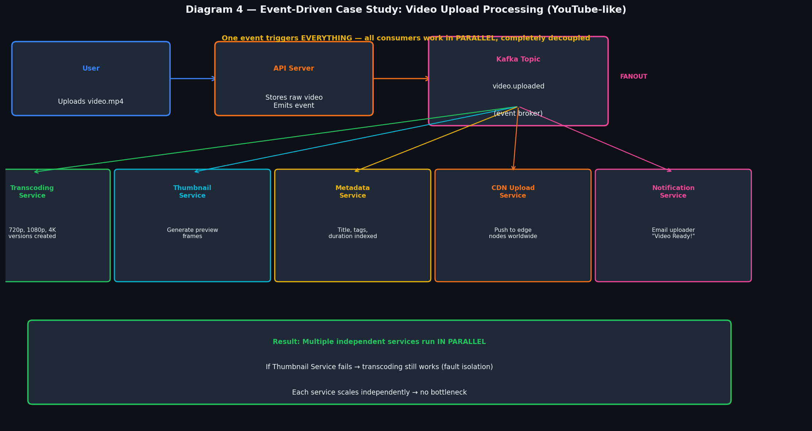

### The Problem (Traditional Approach)

Imagine YouTube. A user uploads a video. Synchronously you would need to:
1. Transcode to 360p, 720p, 1080p, 4K
2. Generate thumbnails
3. Index metadata (title, tags)
4. Upload to CDN nodes worldwide
5. Send notification email

If any step takes 5 minutes, **the user waits 25+ minutes** before getting a response.

### The Solution: Event-Driven Video Processing

```
Step 1: User uploads video.mp4 to API server
Step 2: API server saves raw video to S3 storage
Step 3: API server emits ONE event: "video.uploaded" to Kafka
Step 4: API server immediately returns 200 OK to user
        (Upload complete! Processing in background...)

Then, IN PARALLEL and INDEPENDENTLY:
  Transcoding Service  → reads "video.uploaded" → creates 720p, 1080p, 4K
  Thumbnail Service    → reads "video.uploaded" → generates preview frames
  Metadata Service     → reads "video.uploaded" → indexes title, tags
  CDN Upload Service   → reads "video.uploaded" → distributes to edge nodes
  Notification Service → reads "video.uploaded" → emails "Your video is ready!"
```

### Why This Is Better

```
Traditional (sync):  Upload → Transcode (5min) → Thumbnail (1min) → CDN (2min) = 8 min wait
Event-Driven (async): Upload → emit event → immediate response
                       (all services work in parallel: max time = slowest single service)
```

Benefits:
- **User gets instant response** — no waiting
- **Services are fault-isolated** — Thumbnail service crashing doesn't stop transcoding
- **Each service scales independently** — transcode needs more power? Scale only that
- **Easy to add new features** — want to add a virus-scan service? Just subscribe to the event

---

## 7. Kafka and Scaling

> 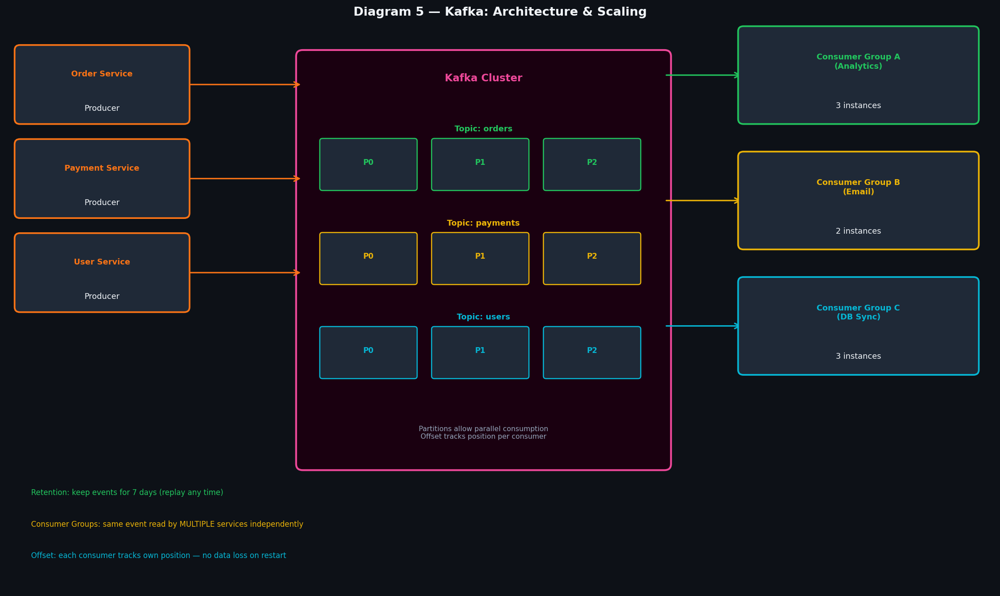

### What is Kafka?

Apache Kafka is a **distributed event streaming platform** — essentially a very fast, durable, scalable event log. It is the most popular event broker for large-scale systems (used by LinkedIn, Netflix, Uber, Airbnb).

### Core Concepts

```
Producer   → writes events to a Topic
Topic      → named category of events (like a channel)
Partition  → a topic split into N buckets (enables parallel consumption)
Consumer   → reads events from a Topic
Consumer Group → multiple consumers reading the same topic (each gets different partitions)
Offset     → position of the last-read event per consumer (Kafka remembers this)
```

### How Topics and Partitions Work

```
Topic: "orders" with 3 partitions:

Producer writes → [P0: events 0,3,6,9...]
                  [P1: events 1,4,7,10...]
                  [P2: events 2,5,8,11...]

Consumer Group A (3 instances):
  Instance A0 → reads P0 (in parallel)
  Instance A1 → reads P1 (in parallel)
  Instance A2 → reads P2 (in parallel)
```

More partitions = more parallel consumers = higher throughput.

### Why Kafka Scales So Well

| Feature | Why It Scales |
|---------|---------------|
| **Partitions** | Split a topic into N parts → N consumers in parallel |
| **Consumer Groups** | Multiple groups read same topic independently (each gets full copy) |
| **Retention** | Events kept for 7 days → consumers can replay if they fall behind |
| **Offset tracking** | Each consumer tracks its own position → no data lost on restart |
| **Replication** | Each partition replicated across 3 brokers → no data loss on server crash |

### Kafka vs SQS vs SNS

| Feature | Kafka | SQS | SNS |
|---------|-------|-----|-----|
| Retention | 7+ days (replay) | ~14 days (consumed = gone) | No persistence |
| Consumer groups | Yes (each gets full copy) | No (one consumer per msg) | Yes (broadcast) |
| Throughput | Millions/sec | Thousands/sec | Thousands/sec |
| Use case | High-throughput streaming | Decoupling services | Fan-out notifications |

---

# PART 2 — CQRS

---

## 8. Traditional Architecture Bottlenecks

> 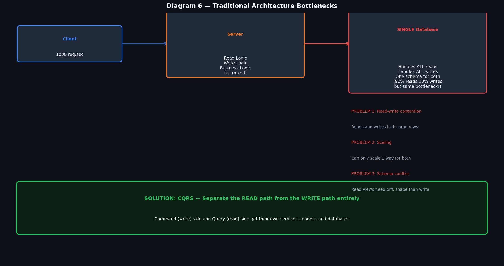

### The Traditional Setup

In a standard REST API application:

```
Client  →  REST API  →  Single Database
                          (reads AND writes go here)
```

This works fine for small apps. But as you scale to millions of users, problems emerge:

### The Bottlenecks

**Bottleneck 1: Read-Write Contention**
```
90% of database queries are READS (SELECT)
10% of database queries are WRITES (INSERT/UPDATE/DELETE)

But they compete for the same database resources!
A heavy write operation LOCKS rows → reads have to wait.
A slow analytical query → write transactions queue up.
```

**Bottleneck 2: Scaling Conflict**
```
You need to add read replicas (good for reads)
But write-heavy tables need different optimization (indexes slow writes!)
You can't optimize the same table for BOTH fast reads AND fast writes.
```

**Bottleneck 3: Schema Mismatch**
```
Read queries often need de-normalized data:
  "Get all orders with customer name, product details, total price"
  → needs joins across 4 tables
  
Write operations need normalized data:
  "Insert one order row" → clean, no joins
  
One schema can't perfectly serve both.
```

**Bottleneck 4: Different Scaling Needs**
```
Twitter-like app: 1 tweet written → 1000 people read it
Read traffic >> Write traffic by 100:1
But both are hitting the SAME database.
```

---

## 9. What is CQRS?

**CQRS** stands for **Command Query Responsibility Segregation**.

It is the pattern of **completely separating** the read (query) side from the write (command) side of your application — including separate models, services, and databases.

```
COMMAND = an intent to change state (Create, Update, Delete)
QUERY   = a request for data (Read only, no side effects)

Traditional:  same model/service/DB handles both
CQRS:         completely different models, services, and databases for each
```

### The Fundamental Insight

> Reading data and writing data are fundamentally different operations that scale differently, require different data shapes, and should be optimized independently.

### Simple Analogy

Think of a restaurant:
- **Kitchen (Command side)** — receives orders, cooks food, modifies inventory
- **Waiter (Query side)** — shows you the menu, tells you what's available

The kitchen and the menu are separate. The kitchen doesn't get slowed down because many people are reading the menu.

---

## 10. CQRS Component Breakdown

> 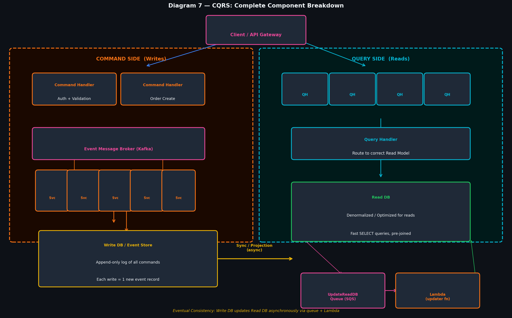

### The Two Sides

```
                    ┌─────────────────────┐
                    │   Client / API GW    │
                    └──────────┬──────────┘
                    ┌──────────┴──────────┐
            WRITE ──┤                     ├── READ
                    │                     │
        ┌───────────▼──────┐   ┌─────────▼───────────┐
        │  COMMAND SIDE    │   │    QUERY SIDE        │
        │                  │   │                      │
        │ CommandService   │   │ QueryService ELB     │
        │ ELB              │   │                      │
        │ (Auth+Validate)  │   │ Query Handlers       │
        │                  │   │ (Route to read model)│
        │ Event Broker     │   │                      │
        │ (Kafka)          │   │ Cache (Redis)        │
        │                  │   │                      │
        │ Workers          │   │ Read DB              │
        │                  │   │ (Denormalized,fast)  │
        │ Write DB         │   │                      │
        │ (Event Store)    │   └──────────────────────┘
        └──────────────────┘
               │
               │ Sync (async via queue)
               ▼
           Read DB gets updated
```

### Command Side — Deep Dive

| Component | Role |
|-----------|------|
| **CommandService ELB** | Load balancer for write operations. Validates auth + input |
| **Command Handlers** | Each type of command has its own handler (CreateOrder, UpdatePayment) |
| **Event Broker** | Kafka/SNS receives command result as an event, fans out |
| **Write Services** | Small workers that execute the actual business logic |
| **Write DB / Event Store** | Append-only log. Every command creates one new event |

**Flow:**
```
POST /orders  →  CommandService ELB  →  CreateOrderHandler
  → Validates (is user logged in? is item in stock?)
  → Persists to Write DB: "OrderCreated {userId:1, item:'Phone'}"
  → Emits event to Kafka
  → Returns 202 Accepted (not 200 — because read side isn't updated yet!)
```

### Query Side — Deep Dive

| Component | Role |
|-----------|------|
| **QueryService ELB** | Load balancer for read operations (separate from command ELB!) |
| **Query Handlers** | Each type of query has its own handler (GetOrder, ListOrders) |
| **Cache (Redis)** | Check cache first before hitting DB |
| **Read DB** | Denormalized, pre-joined tables optimized for fast SELECT queries |

**Flow:**
```
GET /orders/123  →  QueryService ELB  →  GetOrderHandler
  → Check Redis cache: HIT? Return immediately (0.1ms)
  → Cache MISS? Query Read DB (pre-joined, returns in 1ms)
  → Return response
```

---

## 11. Database Segregation & Eventual Consistency

> 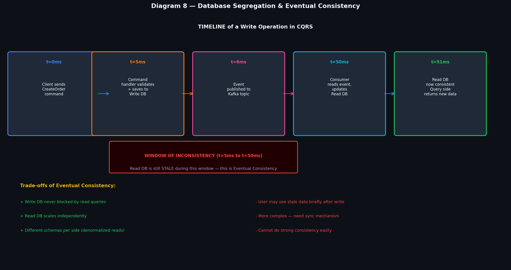

### Two Separate Databases

In CQRS, the Write DB and Read DB are **completely separate databases** — often different technologies:

```
Write DB (Command side):
  → Optimized for writes
  → Normalized schema (3NF)
  → DynamoDB / PostgreSQL with event log structure
  → Heavy on transactional integrity

Read DB (Query side):
  → Optimized for reads
  → Denormalized (pre-joined tables)
  → Redis / Elasticsearch / Read-replica PostgreSQL
  → Heavy on query speed, no locks
```

### What is Denormalization?

In a normalized write DB:
```sql
-- To get an order with details, you need 3 JOINs:
SELECT o.id, u.name, p.title, o.total
FROM orders o
JOIN users u ON o.user_id = u.id
JOIN order_items oi ON o.id = oi.order_id
JOIN products p ON oi.product_id = p.id
WHERE o.id = 123;
```

In a denormalized read DB:
```
orders_view table:
orderId | userName | productTitle | total | status  | createdAt
123     | Alice    | iPhone 15    | 999   | shipped | 2024-01-01
```

One simple `SELECT * FROM orders_view WHERE orderId = 123` — done in microseconds.

### What is Eventual Consistency?

**Eventual Consistency** means: after a write, the read side **will eventually** reflect that write — but not necessarily immediately.

```
t=0ms:  User submits POST /createOrder
t=5ms:  Write DB persisted. Event emitted to Kafka.
t=6ms:  Kafka delivers event to consumer service
t=50ms: Consumer updates Read DB

Between t=5ms and t=50ms:
  → Write DB says order exists ✓
  → Read DB doesn't show the order yet ✗ (it's stale)

At t=51ms: Both sides are consistent ✓
```

This "gap" is called the **window of inconsistency**.

---

## 12. Trade-offs of Eventual Consistency

### Advantages

- **Write performance**: Write DB never waits for read side to update
- **Independent scaling**: Read DB can scale separately (add replicas freely)
- **No read-write contention**: Reads and writes never lock each other
- **Different optimizations**: Each DB optimized for its use case

### Disadvantages

- **Stale reads**: Right after a write, a read might return old data
- **Complexity**: Need sync mechanisms (Kafka → Consumer → Read DB update)
- **Debugging harder**: Data in two places, may be out of sync temporarily
- **Not suitable for all cases**: Banking where you need instant consistency is hard

### When NOT to Use Eventual Consistency

```
❌ "User's current bank balance for a payment transaction"
   → Needs STRONG consistency. Cannot afford stale reads.

❌ "Check if username is available during registration"
   → Two users register same username simultaneously = problem

✅ "User's tweet appearing in followers' feeds"
   → OK if it takes 50ms. Nobody cares about 50ms delay.

✅ "Product review count updating after new review"
   → Count showing 847 instead of 848 for 50ms is fine
```

---

# PART 3 — Event Sourcing + CQRS

---

## 13. Event Sourcing with CQRS

> 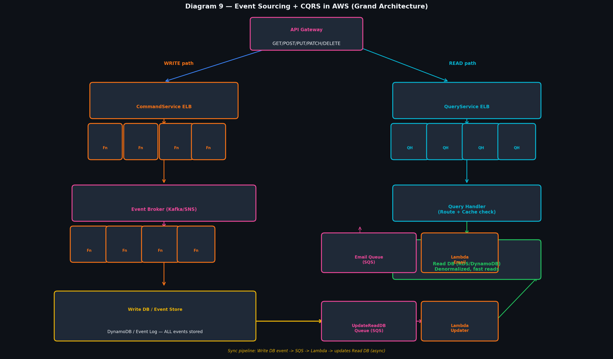

### Why Combine Them?

Event Sourcing and CQRS are **complementary patterns** — they solve different problems but work perfectly together:

| Problem | Solution |
|---------|----------|
| "I need audit trail + time travel" | → Event Sourcing (the Write DB is an event log) |
| "My reads are slow because of write load" | → CQRS (separate read and write databases) |
| "How do I keep Read DB in sync?" | → Event Sourcing feeds events to CQRS Read DB |

### The Combined Pattern

```
Write Path:
Command → Validate → Write to Event Store (not overwrite — APPEND new event)
                   → Event published to Kafka

Read Path (projection):
Kafka Consumer → reads new event
              → updates Read DB projection
              → Read DB reflects new state
```

The **Read DB is a "projection"** of the event log — a specific view derived from events, optimized for queries.

### Multiple Projections from One Event Log

The beauty: one event log can power **many different read models**:

```
EventStore: OrderCreated, OrderShipped, OrderDelivered

Projection 1 → OrderStatus Read DB (for customers checking order status)
Projection 2 → AnalyticsDashboard (daily order counts by region)
Projection 3 → InventoryDB (decrements stock when order placed)
Projection 4 → RevenueReport (aggregates revenue by product)
```

All four read models built from the same events. Add a new one? Just write a new consumer.

---

## 14. CQRS in AWS Context

### AWS Service Mapping

| CQRS Component | AWS Service |
|----------------|-------------|
| API Gateway | AWS API Gateway |
| CommandService ELB | Application Load Balancer + EC2/Lambda |
| Event Broker | Amazon MSK (Kafka) or Amazon SNS |
| Write DB / Event Store | Amazon DynamoDB (append-only table) |
| UpdateReadDB Queue | Amazon SQS |
| Lambda Updater | AWS Lambda (triggered by SQS) |
| Read DB | Amazon RDS (PostgreSQL) or DynamoDB |
| Cache | Amazon ElastiCache (Redis) |
| Email Queue | Amazon SQS + Lambda → SES |

### The Full AWS Flow

```
1. POST /orders → API Gateway
2. → Application Load Balancer (CommandService)
3. → Command Handler Lambda: validates, saves to DynamoDB (event store)
4. → DynamoDB Streams triggers SNS/SQS
5. → Multiple SQS Queues fan out:
     UpdateReadDBQueue → Lambda → updates RDS Read DB
     EmailQueue        → Lambda → sends email via SES
6. GET /orders → API Gateway
7. → Application Load Balancer (QueryService)
8. → Query Handler → checks ElastiCache first
9. → Cache miss → queries RDS Read DB
10. → Returns response to client
```

---

## 15. Caching & Optimization

### Where Caching Fits in CQRS

The read side of CQRS already has a fast, denormalized read DB. But we add **one more layer — cache (Redis)** in front of it:

```
Query Request
     ↓
Check Redis Cache (0.1ms)
     ↓ MISS
Query Read DB (1-2ms)
     ↓
Store result in Redis (TTL: 60 seconds)
     ↓
Return response
```

### Cache Invalidation in CQRS

Because you have an event stream, you know **exactly when** data changes:

```
Event: "OrderStatusUpdated" received by consumer
→ Consumer updates Read DB ✓
→ Consumer also deletes/updates Redis cache key for that order ✓
→ Next read will get fresh data from DB (and cache it again)
```

This is much cleaner than traditional cache invalidation — the event tells you precisely what changed.

### Optimization Strategies

| Strategy | What it Does |
|----------|-------------|
| **Redis Cache** | Store hot read data in memory (10x faster than DB) |
| **Read Replicas** | Multiple copies of Read DB for parallel reads |
| **Pre-aggregation** | Compute counts/totals at write time, store in Read DB |
| **CDN** | Cache API responses at edge for static-ish data |
| **Pagination** | Never return unbounded result sets |

---

# PART 4 — Back-of-Envelope Estimation

---

## 16. What is Back-of-Envelope Calculation?

### Definition

**Back-of-envelope (BOE) calculations** are quick, rough estimates done to understand the **scale and feasibility** of a system before building it. The name comes from the idea of doing calculations on the back of an envelope — quick and approximate, not precise.

### Why Engineers Do This

In a system design interview (or when planning a new service), you need to know:
- How many requests per second will the system handle?
- How much storage will we need in one year?
- Can a single database handle this, or do we need sharding?
- Is caching necessary, or can we go straight to the DB?

These calculations let you **reason about scale before writing a single line of code**.

### The Process

```
1. Write down ASSUMPTIONS (DAU, average actions per user)
2. Calculate DAILY numbers
3. Derive PER-SECOND numbers (QPS)
4. Estimate STORAGE per unit
5. Scale by users and time
6. Identify BOTTLENECKS (what will break first?)
```

---

## 17. Essential Conversion Knowledge

> 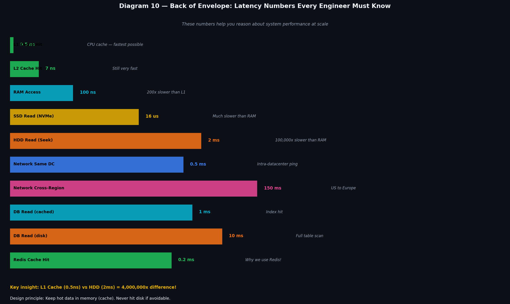

> 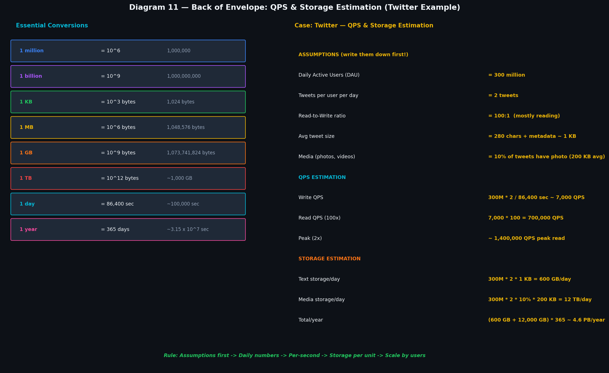

### Powers of Ten — Data Units

```
1 KB  (Kilobyte)  = 10^3  bytes = 1,000 bytes
1 MB  (Megabyte)  = 10^6  bytes = 1,000 KB
1 GB  (Gigabyte)  = 10^9  bytes = 1,000 MB
1 TB  (Terabyte)  = 10^12 bytes = 1,000 GB
1 PB  (Petabyte)  = 10^15 bytes = 1,000 TB
```

### Powers of Ten — User Numbers

```
1 million  = 10^6  = 1,000,000
1 billion  = 10^9  = 1,000,000,000
DAU = Daily Active Users
MAU = Monthly Active Users (usually 3-5x DAU)
```

### Time Conversions

```
1 minute = 60 seconds
1 hour   = 3,600 seconds
1 day    = 86,400 seconds ≈ 100,000 seconds (good approximation!)
1 year   = 365 days = 31,536,000 seconds ≈ 3 × 10^7 seconds
1 month  = 30 days = 2,592,000 seconds
```

### Typical Data Sizes

```
Tweet / SMS         ≈ 1 KB   (280 chars + metadata)
Web page            ≈ 100 KB
Photo (compressed)  ≈ 200 KB – 1 MB
Video (1 min, 720p) ≈ 100 MB
UUID / user ID      ≈ 36 bytes
Integer             ≈ 4 bytes
Timestamp           ≈ 8 bytes
```

---

## 18. Latency Numbers

Every engineer should know these approximate numbers. They help you reason about **where bottlenecks will occur**.

```
Operation                    Latency         Notes
─────────────────────────────────────────────────────────────────
L1 cache hit                 0.5 ns          CPU cache — fastest
L2 cache hit                 7 ns            Still very fast
RAM access                   100 ns          200x slower than L1
SSD random read              16 μs (16,000 ns) 160x slower than RAM
HDD seek + read              2 ms            4,000,000x slower than RAM
Network: same datacenter     0.5 ms          Intra-DC ping
Network: cross-region        150 ms          US to Europe
Redis / Memcache             ~0.1-0.5 ms     In-memory, fast
DB read (indexed, cached)    1-5 ms          With index
DB read (full table scan)    10-100 ms       Without index!
DB write                     5-10 ms         Disk flush
Network: client to server    10-200 ms       Depends on location
```

### Key Takeaways

```
1. RAM is 200x faster than SSD — keep hot data in memory (Redis)
2. SSD is 100x faster than HDD — always use SSD for databases
3. Network adds latency — minimize round trips
4. Cache hits (0.1ms) vs DB reads (5ms) = 50x difference
5. A full table scan (100ms) can ruin your app — always use indexes
```

---

## 19. Assumptions

**Writing assumptions is the most important step** in back-of-envelope calculations. If your assumptions are wrong, your numbers are wrong. State them clearly so interviewers can follow your reasoning.

### Template for Assumptions

```
System: [Twitter-like app]

Users:
  Daily Active Users (DAU):    300 million
  Monthly Active Users (MAU):  1 billion
  Average sessions per user:   3 per day

Actions:
  Tweets written per user/day:  2
  Tweets read per user/day:     200
  Read-to-write ratio:          100 : 1

Data sizes:
  Average tweet size:           280 bytes text + 500 bytes metadata = ~1 KB
  Photo attachment:             200 KB average (10% of tweets have photos)
  Video attachment:             5 MB average (1% of tweets have video)

Availability:
  Target uptime:                99.99%
  Peak traffic multiplier:      3x average
```

---

## 20. QPS Estimation

**QPS = Queries Per Second** — how many requests your system handles every second.

### Formula

```
Write QPS = (DAU × actions_per_user_per_day) / seconds_per_day
Read QPS  = Write QPS × read_write_ratio
Peak QPS  = Average QPS × peak_multiplier (usually 2-3x)
```

### Example: Twitter-like System

**Assumptions:**
- DAU = 300 million
- Tweets per user per day = 2
- Read-to-write ratio = 100:1
- Seconds per day ≈ 86,400 (use 100,000 for easy math)

**Calculation:**

```
Write QPS:
  = 300,000,000 users × 2 tweets/day / 86,400 sec/day
  = 600,000,000 / 86,400
  ≈ 7,000 writes per second

Read QPS (100:1 ratio):
  = 7,000 × 100
  = 700,000 reads per second

Peak Read QPS (3x):
  = 700,000 × 3
  = 2,100,000 QPS at peak
```

**What does 2.1M QPS mean?**
```
One machine handles ~1,000-50,000 QPS depending on operation.
2,100,000 QPS → need ~50-2,000 machines
→ This demands horizontal scaling + load balancer + caching!
```

### Example: Instagram-like Photo Sharing

```
Assumptions:
  DAU = 500 million
  Photos uploaded per user per day = 0.5 (not everyone posts daily)
  Average photo size = 3 MB (compressed)
  Videos (10% of uploads) = 30 MB each
  Read-to-write ratio = 200:1

Write QPS:
  = 500M × 0.5 / 86,400 = 2,900 uploads/sec ≈ 3,000 QPS

Read QPS:
  = 3,000 × 200 = 600,000 QPS
```

---

## 21. Storage Estimation

### Formula

```
Storage per day  = DAU × actions_per_user × size_per_action
Storage per year = Storage per day × 365
```

### Example: Twitter Storage

**Text storage:**
```
= 300M users × 2 tweets × 1 KB/tweet
= 600 million KB/day
= 600 GB/day
= 600 GB × 365 = ~219 TB/year just for text
```

**Photo storage (10% of tweets have a 200 KB photo):**
```
= 300M × 2 × 10% × 200 KB
= 60M × 200 KB
= 12,000,000,000 KB/day
= 12,000 GB/day = 12 TB/day
= 12 TB × 365 = ~4.4 PB/year just for photos
```

**Total storage needed:**
```
Text:    219 TB/year
Photos:  4,400 TB/year = 4.4 PB/year
Videos:  Much more!

After 5 years: ~25 PB minimum
→ Need distributed object storage like S3, not a single hard drive!
```

### Example: Chat App (WhatsApp-like)

```
Assumptions:
  DAU = 500 million
  Messages per user per day = 40
  Average message size = 100 bytes
  Media messages = 5% at 100 KB each

Message storage:
  = 500M × 40 × 100 bytes = 2,000,000,000,000 bytes/day = 2 TB/day

Media storage:
  = 500M × 40 × 5% × 100 KB = 100 TB/day

→ Total: ~100 TB/day = ~36 PB/year
→ Must use distributed sharded databases + object storage
```

### Storage Interview Tips

```
1. Always account for replication (3x storage for 3 replicas)
2. Add 20% overhead for metadata, indexes, fragmentation
3. Distinguish hot storage (SSD, expensive) vs cold storage (HDD/S3, cheap)
4. Videos need CDN — you don't serve 4K video from one machine!
5. Compress data: text compresses 4:1, binary varies
```

---

## Grand Flow Diagram

> 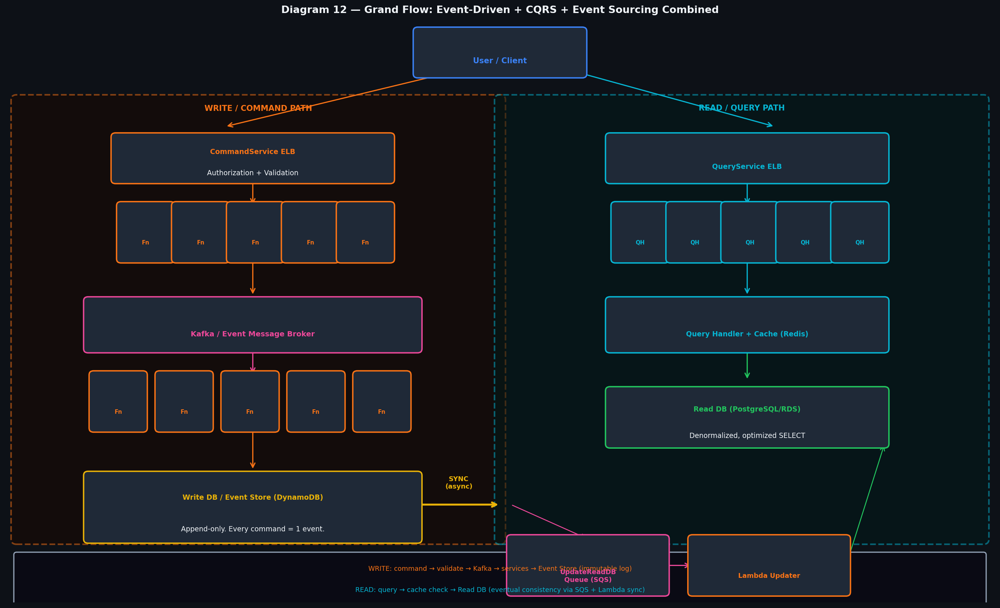

### Everything Connected: The Full Story

When you put EDA + Event Sourcing + CQRS together, here is what a single user action looks like end-to-end:

```
Step 1:  User sends POST /createOrder
Step 2:  API Gateway routes to CommandService ELB
Step 3:  Command Handler validates (auth, stock, payment)
Step 4:  "OrderCreated" event appended to Event Store (DynamoDB)
Step 5:  Event published to Kafka topic "orders"
Step 6:  Kafka fans out to multiple consumers:
           → UpdateReadDB Worker → updates Read DB projection
           → Email Worker → queues "Order Confirmation" email
           → Inventory Worker → decrements stock in inventory DB
Step 7:  User gets 202 Accepted response immediately
         (async processing continues in background)

Step 8:  User sends GET /orders/123
Step 9:  API Gateway routes to QueryService ELB
Step 10: Query Handler checks Redis cache → HIT → returns in 0.1ms
         (or MISS → queries Read DB in 1-2ms → caches result)
Step 11: User sees their order

Step 12: CloudWatch detects CPU > 70% on QueryService
Step 13: Auto Scaling Group adds EC2 instances
Step 14: Read DB can be scaled with Read Replicas (write side unaffected)
```

---

## Diagram Placement Guide

| File | Place After Section |
|------|---------------------|
| `01_crud_vs_eda.png` | Section 1 — Problems with Traditional CRUD |
| `02_event_log.png` | Section 3 — Event Log |
| `03_hydration.png` | Section 4 — Hydration & State Reconstruction |
| `04_video_case_study.png` | Section 6 — Video Processing Case Study |
| `05_kafka.png` | Section 7 — Kafka and Scaling |
| `06_traditional_bottleneck.png` | Section 8 — Traditional Architecture Bottlenecks |
| `07_cqrs_breakdown.png` | Section 10 — CQRS Component Breakdown |
| `08_eventual_consistency.png` | Section 11 — Database Segregation & Eventual Consistency |
| `09_event_sourcing_cqrs_aws.png` | Section 13 — Event Sourcing + CQRS (AWS) |
| `10_latency_numbers.png` | Section 18 — Latency Numbers |
| `11_boe_estimation.png` | Section 20 or 21 — QPS/Storage Estimation |
| **`12_grand_flow.png`** | **Grand Flow section — LAST** |

---

## Quick Revision Cheatsheet

```
EVENT-DRIVEN ARCHITECTURE:
  → Emit events instead of mutating state directly
  → Producers don't know consumers (decoupled)
  → Events are immutable (past tense: "OrderPlaced", "UserRegistered")

EVENT SOURCING:
  → Store events, not current state
  → Current state = replay all events
  → Hydration = rebuild object from events
  → Time travel = replay up to time T
  → Audit trail = automatic and complete
  → Kafka = distributed, scalable, partitioned event broker

CQRS:
  → Command = write (changes state)
  → Query = read (never changes state)
  → Separate ELBs, handlers, and databases for each side
  → Write DB: normalized, append-only, strong consistency
  → Read DB: denormalized, optimized for SELECT, eventual consistency
  → Sync via: Kafka → Consumer → Read DB update

BACK OF ENVELOPE:
  → Write assumptions first
  → QPS = DAU × actions / 86,400
  → Read QPS = Write QPS × read_write_ratio
  → Storage = DAU × actions × size_per_unit × days
  → Key latencies: L1=0.5ns, RAM=100ns, SSD=16us, HDD=2ms, Redis=0.1ms, DB=1-10ms
```

---

*"The goal of architecture is not to make things complex — it's to make them simple enough to understand, scale, and change."*
