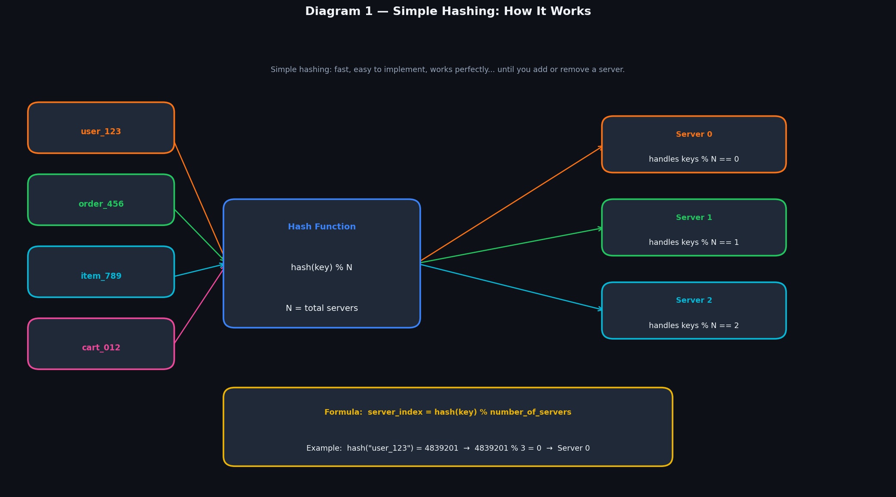
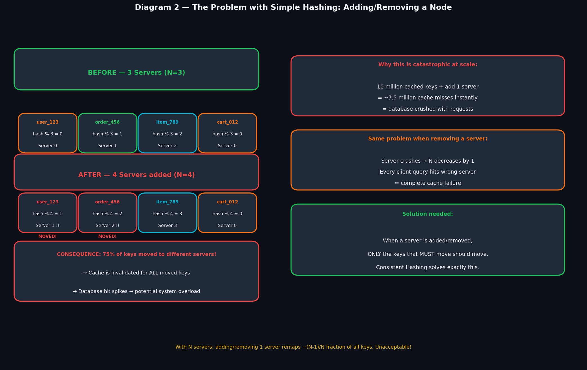
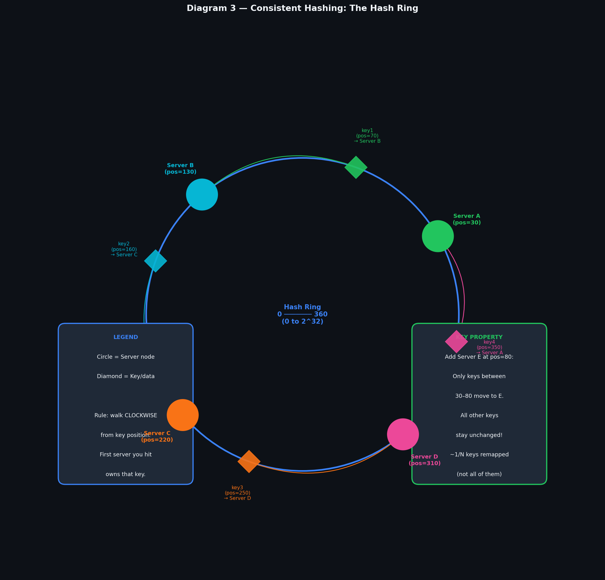
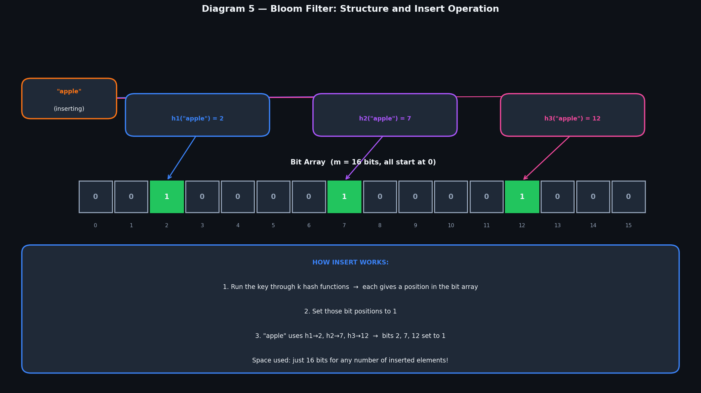
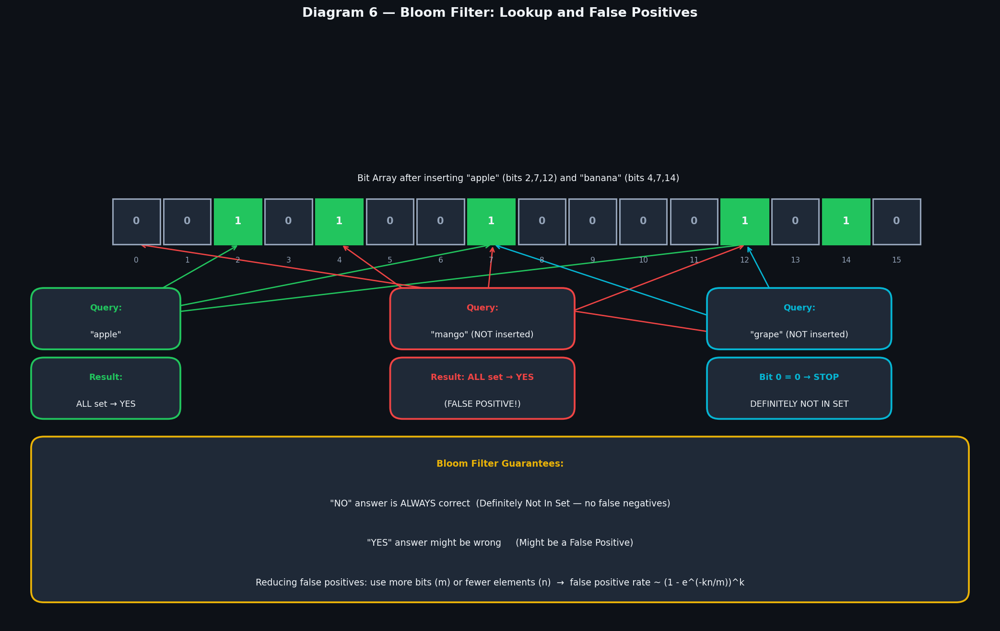
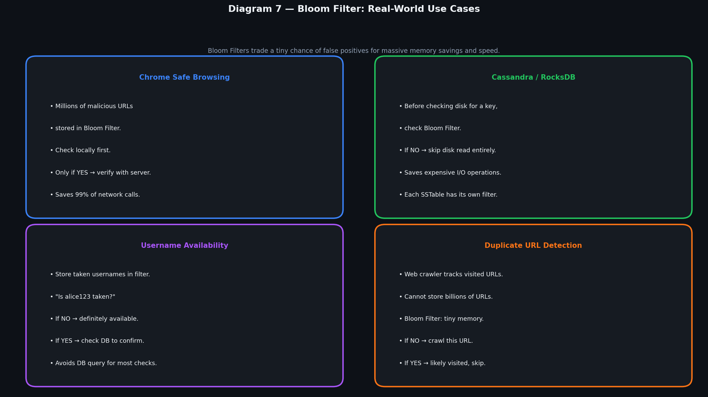
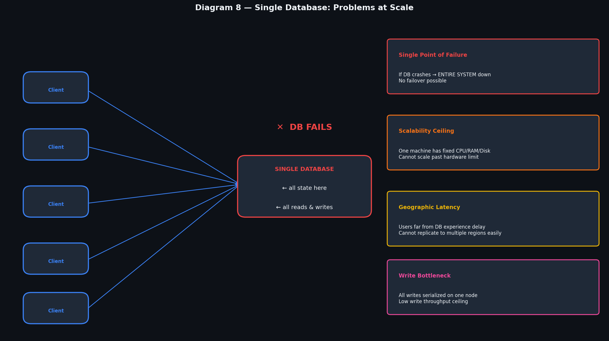
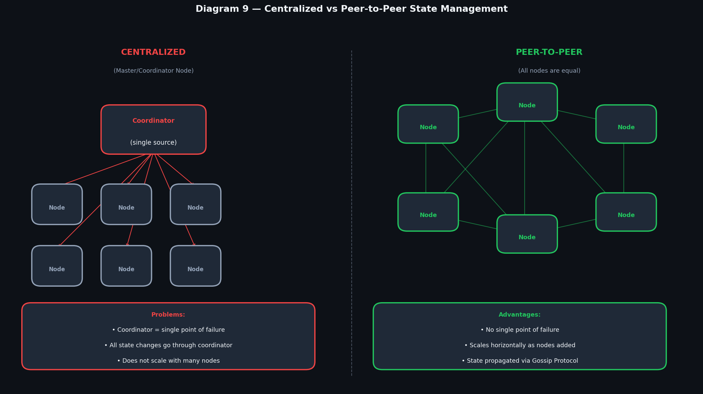
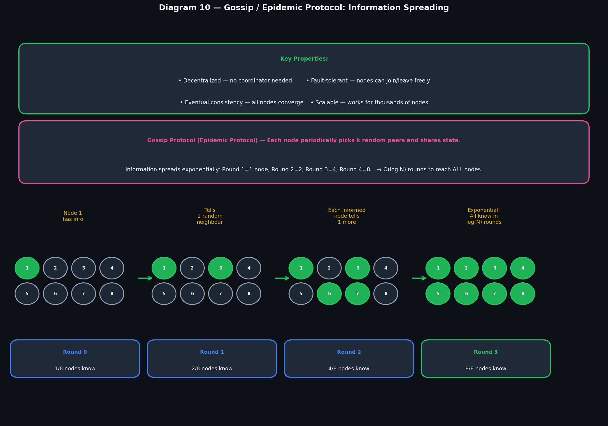
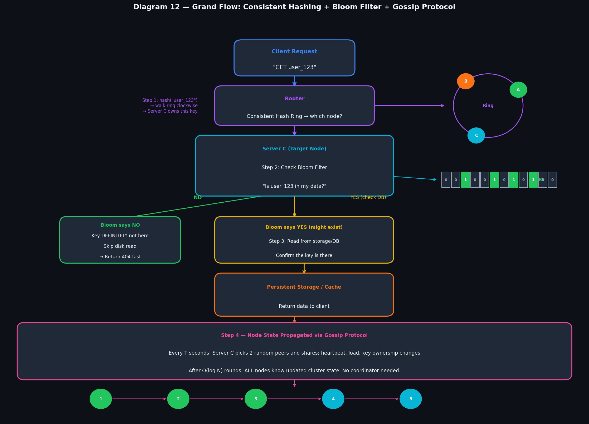

# Consistent Hashing, Bloom Filters & Distributed State Management

---

## Table of Contents

| #                              | Topic                                                                                            |
| ------------------------------ | ------------------------------------------------------------------------------------------------ |
| **PART 1 — Hashing**           |                                                                                                  |
| 1                              | [What is Hashing?](#1-what-is-hashing)                                                           |
| 2                              | [The Problem with Simple Hashing](#2-the-problem-with-simple-hashing)                            |
| 3                              | [Consistent Hashing Mechanism](#3-consistent-hashing-mechanism)                                  |
| 4                              | [Benefits of Consistent Hashing](#4-benefits-of-consistent-hashing)                              |
| 5                              | [Virtual Nodes](#5-virtual-nodes)                                                                |
| **PART 2 — Bloom Filters**     |                                                                                                  |
| 6                              | [What are Bloom Filters?](#6-what-are-bloom-filters)                                             |
| 7                              | [How Bloom Filters Work](#7-how-bloom-filters-work)                                              |
| 8                              | [False Positives](#8-false-positives)                                                            |
| 9                              | [Real-World Use Cases](#9-real-world-use-cases)                                                  |
| **PART 3 — Distributed State** |                                                                                                  |
| 10                             | [The Single Database Problem](#10-the-single-database-problem)                                   |
| 11                             | [Centralized vs Peer-to-Peer State Management](#11-centralized-vs-peer-to-peer-state-management) |
| 12                             | [Broadcast and Eager Reliable Broadcast](#12-broadcast-and-eager-reliable-broadcast)             |
| 13                             | [Gossip / Epidemic Protocol](#13-gossip--epidemic-protocol)                                      |
| 14                             | [Implementation Example](#14-implementation-example)                                             |
| —                              | [Grand Flow Diagram](#grand-flow-diagram)                                                        |
| —                              | [Diagram Placement Guide](#diagram-placement-guide)                                              |
| —                              | [Quick Revision Cheatsheet](#quick-revision-cheatsheet)                                          |

---

# PART 1 — Hashing

---

## 1. What is Hashing?

**Hashing** is the process of converting any input (a string, a number, a file) into a **fixed-size output** called a **hash** or **digest**, using a function called a **hash function**.

```
Input (any size)        Hash Function       Output (fixed size)
"user_123"          →   hash(input)     →   4839201
"order_456"         →   hash(input)     →   7102938
"A huge 5GB file"   →   hash(input)     →   2948102
```

### Properties of a Good Hash Function

| Property                 | Meaning                                         |
| ------------------------ | ----------------------------------------------- |
| **Deterministic**        | Same input always gives same output             |
| **Fast**                 | Computes in O(1) time regardless of input size  |
| **Uniform distribution** | Outputs spread evenly, no clustering            |
| **Avalanche effect**     | Tiny input change → completely different output |
| **One-way**              | Cannot reverse hash to get original input       |

### How Hashing is Used to Distribute Data Across Servers

When you have N servers and want to decide which server stores a key:

```
server_index = hash(key) % N

Example with N=3 servers:
  hash("user_123") = 4839201  →  4839201 % 3 = 0  →  Server 0
  hash("order_456") = 7102938  →  7102938 % 3 = 1  →  Server 1
  hash("item_789") = 3847291  →  3847291 % 3 = 2  →  Server 2
```

> 

This works perfectly — **until you add or remove a server.**

---

## 2. The Problem with Simple Hashing

> 

### What Happens When You Add a Server?

Suppose you had 3 servers (N=3) and add a 4th server (N=4). The formula changes:

```
BEFORE (N=3):
  hash("user_123")  % 3 = 0  →  Server 0
  hash("order_456") % 3 = 1  →  Server 1
  hash("item_789")  % 3 = 2  →  Server 2
  hash("cart_012")  % 3 = 0  →  Server 0

AFTER (N=4):
  hash("user_123")  % 4 = 1  →  Server 1  ← MOVED!
  hash("order_456") % 4 = 2  →  Server 2  ← MOVED!
  hash("item_789")  % 4 = 3  →  Server 3
  hash("cart_012")  % 4 = 0  →  Server 0
```

**75% of keys moved to different servers!** Every key that moved is now a cache miss.

### Why This is Catastrophic

Imagine a production system with:

- 10 million cached keys
- You add 1 new server
- **~7.5 million cache misses happen instantly**
- All those misses hit the database
- Database is overwhelmed → your system crashes

The same disaster happens when a server **fails** — N decreases by 1, and most keys remap.

### The Root Cause

The problem is that `hash(key) % N` is **globally sensitive** — changing N changes the result for almost every key. We need a scheme where adding/removing a server affects **only the minimum number of keys**.

---

## 3. Consistent Hashing Mechanism

> 

### The Big Idea: A Hash Ring

Instead of hashing keys to server indices, consistent hashing maps **both keys AND servers** onto a circular ring (0 to 2³²−1 or 0 to 360 degrees conceptually).

```
Step 1: Hash each server → place it on the ring at that position
Step 2: Hash each key    → place it on the ring at that position
Step 3: Walk CLOCKWISE from the key's position
Step 4: The first SERVER you encounter owns that key
```

### Visual Example

```
                   Server B (pos=130)
                       ●
             key2 ◆         ◆ key1 (pos=70)
          (pos=160)              → owned by Server B

    Server C                          Server A
    (pos=220)                         (pos=30)
       ●                                  ●

          key3 ◆                  ◆ key4 (pos=350)
          (pos=250)                → walk clockwise → Server A
             → owned by Server D

                   Server D (pos=310)
                        ●
```

### Rule

> **Walk clockwise from the key. The first server you hit owns that key.**

### What Happens When You Add a Server?

Add Server E at position 80 (between Server A at 30 and Server B at 130):

```
BEFORE: keys between pos 30-130 were owned by Server B
AFTER:  keys between pos 30-80  are now owned by Server E
        keys between pos 80-130 still owned by Server B

Only keys in the range [30, 80] moved. Everything else: UNCHANGED.
```

**Only ~1/N of keys move** when a server is added or removed. Not 75%. Not 99%. Just 1/N.

---

## 4. Benefits of Consistent Hashing

### Comparison: Simple vs Consistent Hashing

| Scenario                    | Simple Hashing               | Consistent Hashing        |
| --------------------------- | ---------------------------- | ------------------------- |
| Add 1 server (N→N+1)        | ~(N/(N+1)) fraction remapped | Only ~1/N keys remapped   |
| Remove 1 server             | ~(N-1)/N fraction remapped   | Only ~1/N keys remapped   |
| Lookup time                 | O(1)                         | O(log N) with sorted ring |
| Data redistribution         | Massive, system-wide         | Minimal, localised        |
| Cache hit rate after change | Near 0% temporarily          | Stays ~(N-1)/N            |

### Key Benefits

**1. Minimal Disruption**
Adding or removing a node only affects the keys in its immediate neighbourhood on the ring.

**2. No Central Coordinator**
Any node can compute which server owns any key. No master needed.

**3. Scales Smoothly**
Add servers one by one under load. No need to stop the system or rehash everything.

**4. Fault Tolerance**
When a server dies, its keys automatically fall to the next server clockwise.

### Why Consistent Hashing Connects to Virtual Nodes

The ring approach has one problem: with only a few servers, the ring sections are **unequal in size** — one server might own 60% of the ring while another owns 5%. This leads to uneven load. Virtual Nodes solve this.

---

## 5. Virtual Nodes

> 

### The Problem with Plain Consistent Hashing

With 3 servers placed at random positions on the ring, the sections are unequal:

```
Server A: controls ring positions 0-120   (33% of ring)
Server B: controls ring positions 120-140 (5% of ring!)   ← underloaded
Server C: controls ring positions 140-360 (61% of ring!)  ← overloaded
```

This causes **hotspots** — one server is overworked while another idles.

### What are Virtual Nodes?

Instead of placing each server **once** on the ring, each physical server is represented **multiple times** as virtual nodes (vnodes):

```
Server A (1 physical server) → VNode A-1 (pos=20), VNode A-2 (pos=140), VNode A-3 (pos=260)
Server B (1 physical server) → VNode B-1 (pos=80), VNode B-2 (pos=200), VNode B-3 (pos=320)
Server C (1 physical server) → VNode C-1 (pos=40), VNode C-2 (pos=160), VNode C-3 (pos=280)
```

Now each server has **3 evenly-spread positions** on the ring. The ring alternates: A→C→B→A→C→B→A→C→B. Each server owns ~1/3 of the ring, but the sections are spread out and interleaved.

### Benefits of Virtual Nodes

**1. Even Load Distribution**
Each server gets a proportional slice of the ring regardless of where they happen to hash.

**2. Better Fault Tolerance**
When Server A fails, its 3 virtual nodes each get absorbed by a _different_ server (B or C). The load from A distributes evenly across B and C — neither gets overwhelmed.

```
Without VNodes: Server A fails → Server B gets 100% of A's load (2x load!)
With VNodes:    Server A fails → A's 3 VNodes → Server B gets 1 VNode, Server C gets 2 → fair!
```

**3. Heterogeneous Hardware**
A server with 2x the RAM can be given 2x the virtual nodes → naturally handles 2x the load.

```
Powerful Server:  20 virtual nodes
Normal Server:    10 virtual nodes
→ Powerful server handles ~2x the keys automatically
```

**Real-world numbers**: Apache Cassandra uses **256 virtual nodes per physical server** by default.

---

# PART 2 — Bloom Filters

---

## 6. What are Bloom Filters?

### The Problem They Solve

Suppose you have a database with 100 billion entries. A user queries for a key. Before hitting the disk (slow, expensive), you want to quickly check: **"Does this key definitely NOT exist?"**

If it doesn't exist, you can return immediately without touching the disk at all. But storing 100 billion keys to check membership is expensive — you'd need terabytes of RAM.

**Bloom Filter answer:** Use a tiny bit array to answer "definitely not in set" vs "probably in set" — using a fraction of the memory.

### What is a Bloom Filter?

A Bloom Filter is a **space-efficient probabilistic data structure** that tells you:

- **"NO"** → The element is **definitely NOT in the set** (100% certain, zero false negatives)
- **"YES"** → The element **might be in the set** (there's a small chance of a false positive)

```
Bloom Filter: a bit array of m bits + k hash functions

Memory:  Just m bits (e.g., 1 million bits = 125 KB for 100,000 elements!)
Compare: Storing 100,000 strings directly = many megabytes
```

### The Trade-off

Bloom Filters trade a **small probability of being wrong** (false positives) for **massive memory savings**. The key insight: **false negatives are impossible** — if it says NO, it's always correct.

---

## 7. How Bloom Filters Work

> 

### Step 1: Initialization

Create a bit array of m bits, all set to **0**.

```
Bit array (m=16):
Index: [ 0  1  2  3  4  5  6  7  8  9  10 11 12 13 14 15 ]
Bits:  [ 0  0  0  0  0  0  0  0  0  0  0  0  0  0  0  0 ]
```

### Step 2: Inserting an Element

To insert `"apple"`:

1. Run it through **k hash functions** (e.g., k=3)
2. Each hash function gives a **position** in the bit array
3. **Set those positions to 1**

```
h1("apple") = 2   →  set bit[2] = 1
h2("apple") = 7   →  set bit[7] = 1
h3("apple") = 12  →  set bit[12] = 1

Bit array after inserting "apple":
Index: [ 0  1  2  3  4  5  6  7  8  9  10 11 12 13 14 15 ]
Bits:  [ 0  0  1  0  0  0  0  1  0  0  0  0  1  0  0  0 ]
                ↑              ↑              ↑
               h1             h2             h3
```

Insert `"banana"`:

```
h1("banana") = 4, h2("banana") = 7, h3("banana") = 14

Bit array after "apple" + "banana":
Index: [ 0  1  2  3  4  5  6  7  8  9  10 11 12 13 14 15 ]
Bits:  [ 0  0  1  0  1  0  0  1  0  0  0  0  1  0  1  0 ]
```

### Step 3: Querying an Element

> 

To check if `"apple"` is in the set:

1. Run through same k hash functions → positions 2, 7, 12
2. Check if ALL those positions are 1
3. All are 1 → **"YES (probably in set)"**

To check if `"grape"` is in the set:

1. Run through hash functions → positions 0, 7, 12
2. Bit 0 is **0** → immediately return **"NO — definitely not in set"**

### Deletion is NOT Supported

Once a bit is set to 1, you cannot unset it — because it might have been set by a **different element**. Deleting would corrupt the filter for other elements. (Counting Bloom Filters exist as a workaround but are complex.)

---

## 8. False Positives

### How False Positives Happen

After inserting many elements, many bits are set to 1. When querying an element that was **never inserted**, its hash positions might accidentally all land on bits that were set by **other elements**:

```
"mango" was NEVER inserted.
h1("mango") = 4  →  bit[4] = 1 (set by "banana"!)
h2("mango") = 7  →  bit[7] = 1 (set by "apple" and "banana"!)
h3("mango") = 12 →  bit[12] = 1 (set by "apple"!)

All bits are 1 → Bloom Filter says "YES (probably in set)"
→ BUT "mango" was never inserted!
→ This is a FALSE POSITIVE
```

### Controlling False Positive Rate

The false positive probability depends on:

```
p ≈ (1 - e^(-kn/m))^k

Where:
  m = number of bits in the array
  n = number of elements inserted
  k = number of hash functions
  p = false positive probability

To reduce false positives:
  → Increase m (more bits)
  → Decrease n (fewer elements, or use multiple filters)
  → Tune k (optimal k = (m/n) × ln 2)
```

### Practical Numbers

| Bits per element (m/n) | False Positive Rate |
| ---------------------- | ------------------- |
| 5 bits                 | ~9.2%               |
| 8 bits                 | ~2.2%               |
| 10 bits                | ~1.2%               |
| 16 bits                | ~0.3%               |
| 24 bits                | ~0.02%              |

**For most practical use cases:** 10 bits per element → 1.2% false positive rate.

For storing 1 million URLs: 10 MB for a 1.2% false positive rate vs gigabytes to store the URLs directly.

---

## 9. Real-World Use Cases

> 

### 1. Google Chrome Safe Browsing

```
Problem: Check if a URL is malicious before loading it.
Challenge: Millions of malicious URLs. Cannot hit a server for every click.

Solution:
  → Store all known malicious URLs in a Bloom Filter (small, ships with browser)
  → On every URL visit: check local Bloom Filter
  → If NO → load page normally (no network call needed)
  → If YES → verify with Google's server (confirm it's actually malicious)

Result: 99%+ of safe URLs checked locally with zero network overhead.
```

### 2. Cassandra / RocksDB (Database Systems)

```
Problem: Checking if a key exists in an SSTable (disk file) requires reading the file.
Reading from disk = slow (milliseconds vs microseconds for RAM).

Solution:
  → Each SSTable has its own Bloom Filter in memory
  → Query arrives: check Bloom Filter first
  → If NO → this SSTable doesn't have the key, skip it entirely
  → If YES → read the SSTable to confirm

Result: Eliminates most unnecessary disk reads. Huge performance improvement.
```

### 3. Username / Email Availability Check

```
Problem: "Is username 'alice123' taken?" — checking the DB for every keystroke is expensive.

Solution:
  → Store all taken usernames in a Bloom Filter
  → If NO → definitely available → show green tick immediately
  → If YES → do a DB check to confirm (might be false positive)

Result: DB load reduced by ~95%+ for availability checks.
```

### 4. Web Crawler (Duplicate URL Detection)

```
Problem: A crawler encounters billions of URLs. Cannot store all visited URLs in RAM.

Solution:
  → Bloom Filter stores visited URLs (tiny memory footprint)
  → New URL found: check filter
  → If NO → hasn't been visited, add to crawl queue
  → If YES → probably visited, skip it

Result: Deduplication with minimal RAM usage.
```

### 5. Distributed Caches (CDN / Redis)

```
Problem: Cache miss storms — requests for non-existent keys keep hitting the backend.
(Called "cache penetration" — a type of DoS attack)

Solution:
  → Bloom Filter at cache entry point
  → If key never existed → Bloom says NO → return 404 immediately
  → Never reaches backend DB

Result: Protects backend from invalid key storms.
```

---

# PART 3 — Distributed State Management

---

## 10. The Single Database Problem

> 

### Why Single Database Works Initially

For a small application, one database handles everything:

```
Client → Server → [Single Database]
```

Simple to build, debug, and operate. Works fine for hundreds or thousands of users.

### Why It Fails at Scale

As your system grows, the single database becomes a bottleneck in multiple ways:

**1. Single Point of Failure (SPOF)**

```
Database server hardware fails → ENTIRE SYSTEM goes down
No redundancy → users see downtime
Mean time to recovery could be hours
```

**2. Scalability Ceiling**

```
One machine has a maximum of:
  → N CPUs (cannot add more after a point)
  → M GB RAM
  → K GB/s disk throughput

Once you hit that ceiling, you cannot serve more traffic.
Vertical scaling has physical limits.
```

**3. Write Bottleneck**

```
All writes are serialized through one node.
No matter how many app servers you have:
  → They all queue writes to the same DB
  → Write throughput is bounded by that one machine
```

**4. Geographic Latency**

```
Users in India, Europe, US all hitting a DB in US East:
  → India users: 150-200ms just for network
  → Cannot replicate to multiple regions without consistency challenges
```

**5. No Fault Isolation**

```
A slow query locks rows → blocks other queries
A runaway write transaction → impacts all readers
No way to isolate failures
```

### Why This Connects to Distributed Systems

The solution to all these problems is to **distribute state across multiple nodes** — but this introduces a new challenge: **how do all nodes agree on the current state?** This is the state management problem.

---

## 11. Centralized vs Peer-to-Peer State Management

> 

### Centralized State Management

One **coordinator/master node** holds the authoritative state. All other nodes report to it and get state from it.

```
Architecture:
  Coordinator
    ↕ ↕ ↕ ↕ ↕
  N₁ N₂ N₃ N₄ N₅  (all talk to coordinator)
```

**How it works:**

- Node wants to update state → sends request to Coordinator
- Coordinator validates, applies, and broadcasts change to all nodes
- Nodes are always synchronized through the single coordinator

**Examples:** Apache ZooKeeper (leader election), Traditional Primary-Replica DB

**Problems:**
| Problem | Description |
|---------|-------------|
| Single point of failure | Coordinator dies → entire cluster loses state management |
| Scaling bottleneck | All state changes go through one node → limited throughput |
| Network hub | All N nodes talk to coordinator → O(N) connections on coordinator |
| Split-brain risk | If coordinator becomes unreachable, nodes may diverge |

### Peer-to-Peer State Management

Every node is **equal**. State is managed collectively. No coordinator.

```
Architecture:
  N₁ ─── N₂ ─── N₃
  │       │       │
  N₄ ─── N₅ ─── N₆
  (all peers, all equal)
```

**How it works:**

- Node wants to share state → tells a few random neighbours
- Each recipient forwards to more neighbours
- Information spreads through the network like a rumour
- Eventually, all nodes know the update

**This is exactly what the Gossip Protocol implements.**

---

## 12. Broadcast and Eager Reliable Broadcast

> 

Before understanding Gossip, we need to understand the two types of broadcast.

### Simple Broadcast (Best-Effort)

The sender sends a message directly to every other node **once**.

```
Sender → Node 1
Sender → Node 2
Sender → Node 3  (packet dropped — never received!)
Sender → Node 4
```

**Properties:**

- Fast — just send and forget
- No guarantee — if a packet is lost, that node misses the message forever
- If sender crashes mid-broadcast, some nodes get the message, some don't
- **No delivery guarantee**

### Eager Reliable Broadcast

When any node **receives** a message, it immediately **re-broadcasts** to all other nodes it knows.

```
Sender → Node 1, 2, 3, 4, 5 (all at once)

Node 1 receives → Node 1 re-broadcasts to 2, 3, 4, 5
Node 2 receives → Node 2 re-broadcasts to 1, 3, 4, 5
...
```

**Properties:**

- If even ONE node receives the message, it ensures all others get it
- Guarantee: if any correct node delivers → all correct nodes deliver
- More messages sent (O(N²) messages total), but highly reliable
- Works even if the original sender crashes immediately after sending

**Formal guarantee:** If a node delivers a message m, then all non-faulty nodes deliver m.

### The Tradeoff

| Property                | Simple Broadcast     | Eager Reliable Broadcast |
| ----------------------- | -------------------- | ------------------------ |
| Message count           | O(N)                 | O(N²)                    |
| Delivery guarantee      | None                 | Strong                   |
| Works if sender crashes | No                   | Yes                      |
| Bandwidth               | Low                  | High                     |
| Use case                | Non-critical updates | Critical cluster state   |

---

## 13. Gossip / Epidemic Protocol

> 

### What is the Gossip Protocol?

The Gossip Protocol is a **peer-to-peer state synchronization mechanism** inspired by how rumours spread in social networks — or how epidemics spread through a population (hence "Epidemic Protocol").

**Core idea:** Each node periodically picks **k random neighbours** and exchanges state information. No coordinator, no central authority.

### The Spreading Mechanism

```
Round 0: Node 1 learns something (e.g., Node 5 has failed)
Round 1: Node 1 tells 2 random neighbours (Nodes 3 and 7)
Round 2: Nodes 1, 3, 7 each tell 2 more neighbours
Round 3: 8 nodes know. Next round → 16 nodes → ...
```

Information spreads **exponentially**:

```
After 1 round:  1 node knows
After 2 rounds: 2 nodes know
After 3 rounds: 4 nodes know
After k rounds: 2^k nodes know

To reach N nodes: k = log₂(N) rounds

For 1000 nodes:  log₂(1000) ≈ 10 rounds
For 1 million:   log₂(1,000,000) ≈ 20 rounds
```

**O(log N) rounds** to spread information to ALL nodes. This is incredibly efficient.

### What Nodes Gossip About

```
Every T seconds, each node sends to k random peers:
{
  "heartbeat": timestamp,            ← "I am alive"
  "generation": 42,                  ← How many times this node restarted
  "load": 0.73,                      ← My current CPU load
  "ring_position": 128452,           ← My position on the consistent hash ring
  "vnodes": [234, 5643, 98234],      ← My virtual node positions
  "known_failures": ["Node5", "Node9"]  ← Nodes I think are dead
}
```

### Failure Detection via Gossip

```
Node 5 stops sending heartbeats.
After T × failure_threshold seconds:
  → Nodes that expected Node 5's heartbeat mark it "suspected"
  → They gossip: "Node 5 looks dead to me"
  → Other nodes hear this gossip, check their own records
  → Consensus emerges: Node 5 is failed
  → All nodes update their ring: Node 5's keys → Node 6
```

No coordinator decided this. The cluster figured it out collectively.

### Key Properties

| Property                  | Description                                             |
| ------------------------- | ------------------------------------------------------- |
| **Decentralized**         | No coordinator or master node                           |
| **Fault-tolerant**        | Nodes can join/leave without breaking the protocol      |
| **Eventually consistent** | All nodes converge to the same state in O(log N) rounds |
| **Scalable**              | Works for 10 nodes or 10,000 nodes                      |
| **Simple**                | Each node only needs to know a few peers                |
| **Self-healing**          | New nodes automatically learn state by gossiping        |

### Gossip vs Eager Broadcast

| Feature               | Gossip                             | Eager Reliable Broadcast |
| --------------------- | ---------------------------------- | ------------------------ |
| Messages per round    | O(N log N)                         | O(N²)                    |
| Delivery guarantee    | Probabilistic (very high)          | Deterministic            |
| Convergence time      | O(log N) rounds                    | 1 round                  |
| Handles node failures | Yes                                | Yes                      |
| Used in               | Cassandra, DynamoDB, Redis Cluster | Raft, Paxos              |

---

## 14. Implementation Example

### Gossip Node — Pseudocode

```javascript
class GossipNode {
  constructor(nodeId, peers) {
    this.nodeId = nodeId;
    this.state = {
      heartbeat: 0,
      generation: 0,
      load: 0,
    };
    this.knownNodes = new Map(); // nodeId -> { state, lastSeen }
    this.peers = peers; // list of all known peer addresses
  }

  // Called every T milliseconds (e.g., T = 1000ms)
  gossip() {
    // 1. Update own heartbeat
    this.state.heartbeat = Date.now();

    // 2. Pick k random peers
    const selectedPeers = this.pickRandom(this.peers, (k = 3));

    // 3. Send our state + known node states to each peer
    for (const peer of selectedPeers) {
      peer.receive({
        from: this.nodeId,
        myState: this.state,
        knownNodes: this.knownNodes,
      });
    }
  }

  // Called when a peer sends us their gossip
  receive(message) {
    const { from, myState, knownNodes } = message;

    // 4. Merge incoming state with our knowledge
    this.knownNodes.set(from, {
      state: myState,
      lastSeen: Date.now(),
    });

    // 5. Update our view of all nodes the sender knows about
    for (const [nodeId, nodeInfo] of knownNodes.entries()) {
      const current = this.knownNodes.get(nodeId);
      // Keep the most recent heartbeat (higher = newer)
      if (!current || nodeInfo.state.heartbeat > current.state.heartbeat) {
        this.knownNodes.set(nodeId, nodeInfo);
      }
    }

    // 6. Check for failures
    this.detectFailures();
  }

  detectFailures() {
    const now = Date.now();
    for (const [nodeId, info] of this.knownNodes.entries()) {
      if (now - info.lastSeen > FAILURE_THRESHOLD_MS) {
        console.log(`Node ${nodeId} appears to have failed`);
        // Gossip this information to peers in next round
        this.knownNodes.set(nodeId, { ...info, status: 'FAILED' });
      }
    }
  }
}
```

### Consistent Hashing + Gossip Together

```javascript
class DistributedNode {
  constructor(nodeId) {
    this.nodeId = nodeId;
    this.ring = new ConsistentHashRing();
    this.gossip = new GossipNode(nodeId, []);
    this.bloomFilter = new BloomFilter((m = 1000000), (k = 3));
  }

  // When a new node joins the cluster:
  onNodeJoin(newNodeId, position) {
    // 1. Add to hash ring
    this.ring.addNode(newNodeId, position);

    // 2. Gossip the new ring membership to peers
    this.gossip.broadcastRingChange({ added: newNodeId, position });

    // 3. Transfer keys that now belong to the new node
    this.transferKeys(newNodeId);
  }

  // When a node fails (detected by gossip):
  onNodeFailure(failedNodeId) {
    // 1. Remove from hash ring
    this.ring.removeNode(failedNodeId);

    // 2. Keys automatically rerouted to next node clockwise
    // (only ~1/N keys affected — Consistent Hashing guarantee)

    // 3. Bloom filter stays valid — keys that moved still exist somewhere
  }

  // Handle a GET request
  get(key) {
    // 1. Find target node via consistent hash ring
    const targetNode = this.ring.getNode(key);

    if (targetNode === this.nodeId) {
      // 2. We own this key — check bloom filter first
      if (!this.bloomFilter.mightContain(key)) {
        return null; // Definitely not here — fast return
      }
      // 3. Key might exist — check actual storage
      return this.storage.get(key);
    } else {
      // 4. Forward request to the correct node
      return this.network.forwardTo(targetNode, key);
    }
  }
}
```

---

## Grand Flow Diagram

> 

### How All Three Systems Work Together

```
1. CLIENT sends "GET user_123"

2. CONSISTENT HASHING — Find the right server:
   → hash("user_123") = 4839201
   → Place on ring: position 92
   → Walk clockwise → Server C owns position 92
   → Route request to Server C

3. BLOOM FILTER — Avoid unnecessary disk reads:
   → Server C checks Bloom Filter: "Is user_123 here?"
   → If NO → return "not found" immediately (no disk I/O)
   → If YES → check persistent storage

4. STORAGE — Confirm and return:
   → Check disk / cache
   → Return data to client

5. GOSSIP PROTOCOL — Keep cluster state synchronized:
   → Every second: Server C gossips to 3 random peers
   → Shares: "I am alive, my load is 73%, here are my virtual nodes"
   → If Server C fails: peers stop receiving heartbeats
   → Failure gossips through cluster in O(log N) rounds
   → All servers update their ring: Server C's keys → Server D
   → Only 1/N keys remapped (consistent hashing guarantee)
```

---

## Diagram Placement Guide

| Diagram File                     | Place After Section                         |
| -------------------------------- | ------------------------------------------- |
| `01_simple_hashing.png`          | Section 1 — What is Hashing?                |
| `02_simple_hashing_problem.png`  | Section 2 — The Problem with Simple Hashing |
| `03_consistent_hashing_ring.png` | Section 3 — Consistent Hashing Mechanism    |
| `04_virtual_nodes.png`           | Section 5 — Virtual Nodes                   |
| `05_bloom_filter_insert.png`     | Section 7 — How Bloom Filters Work (Insert) |
| `06_bloom_filter_lookup.png`     | Section 7 or 8 — Lookup + False Positives   |
| `07_bloom_filter_usecases.png`   | Section 9 — Real-World Use Cases            |
| `08_single_db_problems.png`      | Section 10 — The Single Database Problem    |
| `09_centralized_vs_p2p.png`      | Section 11 — Centralized vs P2P             |
| `10_gossip_protocol.png`         | Section 13 — Gossip Protocol                |
| `11_broadcast_types.png`         | Section 12 — Broadcast Types                |
| **`12_grand_flow.png`**          | **Grand Flow section — LAST**               |

---

## Quick Revision Cheatsheet

```
CONSISTENT HASHING:
  Problem: simple hash % N remaps ~75% of keys when N changes
  Solution: hash ring — both keys AND servers placed on ring
  Rule: walk clockwise from key → first server you hit owns the key
  Benefit: adding/removing 1 server only remaps ~1/N keys
  Virtual Nodes: each server placed k times on ring → even load distribution

BLOOM FILTERS:
  Structure: bit array of m bits + k hash functions
  Insert: run key through k hash fns → set those bit positions to 1
  Query: run through k hash fns → if ALL positions are 1 → "maybe YES"
                                 → if ANY position is 0 → "definitely NO"
  False negative: IMPOSSIBLE (NO is always correct)
  False positive: possible (YES might be wrong) — rare with proper m/n ratio
  Use cases: Chrome safe browsing, Cassandra SSTable, URL deduplication

GOSSIP PROTOCOL:
  Problem: single coordinator = single point of failure
  Solution: each node gossips state to k random peers every T seconds
  Spread: exponential — reaches N nodes in O(log N) rounds
  What's shared: heartbeat, load, ring membership, known failures
  Failure detection: node stops sending heartbeats → peers mark it suspect → consensus
  Used in: Apache Cassandra, DynamoDB, Redis Cluster, Riak

BROADCAST TYPES:
  Simple: sender sends to all → no guarantee (fast but unreliable)
  Eager Reliable: every receiver re-broadcasts → if ANY node gets it, ALL get it
```

---

_"Distributed systems don't fail because of complex bugs — they fail because of simple assumptions that don't hold at scale."_
