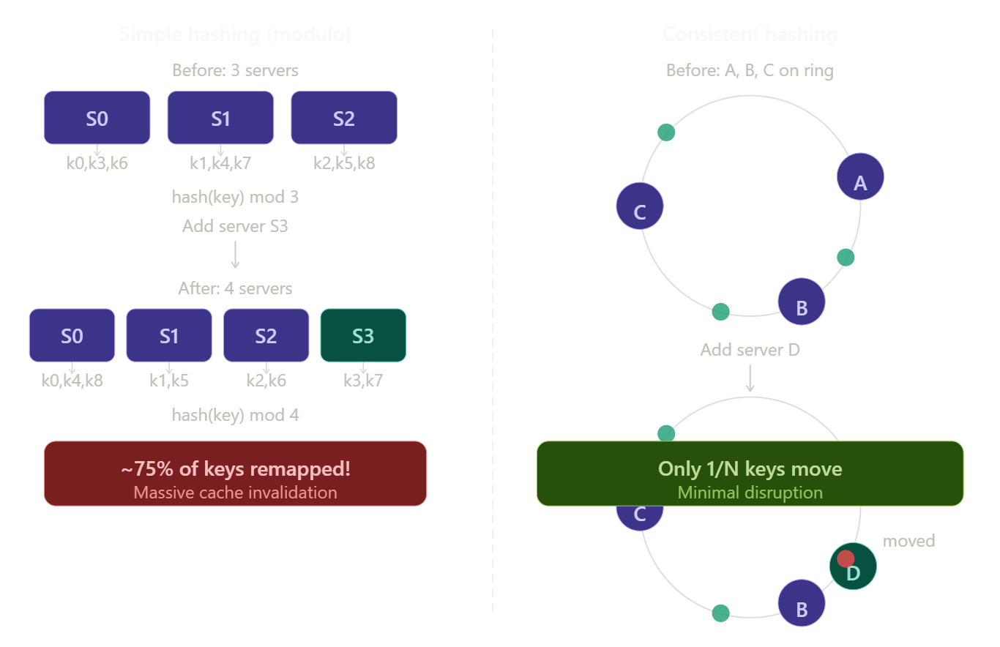
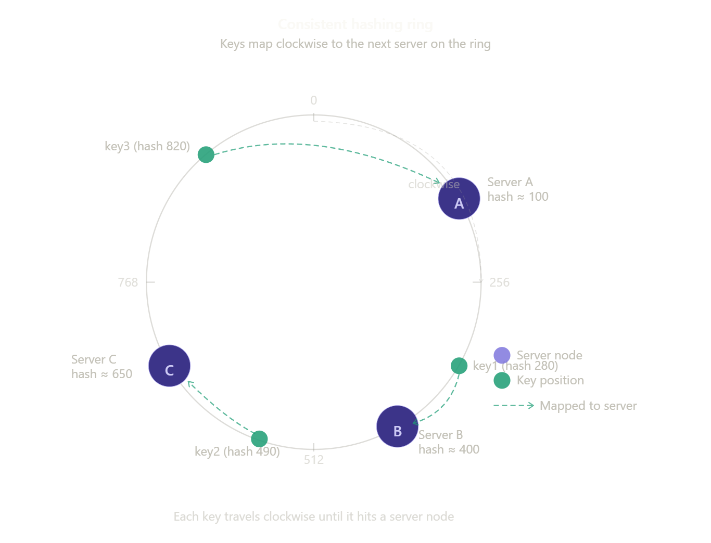
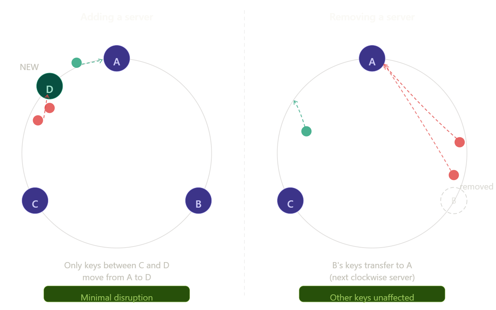
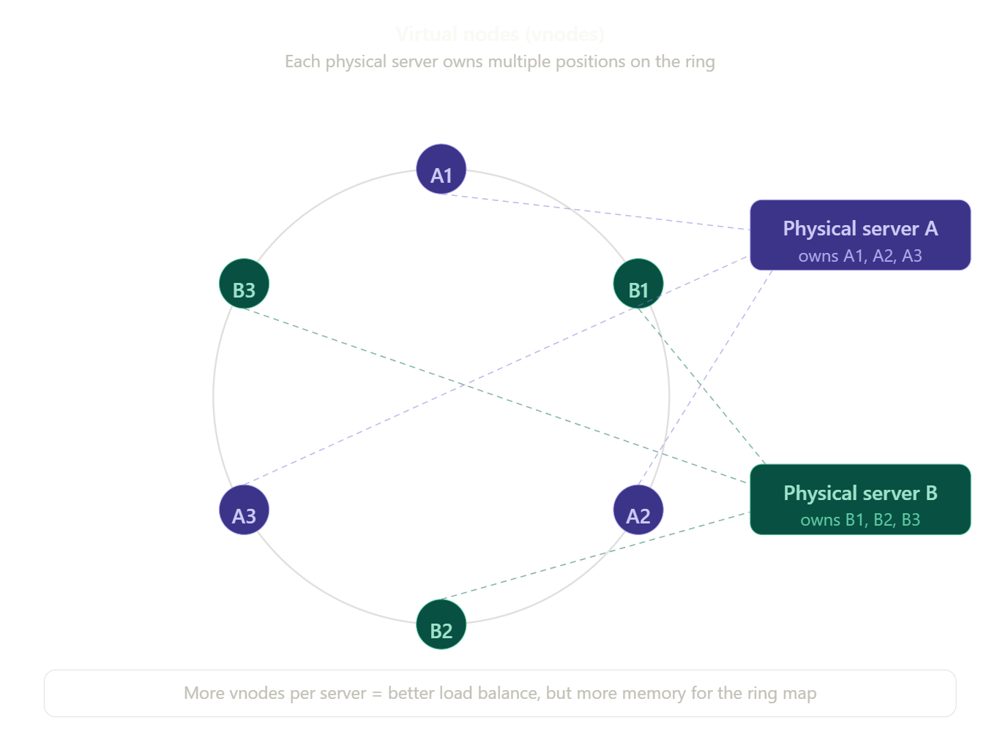
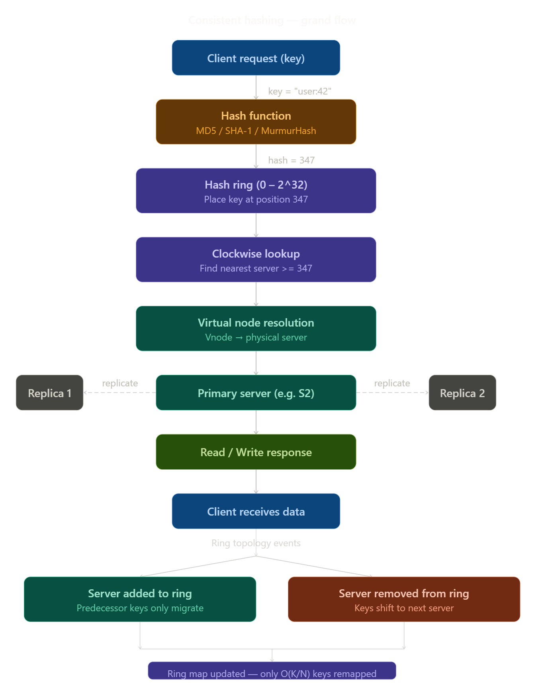

# Consistent Hashing — Complete Guide

> **Beginner-friendly · Interview-ready · Revision-perfect**

---

## Table of Contents

1. [What is Consistent Hashing?](#1-what-is-consistent-hashing)
2. [The Problem It Solves](#2-the-problem-it-solves)
3. [How Simple Hashing Works (and Fails)](#3-how-simple-hashing-works-and-fails)
4. [The Hash Ring — Core Concept](#4-the-hash-ring--core-concept)
5. [How a Key Finds Its Server](#5-how-a-key-finds-its-server)
6. [Adding a Server](#6-adding-a-server)
7. [Removing a Server](#7-removing-a-server)
8. [Virtual Nodes (Vnodes)](#8-virtual-nodes-vnodes)
9. [Replication with Consistent Hashing](#9-replication-with-consistent-hashing)
10. [Hash Functions Used](#10-hash-functions-used)
11. [Real-World Usage](#11-real-world-usage)
12. [Comparison Table](#12-comparison-table)
13. [Grand Flow Diagram](#13-grand-flow-diagram)
14. [Interview Q&A](#14-interview-qa)

---

## 1. What is Consistent Hashing?

Consistent hashing is a technique used to **distribute data across multiple servers** in a way that minimises disruption when servers are added or removed.

Think of it like a roundabout (rotary road). Every server gets a spot on the roundabout. When data arrives, it travels around the roundabout until it reaches the first server it encounters. If a server leaves, the cars just continue to the next one. If a new server joins, only a small slice of traffic is redirected.

```
Without consistent hashing → adding 1 server reshuffles ~75% of all data
With consistent hashing    → adding 1 server reshuffles only ~1/N of data
```

It is the backbone of distributed systems like **Amazon DynamoDB, Apache Cassandra, Memcached, and Akamai CDN**.

---

## 2. The Problem It Solves

Imagine you have a distributed cache with 3 servers storing millions of keys. Everything is working fine. Now you add a 4th server because traffic grew.

**What happens to the existing data?**

This is the core problem consistent hashing solves: how do you scale a distributed system without invalidating most of your cached/stored data?

The two bad outcomes of naive scaling:

- **Cache miss storm** — clients can't find their data because it moved to a different server. Every request hits the database directly. The database crashes.
- **Thundering herd** — all clients simultaneously try to rebuild the cache, overwhelming the system.

Consistent hashing prevents both.

---

## 3. How Simple Hashing Works (and Fails)



> *Place this image here — save as `images/simple_vs_consistent.png`*

**Simple hashing formula:**

```
server_index = hash(key) mod N
```

Where N = number of servers.

**Example with 3 servers:**

| Key | hash(key) | hash mod 3 | Server |
|-----|-----------|-----------|--------|
| user:1 | 100 | 1 | S1 |
| user:2 | 200 | 2 | S2 |
| user:3 | 300 | 0 | S0 |
| user:4 | 400 | 1 | S1 |

Now you add a 4th server. N changes from 3 to 4:

| Key | hash(key) | hash mod 4 | Server | Changed? |
|-----|-----------|-----------|--------|---------|
| user:1 | 100 | 0 | S0 | YES |
| user:2 | 200 | 0 | S0 | YES |
| user:3 | 300 | 0 | S0 | YES |
| user:4 | 400 | 0 | S0 | YES |

**Nearly all keys map to different servers.** This causes massive cache invalidation. The formula completely changes the mapping when N changes — that is the fundamental flaw.

---

## 4. The Hash Ring — Core Concept



> *Place this image here — save as `images/ring_basic.png`*

Consistent hashing fixes this by replacing the modulo formula with a **circular ring**.

**How the ring is built:**

1. Imagine a circle with positions numbered from 0 to 2^32 - 1 (about 4 billion points).
2. Each **server** is hashed using the same hash function. Its hash value determines where it sits on the ring.
3. Each **key** is also hashed. Its hash value determines where it sits on the ring too.
4. A key belongs to the **first server you encounter travelling clockwise** from the key's position.

```
Ring positions:  0 ──────────────────────────── 2^32
                                   ↑ circular, wraps around

Server A placed at hash(ServerA) = 100
Server B placed at hash(ServerB) = 400
Server C placed at hash(ServerC) = 650

Key "user:42" → hash = 280 → travel clockwise → hits Server B first → stored on B
Key "user:99" → hash = 500 → travel clockwise → hits Server C first → stored on C
Key "user:07" → hash = 900 → travel clockwise → wraps around → hits Server A → stored on A
```

**Why this is better:** The ring positions of other servers do not change when a new server is added. Only the keys in the arc between the new server and its predecessor are affected.

**Connection between ring and hash function:** The ring is simply a number line bent into a circle. The hash function maps both servers and keys to numbers on this line. Without a consistent hash function (one that maps the same input to the same output every time), the ring would be meaningless — keys and servers must always land at the same spot.

---

## 5. How a Key Finds Its Server

**Step-by-step lookup for key `"product:55"`:**

1. Compute `hash("product:55")` → say result = `347`
2. On the ring, go to position 347
3. Walk clockwise until you hit the first server node
4. That server is responsible for this key
5. Read or write the data to that server

**This lookup is O(log N)** using a sorted data structure (like a balanced binary search tree or sorted array with binary search) to store server positions. Finding the next clockwise server is a `ceiling` operation on the sorted array.

```python
# Simplified pseudocode
import bisect

ring = sorted_list_of_server_positions   # e.g. [100, 400, 650]
servers = {100: "ServerA", 400: "ServerB", 650: "ServerC"}

def get_server(key):
    key_hash = hash_function(key) % RING_SIZE
    idx = bisect.bisect_right(ring, key_hash) % len(ring)  # wrap around
    position = ring[idx]
    return servers[position]
```

**Why wrap around?** If the key's hash is larger than all server positions (e.g., hash = 900 and the largest server is at 650), you wrap back to position 0 and take the first server (at 100). This is what makes it a *ring* rather than a *line*.

---

## 6. Adding a Server



> *Place this image here — save as `images/add_remove_server.png`*

When you add a new server D to the ring:

1. Hash server D → say it lands at position 280
2. Insert position 280 into the sorted ring list
3. Server D is now between Server A (100) and Server B (400)
4. Only keys in the arc **from 100 to 280** were previously going to Server B — they now go to Server D
5. All other keys are **completely unaffected**

**How many keys move?**

```
Keys moved = total_keys / N

If you have 1,000,000 keys and 4 servers → ~250,000 keys move (25%)
If you have 1,000,000 keys and 10 servers → ~100,000 keys move (10%)
```

Compare this to simple hashing: ~75% of keys would move regardless of N.

**Connection to ring:** Adding a server only affects the arc between the new server and the previous one. Everything else on the ring is untouched because the positions of all other servers haven't changed.

---

## 7. Removing a Server

When Server B (position 400) is removed:

1. Remove position 400 from the ring
2. Keys that were in the arc **from previous_server to B (100 to 400)** now travel clockwise and hit Server C (650)
3. Server C absorbs B's keys
4. All other keys are unaffected

**Why only the next server is affected:** The ring is ordered. Removing B creates a gap from 100 to 650. Keys in that range now find C as their first clockwise server. Keys beyond position 650 still find their own servers unchanged.

**In practice — graceful removal:**
- Before removing, migrate B's keys to C manually
- Then remove B from the ring
- This avoids data loss if B's data isn't replicated

---

## 8. Virtual Nodes (Vnodes)



> *Place this image here — save as `images/virtual_nodes.png`*

### The problem with basic consistent hashing

With only 3 servers on the ring, the arcs between them may be very unequal. One server might own 60% of the ring, another only 15%. This causes **load imbalance** — one server handles much more traffic than others.

Also, when a server is removed, all its keys go to **one** server. That single server gets a sudden flood of traffic.

### The solution: virtual nodes

Instead of placing each physical server **once** on the ring, place it **multiple times** at different positions. Each position is called a **virtual node (vnode)**.

```
Server A appears as: A1 (hash 80), A2 (hash 340), A3 (hash 700)
Server B appears as: B1 (hash 160), B2 (hash 500), B3 (hash 820)
Server C appears as: C1 (hash 250), C2 (hash 580), C3 (hash 950)
```

The ring now has 9 positions instead of 3. The arcs between positions are much smaller and more evenly distributed.

**Benefits of virtual nodes:**

- **Better load balance** — each server owns roughly equal portions of the ring
- **Graceful failure** — when a server dies, its keys are spread across multiple successor servers (not all dumped onto one)
- **Proportional capacity** — a server with twice the RAM can have twice the vnodes, so it handles twice the load proportionally

**Trade-off:** More vnodes means a larger ring map that consumes more memory. Typical systems use 100–200 vnodes per physical server.

**How vnodes are created:**

```python
# Each server gets multiple hash positions using a suffix
for server in ["ServerA", "ServerB", "ServerC"]:
    for i in range(NUM_VNODES):
        vnode_key = f"{server}#vnode{i}"
        position = hash_function(vnode_key) % RING_SIZE
        ring.add(position, server)  # maps vnode position → physical server
```

**Connection to ring:** Vnodes are just extra entries in the ring's sorted list. The lookup algorithm is unchanged — you still walk clockwise and take the first entry. The only difference is that entry might be a vnode label like "A2" which you then resolve to physical Server A.

---

## 9. Replication with Consistent Hashing

In production systems, data is always replicated across multiple servers for fault tolerance. Consistent hashing handles replication elegantly.

**Replication strategy:**

When writing key K to its primary server (the first clockwise server), also write it to the **next N-1 clockwise servers** on the ring.

```
Key "user:42" → primary server = B (position 400)
Replication factor = 3
→ also write to C (position 650) and A (position 100, wrap around)
```

**Why clockwise neighbours?** Because they are the servers most likely to take over if the primary fails. If B crashes, C is the next clockwise server — it already has a copy.

**Consistency models that use this:**

- **Quorum reads/writes** (used by Cassandra): write to W servers, read from R servers. As long as W + R > N, you always read at least one fresh copy.
- **Eventual consistency** (used by DynamoDB): writes propagate asynchronously. Reads might get stale data briefly, but eventually all replicas converge.

**Connection to virtual nodes and replication:** With vnodes, the N clockwise neighbours might actually all be different physical servers (since vnodes from multiple physical servers are interspersed on the ring). This naturally spreads replicas across different machines, improving fault tolerance.

---

## 10. Hash Functions Used

The hash function determines how evenly servers and keys are distributed on the ring. A good hash function produces uniformly random outputs even for similar inputs.

| Hash Function | Speed | Output Size | Used In |
|---|---|---|---|
| MD5 | Fast | 128-bit | Classic Memcached |
| SHA-1 | Medium | 160-bit | Git, legacy systems |
| MurmurHash3 | Very fast | 128-bit | Cassandra, Redis |
| xxHash | Fastest | 64/128-bit | Modern systems |
| FNV-1a | Simple | 32/64-bit | Embedded, DNS |

**Key properties needed:**

- **Deterministic** — same key always hashes to same position
- **Uniform** — keys spread evenly across the ring, not clustered
- **Fast** — called on every read/write request
- **Avalanche effect** — small change in input causes large change in output (so similar keys don't cluster)

**Why not use a cryptographic hash like SHA-256?** It is overkill. Cryptographic hashes are designed to be hard to reverse — you don't need that property here. MurmurHash3 is ~10× faster and produces equally uniform distributions for this use case.

---

## 11. Real-World Usage

| System | How It Uses Consistent Hashing |
|---|---|
| Amazon DynamoDB | Partitions data across nodes using a variant of consistent hashing |
| Apache Cassandra | Uses vnodes (default 256 per node) to partition data across the cluster |
| Memcached | Client-side consistent hashing to distribute cache keys across servers |
| Redis Cluster | 16384 hash slots mapped to nodes — a discrete form of consistent hashing |
| Akamai CDN | Routes web requests to the nearest edge server |
| Discord | Distributes user session data across microservices |
| Nginx (upstream) | Uses consistent hashing for load balancing sticky sessions |

**Why Redis uses 16384 slots and not a full ring:**
Redis Cluster uses a fixed number of hash slots (0–16383) rather than a continuous ring. This is a practical simplification — instead of sorting a dynamic list of node positions, each key's slot is `CRC16(key) mod 16384`. Slots are then assigned to nodes. The idea is the same (move only a fraction of data when scaling) but the implementation is simpler and deterministic.

---

## 12. Comparison Table

| Property | Simple Hashing | Consistent Hashing | Consistent + Vnodes |
|---|---|---|---|
| Keys remapped on add/remove | ~(N-1)/N ≈ all | ~1/N | ~1/N |
| Load balance | Perfect (modulo) | Uneven arcs | Near-perfect |
| Fault tolerance | Poor | Moderate | Good |
| Implementation complexity | Trivial | Moderate | Moderate |
| Memory for ring map | None | O(N) | O(N × vnodes) |
| Lookup time | O(1) | O(log N) | O(log N) |
| Hotspot on node failure | N/A | Yes (one successor) | No (spread) |

---

## 13. Grand Flow Diagram



> *Place this image here — save as `images/grand_flow.png`*

**Reading the diagram top to bottom:**

1. **Client** sends a request with a key (e.g., `"user:42"`).
2. The key is fed into the **hash function** (e.g., MurmurHash3) → produces a numeric hash value.
3. The hash value is a position on the **hash ring** (0 to 2^32).
4. A **clockwise lookup** finds the first server node at or after that position.
5. If vnodes are used, the vnode is resolved to its **physical server**.
6. The request is served by the **primary server**. Writes are also propagated to **replica servers** (next clockwise neighbours).
7. The **response** travels back to the client.
8. Separately: when a server is **added**, only predecessor keys migrate. When a server is **removed**, its keys shift to the next clockwise server. In both cases, the **ring map is updated** and only O(K/N) keys are remapped.

The dashed lines between nodes represent the key insight: most of the ring is unaffected by topology changes.

---

## 14. Interview Q&A

### Q1: What is consistent hashing and why is it needed?

**A:** Consistent hashing is a distributed hashing technique that maps both servers and keys onto a ring. When the cluster size changes (a server is added or removed), only a fraction of keys — about 1/N — need to be remapped instead of nearly all of them as with simple modulo hashing. It is needed because distributed caches and databases must scale without invalidating all stored data.

---

### Q2: How does the hash ring work?

**A:** The ring represents a fixed hash space, typically 0 to 2^32 - 1. Each server is hashed and placed at a position on the ring. Each key is also hashed to a position. To find which server owns a key, you travel clockwise from the key's position until you reach the first server node. Because the ring is circular, if you go past the largest server position, you wrap around to the smallest.

---

### Q3: What happens when a new server is added?

**A:** The new server is hashed and inserted into the ring at its position. Only keys in the arc between the new server and its predecessor (the previous clockwise server) are affected — they now map to the new server instead of their old server. All other keys are completely unchanged. This means roughly 1/N of keys move, where N is the new total number of servers.

---

### Q4: What are virtual nodes and why are they used?

**A:** Virtual nodes (vnodes) are multiple ring positions assigned to each physical server. Instead of each server appearing once, it appears 100–200 times at different positions. This solves two problems: first, it improves load balance because arcs between servers become smaller and more uniform. Second, when a server fails, its keys are distributed across multiple successor servers rather than all going to one, preventing a sudden hotspot.

---

### Q5: How does consistent hashing compare to simple modulo hashing?

**A:** Simple hashing uses `hash(key) mod N`. When N changes, nearly all keys map to different servers — about (N-1)/N of them, which is ~75% when going from 3 to 4 servers. Consistent hashing only remaps 1/N of keys. The trade-off is that simple hashing gives perfect load balance (modulo distributes evenly), while basic consistent hashing can have uneven arcs. Virtual nodes restore balance to consistent hashing.

---

### Q6: What hash function would you choose and why?

**A:** I would use MurmurHash3 or xxHash for most production systems. They are non-cryptographic, extremely fast (important since every read/write call computes a hash), and produce very uniform distributions. Cryptographic hashes like SHA-256 are unnecessary — the security properties they provide are not needed here, and they carry ~10× performance overhead.

---

### Q7: How does replication work with consistent hashing?

**A:** When writing a key to its primary server (the first clockwise server), you also write to the next N-1 clockwise servers, where N is the replication factor. For example, with replication factor 3, you write to the first, second, and third clockwise servers. This ensures data survives node failures. When the primary fails, the first replica is already the next clockwise server — exactly the server that would become the new primary after a topology update.

---

### Q8: What is a hotspot and how does consistent hashing help prevent it?

**A:** A hotspot occurs when one server receives disproportionately more traffic than others. In simple hashing, this can happen if certain key prefixes (e.g., all "user:*" keys) happen to hash to the same bucket. In consistent hashing with vnodes, each server's vnodes are spread across the ring, so traffic from any key range is spread across multiple physical servers. A single server cannot dominate unless its vnode positions are all clustered — which a good hash function prevents.

---

### Q9: How does Redis Cluster implement consistent hashing?

**A:** Redis Cluster uses a discrete version called hash slots. There are 16384 fixed slots (0–16383). A key's slot is computed as `CRC16(key) mod 16384`. Slots are then assigned to nodes (e.g., node 1 owns slots 0–5460, node 2 owns 5461–10922, etc.). When scaling, you move slot ranges between nodes. This is conceptually the same as consistent hashing — only the keys in moved slots are affected — but it is simpler to implement and reason about.

---

### Q10: What are the trade-offs of more virtual nodes?

**A:** More vnodes per server means better load distribution (arcs are more uniform) and better fault isolation (a failure spreads load across more servers). The trade-offs are: the ring map consumes more memory (O(N × vnodes) entries), and ring operations (inserting or deleting a server) are slower because you update many entries at once. Typical production systems use 100–256 vnodes per server as a good balance.

---

### Q11: How would you handle a server that is temporarily down vs permanently removed?

**A:** For a temporary outage, you do not remove the server from the ring. Reads can fall through to replicas. When the server comes back, it re-syncs its data from the ring's replication mechanism. For a permanent removal, you explicitly remove the server from the ring, triggering the one-time migration of its keys to the next clockwise server. Mixing these up — permanently removing a server that is just slow — causes unnecessary data migration and potential data loss if replication hasn't caught up.

---

### Q12: Can consistent hashing guarantee perfect load balance?

**A:** Not with basic consistent hashing. The hash function distributes servers and keys uniformly at random, but random placement can still produce unequal arc sizes. With vnodes (100+), the law of large numbers ensures arc sizes converge toward uniformity — practical imbalance drops to within 5–10% of the ideal. Perfect balance would require centrally assigning server positions to guarantee equal arc sizes, which defeats the distributed nature of the system.

---

*End of Consistent Hashing Guide*
