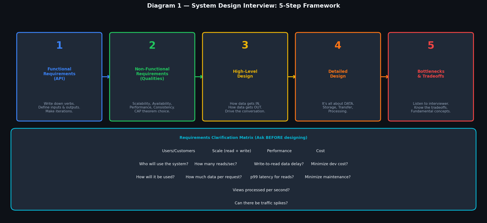
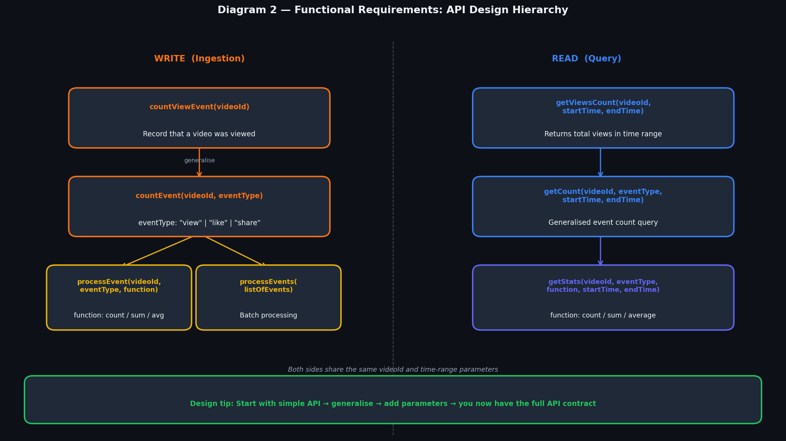
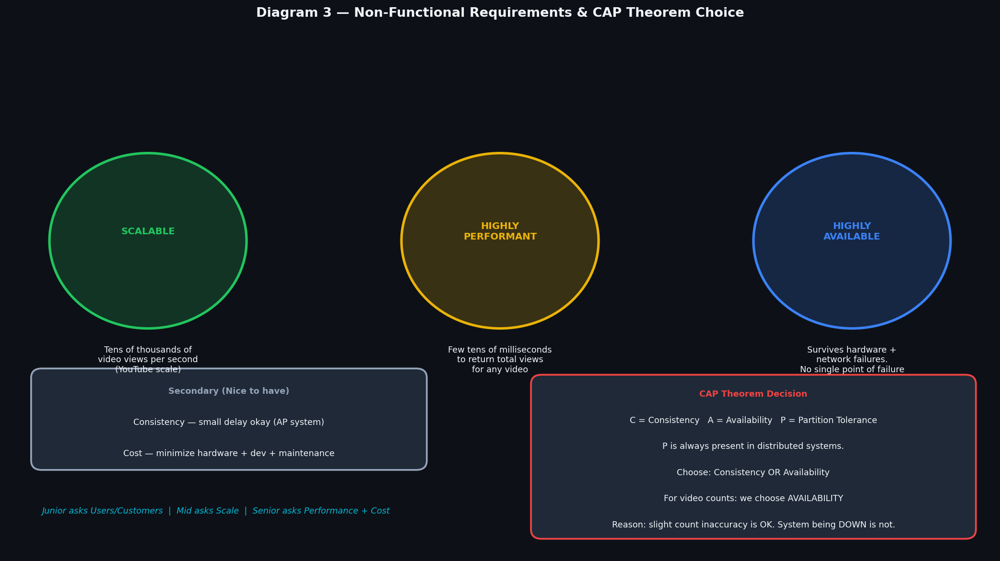
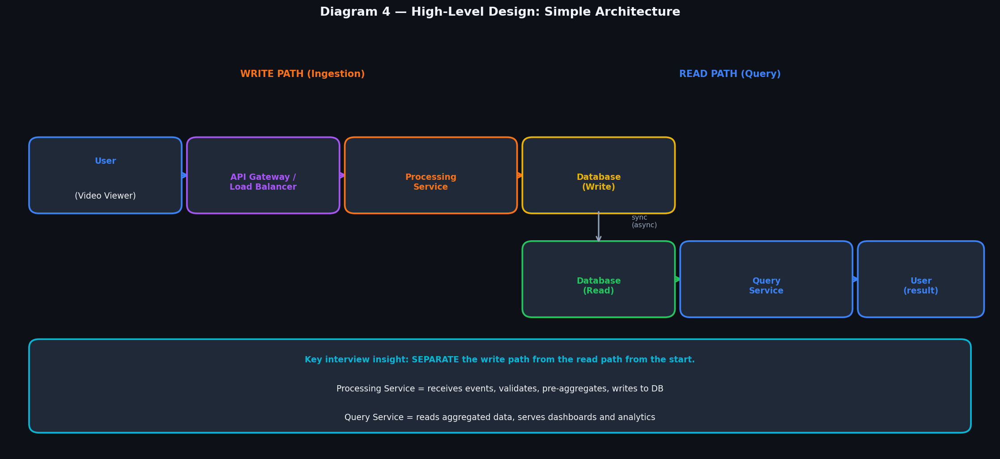
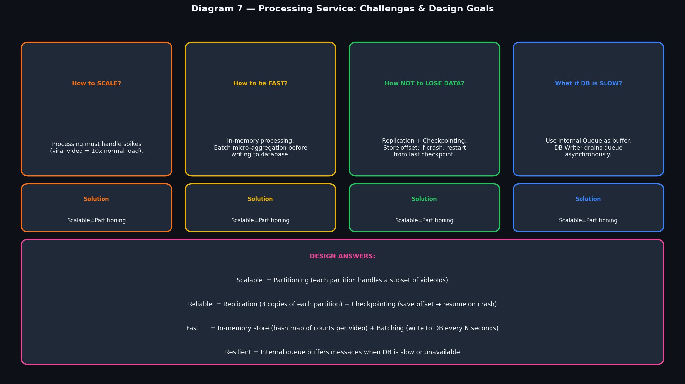
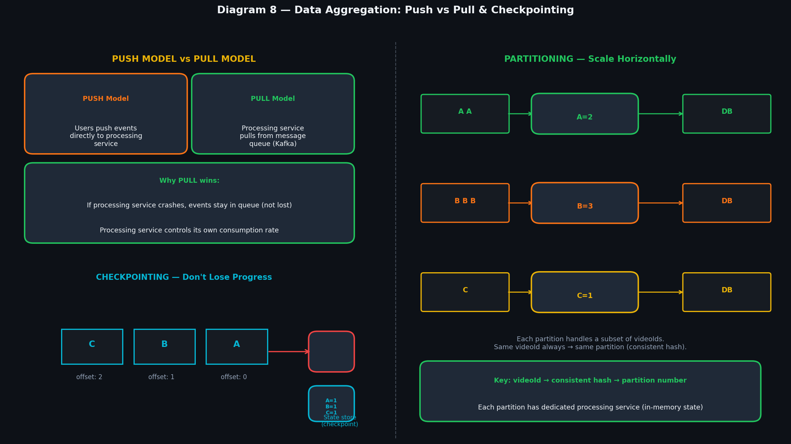
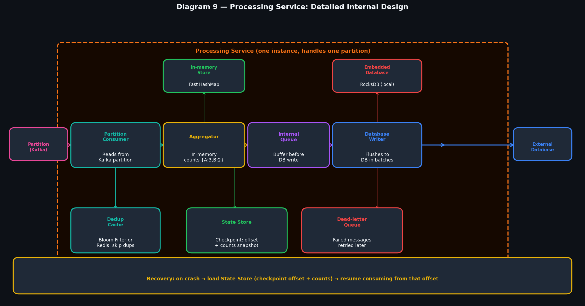
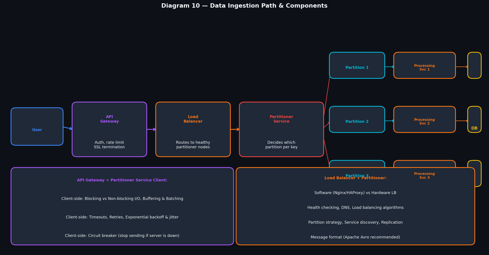
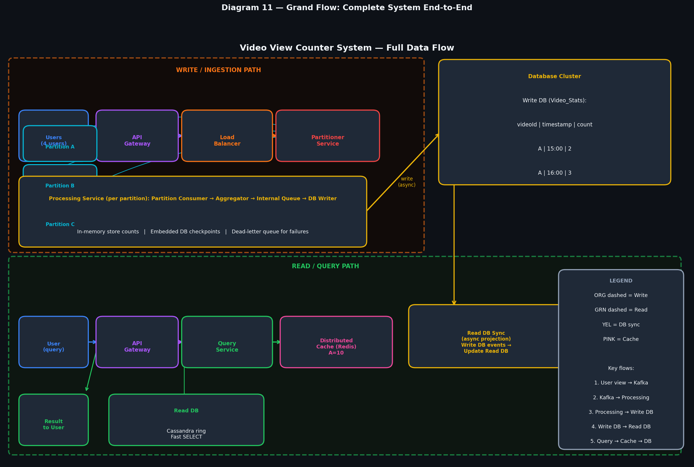

# System Design Interview — Complete Blueprint
## How to Design a Video Analytics System (YouTube-Scale)

> **A complete, step-by-step guide to navigating a system design interview.**  
> Every concept connected to the next. Foundation thinking for any system design problem.

---

## Table of Contents

| Step | Topic |
|------|-------|
| — | [How to Use This Guide](#how-to-use-this-guide) |
| 1 | [The 5-Step Interview Framework](#step-1--the-5-step-interview-framework) |
| 2 | [Requirements Clarification](#step-2--requirements-clarification) |
| 3 | [Functional Requirements — API Design](#step-3--functional-requirements--api-design) |
| 4 | [Non-Functional Requirements](#step-4--non-functional-requirements) |
| 5 | [High-Level Design](#step-5--high-level-design) |
| 6 | [What We Store — Data Model Decision](#step-6--what-we-store--data-model-decision) |
| 7 | [How We Store — Database Choice](#step-7--how-we-store--database-choice) |
| 8 | [Processing Service — Challenges & Goals](#step-8--processing-service--challenges--goals) |
| 9 | [Data Aggregation — Push vs Pull & Partitioning](#step-9--data-aggregation--push-vs-pull--partitioning) |
| 10 | [Processing Service — Detailed Internal Design](#step-10--processing-service--detailed-internal-design) |
| 11 | [Data Ingestion Path — End-to-End](#step-11--data-ingestion-path--end-to-end) |
| 12 | [Ingestion Path Components Deep-Dive](#step-12--ingestion-path-components-deep-dive) |
| 13 | [Grand Flow — Everything Connected](#step-13--grand-flow--everything-connected) |
| 14 | [Summary & Interview Cheatsheet](#step-14--summary--interview-cheatsheet) |

---

## How to Use This Guide

This guide is built around one concrete problem: **Design a Video View Counter System (YouTube scale)**.

Why this problem? Because it covers almost every major concept in system design:
- API design, data modelling, database choice, distributed processing, streaming, caching, and fault tolerance.

**The key insight from the slides:** You are always designing around **DATA** — how it gets in, how it gets stored, and how it gets out. Everything else is mechanics.

Read each step in order. Each section explains **why** it connects to the next.

---

## Step 1 — The 5-Step Interview Framework

> 

Every system design interview follows the same skeleton. Master this skeleton before memorising any technology.

```
Step 1: Functional Requirements (API)
    ↓
Step 2: Non-Functional Requirements (Qualities)
    ↓
Step 3: High-Level Design
    ↓
Step 4: Detailed Design
    ↓
Step 5: Bottlenecks & Tradeoffs
```

### Why This Order Matters

You cannot design something without first knowing **what it does** (functional) and **how well it must do it** (non-functional). Jumping to technology decisions before this is the #1 reason candidates fail.

**The framework also acts as a communication tool:**
- Junior engineers define users/customers (basic requirements)
- Mid-level engineers tackle scale questions
- Senior engineers discuss performance, cost, and tradeoffs

### The Requirements Clarification Matrix

Before writing a single box on your diagram, ask these questions:

| Dimension | Key Questions |
|-----------|--------------|
| **Users/Customers** | Who uses this? How will it be used? |
| **Scale (read/write)** | How many reads/sec? Writes/sec? Data per request? Traffic spikes? |
| **Performance** | Write-to-read delay? p99 latency for reads? |
| **Cost** | Minimize dev cost? Minimize maintenance? |

---

## Step 2 — Requirements Clarification

### Agreed-Upon Requirements for Our System

**Users:** Anyone watching videos on a YouTube-like platform. External dashboards for creators and internal analytics teams.

**Scale (our assumptions):**
```
Write: ~10,000 video views per second (YouTube-scale)
Read:  ~1,000 queries per second for analytics dashboards
Data per request: lightweight (just a videoId + count)
Spikes: YES — a viral video can cause 10x-100x traffic spike
```

**Performance:**
```
Write-to-read delay: a few seconds is acceptable
p99 latency for reads: < 100 milliseconds
```

**Cost:** Use open-source, minimize hardware, design for operational simplicity.

### Why This Connects to Non-Functional Requirements

The scale numbers tell you immediately whether you need distributed systems. 10,000 writes/sec means one database cannot handle this alone — you need horizontal scaling. The performance target of < 100ms means you need pre-aggregation and caching.

---

## Step 3 — Functional Requirements — API Design

> 

### How to Design an API in an Interview

**Trick: write down the VERBS from the problem statement first.**

```
Problem: "The system counts video view events and returns view counts for a time period."

Verbs:   count → countViewEvent
         return → getViewsCount
```

Then generalise, then add parameters.

### The Write API (Ingestion)

```
Level 1 (simplest):
  countViewEvent(videoId)
      ↓ generalise (more event types)
  countEvent(videoId, eventType)
      eventType: "view" | "like" | "share"
      ↓ add function parameter
  processEvent(videoId, eventType, function)
      function: "count" | "sum" | "average"
      ↓ add batch support
  processEvents(listOfEvents)
```

### The Read API (Query)

```
Level 1 (simplest):
  getViewsCount(videoId, startTime, endTime)
      ↓ generalise (any event type)
  getCount(videoId, eventType, startTime, endTime)
      ↓ add aggregation function
  getStats(videoId, eventType, function, startTime, endTime)
```

### Why This Connects to Data Model

The API tells you exactly what queries you need to support. `getStats(videoId, eventType, function, startTime, endTime)` tells you the primary key must include `videoId`, you need time-range filtering, and you need pre-computed counts.

---

## Step 4 — Non-Functional Requirements

> 

### The Three Big Requirements

**1. Scalable** — Handle tens of thousands of video views per second without degradation.

**2. Highly Performant** — Return total view count for any video in a few tens of milliseconds.

**3. Highly Available** — The system survives hardware failures and network partitions. No single point of failure.

### Secondary Requirements

- **Consistency:** We accept slight eventual consistency. View counts may lag by a few seconds.
- **Cost:** Use horizontal scaling with commodity hardware. No expensive enterprise solutions.

### The CAP Theorem Decision

> **This is what separates mid-level from senior engineers in an interview.**

```
CAP Theorem: In a distributed system, you can only guarantee 2 of:
  C = Consistency (all nodes see same data at same time)
  A = Availability (every request gets a response)
  P = Partition Tolerance (system works despite network splits)

P is always required in a real distributed system.
So the real choice is: C vs A.

Our decision: AVAILABILITY over CONSISTENCY.
Reason: A view count being off by a few seconds is acceptable.
        The system being DOWN is not acceptable.
```

This means we build an **AP system** — always available, eventually consistent.

---

## Step 5 — High-Level Design

> 

### Start Simple — Three Boxes

The first version of any system design should be simple enough to fit on a napkin:

```
WRITE PATH:
User → API Gateway → Processing Service → Write Database

READ PATH:
User → Query Service → Read Database
```

### Why Separate Write and Read?

This is not just optimisation — it is architectural correctness:

- **Write path** is about receiving events fast (high throughput, low latency writes)
- **Read path** is about serving queries fast (pre-aggregated, cached data)
- **Different databases** for each: write DB optimised for writes, read DB optimised for reads

This pattern is called **CQRS (Command Query Responsibility Segregation)** — same pattern we studied previously, applied here.

### The Simple Architecture Components

| Component | Role |
|-----------|------|
| **Processing Service** | Receives events, validates, pre-aggregates counts in memory, writes to DB |
| **Write Database** | Stores aggregated counts per time bucket (e.g., per minute) |
| **Query Service** | Reads pre-aggregated data, serves dashboards |
| **Read Database** | Denormalized, optimised for fast SELECT by videoId + time range |

---

## Step 6 — What We Store — Data Model Decision

> 

### Two Approaches

**Approach 1: Store Individual Events (every click)**

```
| VideoId | Timestamp           | UserId | ... |
| A       | 2019-08-26 15:21:17 | u1     | ... |
| A       | 2019-08-26 15:21:32 | u2     | ... |
| B       | 2019-08-26 15:22:04 | u3     | ... |
```

- ✅ Fast writes (append-only)
- ✅ Flexible — re-aggregate any way you need
- ✅ Can recalculate if aggregation logic changes
- ❌ Slow reads — must scan millions of rows
- ❌ Expensive at YouTube scale (billions of rows/day)

**Approach 2: Store Pre-Aggregated Data (per minute)**

```
| VideoId | Timestamp       | Count |
| A       | 2019-08-26 15:21| 2     |
| B       | 2019-08-26 15:22| 2     |
```

- ✅ Fast reads — one row per time bucket
- ✅ Data ready for dashboards immediately
- ✅ Scales well
- ❌ Can only query the granularity it was aggregated at
- ❌ Requires aggregation pipeline

### Our Decision

**Store pre-aggregated data** for the main serving layer. Keep raw events in the message queue (Kafka) for a retention period — so if aggregation logic changes, we can re-process.

---

## Step 7 — How We Store — Database Choice

> 

### SQL (MySQL) Option

**Architecture:**

```
Processing Service
       ↓
Cluster Proxy (ZooKeeper for config)
       ↓
Master Shard A-M ←→ Read Replica A-M (Data Center A / B)
Master Shard N-Z ←→ Read Replica N-Z
```

**Data Schema:**
```sql
-- Video_Info (metadata, not frequently updated)
| VideoId | Name              | ChannelId |
| A       | Design Interview  | 111       |

-- Video_Stats (time-series, frequently updated)
| VideoId | Timestamp | Count |
| A       | 15:00     | 2     |
| A       | 16:00     | 3     |

-- Channel_Info
| ChannelId | Name                    |
| 111       | System Design Interview |
```

### NoSQL (Cassandra) Option

**Architecture:** Consistent Hash Ring with no master.

```
Processing Service → Node 4 (S-Z) ──── Ring ──── Node 1 (A-F)
Query Service     → Any node              \      /
                                        Node 3   Node 2
                                        (M-R)   (G-L)
```

**Data Model (wide rows — time as columns):**
```
Partition Key: videoId
| VideoId | ChannelName | 15:00 | 16:00 | 17:00 |
| A       | SysDesign   | 2     | 3     | 8     |
```

Instead of adding rows, Cassandra adds **columns** for each time period — perfect for time-series.

### Decision: Which to Use?

| Criteria | SQL (MySQL) | NoSQL (Cassandra) |
|----------|-------------|-------------------|
| Scale | Manual sharding via ZooKeeper | Auto-sharding built-in |
| Availability | Master-replica (manual failover) | No master, any node writes |
| Query flexibility | Rich (JOINs, complex queries) | Limited (partition key queries) |
| Write throughput | Lower | Higher |
| Operational complexity | Higher (ZooKeeper, shard proxy) | Lower |
| **Best for our case** | Medium scale | Large scale (YouTube-level) |

**Our choice: Cassandra for Video_Stats, MySQL for Video_Info and Channel_Info.**

Why? Video_Stats is our hot, high-write time-series data (Cassandra excels here). Video/Channel metadata is infrequently updated and benefits from relational queries (MySQL works fine).

---

## Step 8 — Processing Service — Challenges & Goals

> 

### The Four Challenges

When the interviewer asks "how will your processing service work?", you need to answer four questions:

**1. How to Scale?**
```
Problem: A viral video creates 100x normal traffic spikes.
Solution: PARTITIONING
  → Hash videoId to a partition number
  → Each partition is handled by a dedicated processing service instance
  → Add more partitions (and instances) to scale
```

**2. How to Achieve High Throughput?**
```
Problem: Writing to database for every event = too slow.
Solution: IN-MEMORY AGGREGATION
  → Maintain a HashMap in memory: { "videoId_A": 7, "videoId_B": 3 }
  → Aggregate events in memory for N seconds
  → Flush to database in one batch write
  → Thousands of events → one DB write
```

**3. How Not to Lose Data When Node Crashes?**
```
Problem: Processing service crashes → in-memory state lost.
Solution: CHECKPOINTING + REPLICATION
  → Periodically save: current offset in Kafka + current count state to a State Store
  → On crash: new instance reads the checkpoint and resumes from that offset
  → Kafka retains messages → events are NOT lost
  → Replicate the Kafka partition (3 copies) so partition itself survives crashes
```

**4. What to Do When Database is Unavailable?**
```
Problem: DB is down or slow → events pile up.
Solution: INTERNAL QUEUE (buffer)
  → Aggregator writes to an internal queue first
  → Database Writer reads from queue and writes to DB
  → If DB is slow → queue absorbs the backpressure
  → When DB recovers → queue drains normally
```

### Design Philosophy Summary

```
Scalable  = Partitioning        (horizontal scale-out)
Reliable  = Replication         (no data loss)
          + Checkpointing       (resume after crash)
Fast      = In-memory store     (microsecond reads/writes)
          + Batching            (reduce DB write amplification)
Resilient = Internal queue      (handle DB slowness)
          + Dead-letter queue   (handle persistent failures)
```

---

## Step 9 — Data Aggregation — Push vs Pull & Partitioning

> 

### Push Model vs Pull Model

**Push Model:** Services push events directly to the processing service.

```
Problem: If processing service is overloaded or crashes:
  → Push sender gets connection refused
  → Events are LOST
  → No way to replay
```

**Pull Model (Kafka):** Processing service pulls events from a queue.

```
Why Pull wins:
  → Events stored in Kafka (durable)
  → Processing service pulls at its own rate
  → If it crashes → events stay in Kafka
  → On restart → resume from last offset
  → Kafka retains events for 7 days → full replay possible
```

**We use the Pull Model with Kafka.**

### Checkpointing — Never Lose Progress

Kafka assigns each event an **offset** (sequence number). The processing service remembers which offset it last processed.

```
Kafka Partition:  [ event_0 | event_1 | event_2 | ... ]
                                          ↑
                              Last processed offset = 2

Processing Service saves checkpoint:
  { offset: 2, counts: { "A": 1, "B": 1, "C": 1 } }
  → stored in ZooKeeper or a State Store

On crash: new instance reads checkpoint → resumes at offset 2
  → events 0 and 1 NOT reprocessed (no double-counting)
```

### Partitioning — Scale Horizontally

All events for the same `videoId` must go to the **same partition** — otherwise counts would be split across machines and be wrong.

```
videoId "A" → hash("A") % 3 = 0 → Partition A (dedicated processing service)
videoId "B" → hash("B") % 3 = 1 → Partition B (dedicated processing service)
videoId "C" → hash("C") % 3 = 2 → Partition C (dedicated processing service)

Each processing service maintains its OWN in-memory state:
  Partition A: { "A": 2 }
  Partition B: { "B": 3 }
  Partition C: { "C": 1 }
```

No coordination needed between processing services — they are completely independent.

---

## Step 10 — Processing Service — Detailed Internal Design

> 

### What's Inside One Processing Service Instance

Each processing service instance handles **one Kafka partition** and contains these components:

```
┌──────────────────────────────────────────────────────────────────┐
│  Processing Service (one instance)                                │
│                                                                    │
│  Partition Consumer → Aggregator → Internal Queue → DB Writer     │
│         │                │                               │        │
│   Dedup Cache      In-memory Store              Embedded Database  │
│   (skip dupes)     (fast HashMap)               (checkpoint store) │
│                         │                                         │
│                    State Store (periodic snapshot)                 │
└──────────────────────────────────────────────────────────────────┘
         ↑                                              ↓
  Kafka Partition                               External Database
```

### Each Component Explained

**Partition Consumer**
- Polls events from its assigned Kafka partition
- Applies exactly-once semantics using offsets
- Checks Dedup Cache before processing each event

**Aggregator**
- Maintains a HashMap `{videoId: count}` in memory
- Accumulates counts for N seconds (e.g., 60 seconds)
- After N seconds, flushes aggregate to Internal Queue

**In-memory Store**
- Stores the current running counts
- Blazing fast (nanoseconds) — no disk I/O
- Backed by Embedded Database for durability

**Internal Queue**
- Decouples Aggregator from Database Writer
- If DB is slow → queue fills up (not events dropped)
- DB Writer drains queue asynchronously

**Database Writer**
- Reads from Internal Queue
- Writes batches to external database
- Handles retries and error cases

**Deduplication Cache**
- Prevents double-counting duplicate events
- Can be a Bloom Filter (low memory) or Redis (exact)
- Key: `{eventId}` → already processed? Skip it

**State Store (Checkpointing)**
- Periodically saves: current Kafka offset + current in-memory counts
- On crash: new instance loads State Store → resumes exactly where left off
- Can use RocksDB (embedded) or ZooKeeper

**Dead-letter Queue**
- Messages that failed after N retries go here
- Monitored by on-call engineers
- Can be reprocessed manually after fixing root cause

---

## Step 11 — Data Ingestion Path — End-to-End

> 

### The Full Write Path

```
User (video view event)
    ↓
API Gateway          ← Auth, SSL termination, rate limiting
    ↓
Load Balancer        ← Distributes across healthy partitioner nodes
    ↓
Partitioner Service  ← Decides which Kafka partition this event belongs to
    ↓          ↘          ↘
Partition 1    Partition 2   Partition 3   ← Kafka partitions (durable queue)
    ↓               ↓            ↓
Processing     Processing   Processing    ← One per partition
Service 1      Service 2    Service 3
    ↓               ↓            ↓
                  Database                ← Aggregated counts stored
```

### Why Each Layer Exists

- **API Gateway:** Single entry point. Handles authentication so downstream services don't need to. Also provides rate limiting per client.
- **Load Balancer:** Multiple Partitioner Service nodes for fault tolerance. If one dies, LB stops routing to it.
- **Partitioner Service:** Crucial — it ensures the same videoId always goes to the same Kafka partition (consistent hashing). This guarantees correct aggregation.
- **Kafka Partitions:** The reliability backbone. Events are durable. Can replay. Can have multiple consumers.
- **Processing Services:** One per partition = no coordination overhead = maximum throughput.

---

## Step 12 — Ingestion Path Components Deep-Dive

### Partitioner Service Client (runs on API server side)

The client that sends events to the Partitioner Service must handle failure gracefully:

| Feature | Why It's Needed |
|---------|----------------|
| **Non-blocking I/O** | Don't block the user request thread while sending to Kafka |
| **Buffering + Batching** | Accumulate N events before sending → fewer network calls |
| **Timeouts** | Don't wait forever if Partitioner is slow |
| **Retries** | Transient failures → retry automatically |
| **Exponential backoff + jitter** | Avoid thundering herd when Partitioner recovers |
| **Circuit breaker** | If Partitioner is down → stop sending immediately, fail fast |

### Load Balancer

```
Software LB (Nginx/HAProxy/AWS ALB):
  + Cheap, flexible, layer 7 routing
  + Health checking, algorithm choice
  - Software overhead

Hardware LB (F5):
  + Extremely fast, high throughput
  - Expensive, inflexible

Algorithms:
  Round Robin  → take turns
  Least Connections → send to least busy
  IP Hash → same client → same server (sticky sessions)
```

### Partitioner Service & Partitions

```
Partition strategy:
  Default: hash(videoId) % numberOfPartitions
  Ensures: same videoId → same partition → correct aggregation

Service discovery:
  How does Partitioner know where the Kafka brokers are?
  → ZooKeeper or etcd stores broker addresses
  → Partitioner reads from ZooKeeper on startup and on change

Replication:
  Kafka replication factor = 3
  → 3 copies of each partition on different brokers
  → If 1 broker dies → 2 others have the data

Message format:
  Apache Avro recommended:
  → Schema stored in Schema Registry
  → Compact binary format (efficient network + storage)
  → Schema evolution (add new fields without breaking consumers)
```

---

## Step 13 — Grand Flow — Everything Connected

> 

### Tracing One Event: "User watches Video A"

```
EVENT: User watches Video A at 15:21:17

Step 1: User's browser calls: countViewEvent("videoId=A")

Step 2: API Gateway
  → Authenticates user
  → Rate checks (not sending too fast?)
  → Forwards to Load Balancer

Step 3: Load Balancer
  → Picks a healthy Partitioner Service node
  → Forwards event

Step 4: Partitioner Service
  → hash("A") % 3 = 0 → send to Partition 0
  → Event appended to Kafka Partition 0

Step 5: Processing Service (handles Partition 0)
  → Partition Consumer reads event from Kafka
  → Dedup Cache: seen this eventId before? No → continue
  → Aggregator: counts["A"] += 1 → counts["A"] = 1
  → (every 60 seconds) Aggregator flushes: {"A": 7} to Internal Queue
  → DB Writer reads queue → writes to Cassandra:
    { videoId="A", timestamp="15:21", count=7 }

Step 6: Checkpointing (every 60s)
  → State Store saves: { offset: 1542, counts: {"A": 7} }
  → Safe to advance Kafka offset

Step 7: Read DB Sync (async)
  → Write DB update triggers event to Read DB consumer
  → Read DB (Cassandra/Redis) updated with new count

Step 8: Query Request: getViewsCount("A", "15:00", "16:00")
  → Query Service receives request
  → Check Distributed Cache (Redis): cached? Return in 0.1ms
  → Cache miss → query Read DB:
    SELECT sum(count) FROM Video_Stats WHERE videoId="A"
    AND timestamp BETWEEN "15:00" AND "16:00"
  → Cache result in Redis with TTL=60s
  → Return: { videoId: "A", views: 10, period: "15:00-16:00" }
```

### What Happens When Something Breaks

```
Scenario: Processing Service crashes at 15:21:30

Without recovery:
  → In-memory counts {"A": 3} are lost
  → Kafka offset not committed
  → Some events counted twice (if offset not saved)

With our design:
  → New Processing Service starts up
  → Loads State Store: { offset: 1521, counts: {"A": 2} }
  → Resumes consuming from Kafka offset 1521
  → Events after offset 1521 reprocessed correctly
  → No data loss, at-least-once delivery guaranteed
```

---

## Step 14 — Summary & Interview Cheatsheet

### The 5-Step Interview Process

```
STEP 1: FUNCTIONAL REQUIREMENTS (API)
  → Write down verbs from the problem statement
  → Define input parameters and return values
  → Start simple, then generalise, then make several iterations

STEP 2: NON-FUNCTIONAL REQUIREMENTS (QUALITIES)
  → Ask about: Users, Scale (reads + writes), Performance, Cost
  → State your CAP theorem choice and justify it
  → Junior = Users. Mid = Scale. Senior = Performance + Cost.

STEP 3: HIGH-LEVEL DESIGN
  → Separate write path from read path immediately
  → How does data get IN? (Processing Service + Queue)
  → How does data get OUT? (Query Service + Cache)
  → Drive the conversation — don't wait to be asked

STEP 4: DETAILED DESIGN
  → It's all about DATA: storage, transfer, processing
  → Data model: individual events vs pre-aggregated
  → Database: SQL vs NoSQL (choose based on scale + query needs)
  → Processing: Partitioning + Checkpointing + In-memory
  → Apply relevant technologies (Kafka, Cassandra, Redis, ZooKeeper)

STEP 5: BOTTLENECKS & TRADEOFFS
  → Listen carefully to the interviewer's pushback
  → Know the tradeoffs of every decision you made
  → Have a counter-proposal for each tradeoff
```

### Technology Decision Map

| Need | Use |
|------|-----|
| Event streaming / durability | Apache Kafka |
| Fast time-series writes | Cassandra |
| Metadata / relational queries | MySQL (with sharding) |
| Result caching | Redis |
| Config / coordination | ZooKeeper |
| Processing checkpoint state | RocksDB (embedded) |
| Message deduplication | Redis or Bloom Filter |
| Service discovery | ZooKeeper or etcd |
| Message format | Apache Avro |

### Key Design Principles Recap

```
1. SEPARATE concerns: write path ≠ read path (CQRS)
2. PRE-AGGREGATE: don't compute at read time, compute at write time
3. PARTITION: hash(videoId) → consistent partition (correct aggregation)
4. CHECKPOINT: save offset + state → resume on crash (no data loss)
5. BUFFER: internal queue absorbs DB slowness (backpressure)
6. REPLICATE: 3 copies of everything (partition, DB) for availability
7. CACHE: serve reads from Redis (sub-millisecond), not DB
8. DEDUP: idempotent processing (same event = count only once)
```

---

## Diagram Placement Guide

| Diagram File | Place After Section |
|---|---|
| `01_interview_framework.png` | Step 1 — 5-Step Framework |
| `02_api_design.png` | Step 3 — Functional Requirements / API Design |
| `03_non_functional.png` | Step 4 — Non-Functional Requirements |
| `04_high_level_design.png` | Step 5 — High-Level Design |
| `05_what_we_store.png` | Step 6 — What We Store |
| `06_database_choice.png` | Step 7 — How We Store / Database Choice |
| `07_processing_service.png` | Step 8 — Processing Service Challenges |
| `08_data_aggregation.png` | Step 9 — Data Aggregation (Push/Pull + Partitioning) |
| `09_processing_detailed.png` | Step 10 — Processing Service Detailed Design |
| `10_ingestion_path.png` | Step 11 — Data Ingestion Path |
| **`11_grand_flow.png`** | **Step 13 — Grand Flow (LAST)** |

---

*"In a system design interview, you are not expected to know all the answers. You are expected to ask the right questions, make informed trade-offs, and communicate your reasoning clearly."*
