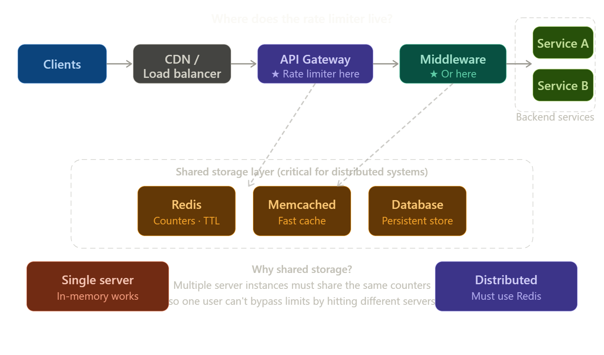
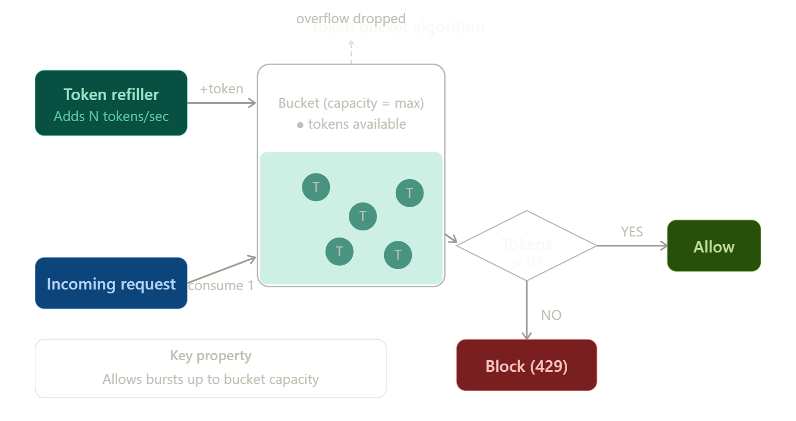
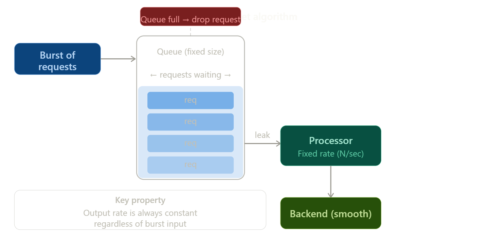
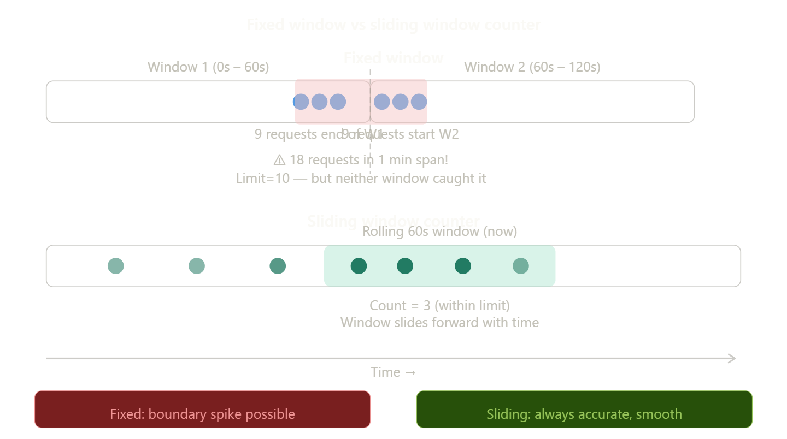
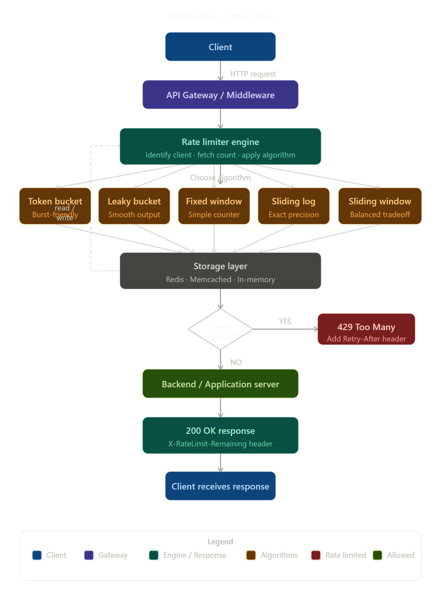

# Rate Limiter — Complete Guide

> **Beginner-friendly · Interview-ready · Revision-perfect**

---

## Table of Contents

1. [What is a Rate Limiter?](#1-what-is-a-rate-limiter)
2. [Why Do We Need It?](#2-why-do-we-need-it)
3. [How It Fits in the System](#3-how-it-fits-in-the-system)
4. [How to Identify a Client](#4-how-to-identify-a-client)
5. [Algorithms](#5-algorithms)
   - [Token Bucket](#51-token-bucket)
   - [Leaky Bucket](#52-leaky-bucket)
   - [Fixed Window Counter](#53-fixed-window-counter)
   - [Sliding Window Log](#54-sliding-window-log)
   - [Sliding Window Counter](#55-sliding-window-counter)
6. [Storage — Where Counts Live](#6-storage--where-counts-live)
7. [HTTP Headers](#7-http-headers)
8. [Distributed Rate Limiting](#8-distributed-rate-limiting)
9. [Rules / Policies](#9-rules--policies)
10. [Algorithm Comparison Table](#10-algorithm-comparison-table)
11. [Grand Flow Diagram](#11-grand-flow-diagram)
12. [Interview Q&A](#12-interview-qa)

---

## 1. What is a Rate Limiter?

A **rate limiter** is a control that limits how many requests a client can send to a server in a given time window.

Think of it like a nightclub bouncer: he lets people in, but not too many at once. If the club is full, he makes you wait or turns you away.

```
Client ──[5 req/sec allowed]──► Server
         rate limiter here
```

**Simple rule:** If you send more than the allowed number of requests → you get blocked (temporarily).

---

## 2. Why Do We Need It?

| Problem | How Rate Limiting Helps |
|---|---|
| Denial of Service (DoS) attacks | Blocks flood of requests from one IP |
| Expensive API calls | Stops runaway bots from burning your budget |
| Fair usage | Ensures one greedy user can't starve others |
| Server overload | Protects backend from being crushed |
| Scrapers / bots | Slows down automated abuse |

> **Real-world example:** Twitter allows 300 tweets per 3 hours per user. GitHub allows 5000 API calls per hour per token.

---

## 3. How It Fits in the System



> *Place this image after the section heading above. Save the architecture diagram screenshot as `images/architecture_placement.png`*

The rate limiter typically sits **between the client and your backend**. It can live in:

**Option A — API Gateway (most common)**
The gateway is the single entry point. Putting the rate limiter here means every request passes through it before reaching any service.

**Option B — Middleware (application-level)**
Inside your application server as a middleware layer. More flexible but harder to share state across servers.

**Option C — Client-side**
Never rely on this alone — a malicious client can simply ignore it.

**Why the API Gateway is preferred:**
- Centralised — one place to manage rules
- Language agnostic — works regardless of what language your services use
- Shared state — all server instances read from the same counter store

---

## 4. How to Identify a Client

Before limiting, you need to know *who* is making the request.

| Identifier | Use case | Downside |
|---|---|---|
| IP address | Public APIs, anonymous users | Shared IPs (office, NAT) punish multiple users |
| User ID | Logged-in users | Requires authentication |
| API Key | Developer APIs | Key can be stolen or shared |
| Device ID | Mobile apps | Can be spoofed |
| Combination | High-security systems | More complex rules |

**Most APIs use API key or user ID** because they are more accurate than IP addresses.

---

## 5. Algorithms

There are five common algorithms. Each makes a different trade-off between accuracy, memory, and burst tolerance.

---

### 5.1 Token Bucket



> *Place this image here. Save the token bucket screenshot as `images/token_bucket.png`*

**Mental model:** Imagine a bucket that holds tokens. Every second, N tokens are added. Each request costs 1 token. If the bucket is empty, the request is rejected.

**How it works step by step:**

1. Bucket starts with `capacity` tokens.
2. A refiller adds `refill_rate` tokens every second (up to max capacity — overflow is discarded).
3. When a request arrives, check if there is at least 1 token.
4. If YES → consume 1 token → allow the request.
5. If NO → reject the request (429 Too Many Requests).

**Why burst is allowed:** If no requests came for 5 seconds, 5×N tokens accumulated. The next burst of requests up to that amount will all pass through.

**Connection to storage:** The bucket state (current token count + last refill time) must be stored. In distributed systems, this lives in Redis.

```
Params needed:
  - bucket_capacity  (max tokens)
  - refill_rate      (tokens added per second)
```

**Used by:** Stripe, AWS, most REST APIs.

---

### 5.2 Leaky Bucket



> *Place this image here. Save the leaky bucket screenshot as `images/leaky_bucket.png`*

**Mental model:** Water (requests) pours into a bucket with a hole in the bottom. Water leaks out at a constant rate. If you pour too fast, the bucket overflows (request dropped).

**How it works step by step:**

1. Incoming requests go into a FIFO queue.
2. The queue has a fixed size (capacity).
3. A processor pulls requests from the queue at a constant rate and forwards them to the backend.
4. If the queue is full when a new request arrives → drop it (429).

**Key difference from Token Bucket:** The *output* rate is always constant. Token bucket allows bursts to pass through; leaky bucket smooths them.

**Why this matters:** If you are protecting a backend that cannot handle spikes (e.g., a database), leaky bucket is safer — the server always sees a steady, predictable load.

```
Params needed:
  - queue_size       (max waiting requests)
  - leak_rate        (requests processed per second)
```

---

### 5.3 Fixed Window Counter

**Mental model:** Divide time into fixed buckets (windows). Count how many requests came in the current window. If over the limit → reject.

**How it works:**

```
[0s ──────── 59s]  [60s ──────── 119s]
  Window 1            Window 2
  count: 0..10        count: 0..10
```

1. Every request increments a counter for the current time window.
2. Each window has a TTL — it resets automatically when the next window starts.
3. If counter > limit → reject.

**The boundary spike problem (critical weakness):**

```
Window 1: 9 requests arrive at 59s
Window 2: 9 requests arrive at 61s
→ 18 requests in 2 seconds, but NEITHER window exceeded limit of 10!
```

This is why fixed window is simple but not always safe.

**Connection to storage:** One counter key per (user, window). In Redis: `SET user:123:window:1720000 0 EX 60`

```
Params needed:
  - window_size      (e.g., 60 seconds)
  - limit            (e.g., 100 requests)
```

---

### 5.4 Sliding Window Log

**Mental model:** Keep a log of timestamps of every request. To check the limit, count how many timestamps fall within the last N seconds.

**How it works:**

1. Every request → append its timestamp to a sorted set in Redis.
2. Remove timestamps older than `now - window_size`.
3. Count remaining entries.
4. If count > limit → reject; else allow and keep the timestamp.

**Solves the boundary spike problem completely** — the window always looks at the last exact N seconds, not a fixed bucket.

**Downside:** Memory-heavy. For a limit of 1000 req/min, you store up to 1000 timestamps per user. At scale with millions of users, this is expensive.

```
Params needed:
  - window_size      (e.g., 60 seconds)
  - limit            (e.g., 1000 requests)
```

---

### 5.5 Sliding Window Counter



> *Place this image here. Save the window comparison screenshot as `images/window_comparison.png`*

**Mental model:** A hybrid. Instead of storing every timestamp (like the log), use two fixed window counters and blend them with a formula.

**How it works:**

```
count = prev_window_count × overlap_ratio + current_window_count
```

Where `overlap_ratio` = how much of the previous window falls in the current rolling window.

**Example:**
- Limit: 10 req/min
- Previous window: 8 requests
- Current window so far: 5 requests
- We are 30% into the current window (30s of 60s elapsed)
- overlap_ratio = 1 - 0.30 = 0.70
- Estimated count = 8 × 0.70 + 5 = 10.6 → reject

**Why this is the sweet spot:**
- More accurate than fixed window (no boundary spike)
- Much cheaper than sliding log (only 2 counters per user, not N timestamps)
- Small approximation error (~0.003%) acceptable for most systems

```
Params needed:
  - window_size      (e.g., 60 seconds)
  - limit            (e.g., 100 requests)
```

---

## 6. Storage — Where Counts Live

The rate limiter needs to **read and write counters fast**. This is why storage choice is critical.

**In-memory (single server only)**
Fast, no network hop, but cannot be shared across multiple server instances. If you run 3 instances, each has its own counter — a user could send 3× the limit.

**Redis (recommended for distributed systems)**

Redis is the go-to choice because:
- **Atomic operations:** `INCR` increments a counter in one operation — no race conditions.
- **TTL support:** `EXPIRE` auto-deletes old counters.
- **Speed:** Sub-millisecond reads/writes.
- **Persistence options:** Can survive restarts.

**Redis commands used by rate limiters:**

```bash
# Increment counter and set expiry (atomic with Lua script)
INCR user:123:window:60          # returns new count
EXPIRE user:123:window:60 60     # expire in 60 seconds

# For token bucket — store float with TTL
SET user:123:tokens 5.0 EX 3600

# For sliding log — sorted set by timestamp
ZADD user:123:log <timestamp> <timestamp>
ZREMRANGEBYSCORE user:123:log 0 <now-window>
ZCARD user:123:log               # count remaining
```

**Why Redis over a regular database?**
A relational database (MySQL, PostgreSQL) can handle this but requires network round-trips and locks. Redis is in-memory and purpose-built for counters — it's ~10× faster.

---

## 7. HTTP Headers

When a rate limiter responds, it communicates the state back to the client via HTTP headers. This is important — it lets clients self-regulate.

| Header | Meaning |
|---|---|
| `X-RateLimit-Limit` | Total requests allowed in the window |
| `X-RateLimit-Remaining` | Requests left in this window |
| `X-RateLimit-Reset` | Unix timestamp when the window resets |
| `Retry-After` | Seconds to wait before retrying (sent on 429) |

**Response when allowed (200 OK):**
```
HTTP/1.1 200 OK
X-RateLimit-Limit: 100
X-RateLimit-Remaining: 63
X-RateLimit-Reset: 1720001060
```

**Response when blocked (429):**
```
HTTP/1.1 429 Too Many Requests
Retry-After: 37
X-RateLimit-Limit: 100
X-RateLimit-Remaining: 0
Content-Type: application/json

{ "error": "rate limit exceeded", "retry_after": 37 }
```

**Why these headers matter:** Good clients (SDKs, mobile apps) read `Retry-After` and back off automatically. This reduces hammering and makes the system more cooperative.

---

## 8. Distributed Rate Limiting

When you run multiple server instances (horizontal scaling), rate limiting gets harder.

**The problem:**

```
Server 1 ─── User A (counter: 4)
Server 2 ─── User A (counter: 4)   ← same user, separate counters!
Server 3 ─── User A (counter: 4)

Total actual requests: 12, but each server thinks: 4 < 10 limit → all allowed!
```

**Solutions:**

**Solution 1 — Centralised Redis (most common)**
All servers share one Redis cluster. Every counter read/write goes to Redis. This is accurate but adds ~1ms network latency per request.

```
Server 1 ─┐
Server 2 ─┼──► Redis ◄── single source of truth
Server 3 ─┘
```

**Solution 2 — Sticky sessions**
Route all requests from one user to the same server. Works but loses fault tolerance — if that server dies, the user's counter is lost.

**Solution 3 — Local + sync (approximate)**
Each server maintains a local counter and periodically syncs to Redis. Faster but allows small over-counting between sync intervals. Good when approximate limiting is acceptable.

**Race condition issue with Redis:**
Without atomic operations, two servers might both read `count=9` and both decide to allow (both write `count=10`) → 11 total requests slip through.

**Fix:** Use Redis Lua scripts or `INCR` which is atomic:
```lua
-- Lua script (runs atomically on Redis)
local current = redis.call('INCR', KEYS[1])
if current == 1 then
  redis.call('EXPIRE', KEYS[1], ARGV[1])
end
return current
```

---

## 9. Rules / Policies

Rate limiter rules define *who* gets *what* limit and *when*.

**Common policy patterns:**

```yaml
# Per-user limits
user:free_tier:    100 req/hour
user:pro_tier:    1000 req/hour
user:enterprise: 10000 req/hour

# Per-endpoint limits
POST /login:      5 req/min        (brute force protection)
GET  /search:   100 req/min        (expensive query)
GET  /health:  unlimited           (monitoring)

# Per-IP limits (unauthenticated)
anonymous:       10 req/min

# Global limits
total_system:  50000 req/sec       (protects infrastructure)
```

**Where rules are stored:**
- Configuration files (simple, requires redeploy to change)
- Redis / database (dynamic, rules can change without restart)
- Control plane service (microservice architecture)

**Rule priority:** Usually applied in order: IP → user → endpoint → global.

---

## 10. Algorithm Comparison Table

| Algorithm | Memory | Burst allowed | Accuracy | Complexity | Best for |
|---|---|---|---|---|---|
| Token Bucket | Low | Yes | High | Medium | APIs with variable traffic |
| Leaky Bucket | Low | No (smoothed) | High | Medium | Protecting fragile backends |
| Fixed Window | Very low | Boundary spike | Low | Very simple | Simple use cases |
| Sliding Log | High | No | Perfect | Medium | High-accuracy requirements |
| Sliding Window Counter | Low | Partial | High | Medium | Production default |

**Rule of thumb:**
- Building an API for developers → **Token Bucket** (burst-friendly)
- Protecting a database or slow service → **Leaky Bucket** (steady output)
- Quick prototype → **Fixed Window** (simple to implement)
- Compliance or billing → **Sliding Log** (perfect accuracy)
- General production → **Sliding Window Counter** (best balance)

---

## 11. Grand Flow Diagram



> *Place this image here. Save the grand flow screenshot as `images/grand_flow.png`*

**Reading the diagram left to right (top to bottom):**

1. **Client** sends an HTTP request.
2. Request hits the **API Gateway / Middleware**.
3. The **Rate Limiter Engine** is invoked — it identifies the client, fetches their counter from storage, and passes it through the chosen algorithm.
4. The **Storage Layer** (Redis) provides and updates the counter.
5. A **decision** is made: limit reached or not.
6. If **YES** → return `429 Too Many Requests` with a `Retry-After` header.
7. If **NO** → forward request to the **Backend**, get a response, and return `200 OK` with remaining limit headers.

The dashed arrow from Storage back to the Engine represents the read/write feedback loop — the engine reads the current state, makes a decision, and writes the updated state back.

---

## 12. Interview Q&A

### Q1: What is a rate limiter and why do we use it?

**A:** A rate limiter restricts the number of requests a client can make in a time window. We use it to prevent DoS attacks, ensure fair usage across users, protect backend services from overload, and control costs for expensive operations like AI inference or database queries.

---

### Q2: What are the main algorithms for rate limiting? Which would you choose?

**A:** The five main algorithms are Token Bucket, Leaky Bucket, Fixed Window Counter, Sliding Window Log, and Sliding Window Counter.

For most production APIs, I would choose **Sliding Window Counter** — it is memory-efficient (only stores 2 counters per user), avoids the boundary spike problem of Fixed Window, and is accurate enough for all practical purposes. If burst tolerance is critical (e.g., developer API), I would use **Token Bucket** instead.

---

### Q3: What is the boundary spike problem in Fixed Window Counter?

**A:** If the limit is 10 requests per minute and a user sends 9 requests at 11:59:59 and 9 more at 12:00:01, neither window exceeds the limit, but the user sent 18 requests in 2 seconds. This is the boundary spike — requests cluster around window boundaries to exploit the reset.

Sliding Window Counter solves this by blending the previous window's count with an overlap ratio, making boundary exploitation ineffective.

---

### Q4: How do you implement rate limiting in a distributed system?

**A:** The key challenge is sharing state across multiple server instances. The standard solution is a **centralised Redis cluster** that all instances read from and write to. Redis provides atomic `INCR` operations and TTL-based expiry, making it ideal.

For extra safety against race conditions, I use a Lua script executed atomically on Redis — it increments the counter and sets the expiry in a single atomic operation, so two servers cannot both allow the same over-limit request.

---

### Q5: What HTTP status code does a rate limiter return and what headers?

**A:** The rate limiter returns `429 Too Many Requests`. The important response headers are:
- `Retry-After` — seconds the client must wait before retrying
- `X-RateLimit-Limit` — the total allowed requests
- `X-RateLimit-Remaining` — how many are left in this window
- `X-RateLimit-Reset` — when the window resets (Unix timestamp)

Good client SDKs read `Retry-After` and back off automatically, reducing unnecessary hammering.

---

### Q6: Token Bucket vs Leaky Bucket — what is the key difference?

**A:** Token Bucket allows bursts — if tokens accumulated while traffic was low, a sudden burst of requests up to the bucket capacity will all pass through. Leaky Bucket never allows bursts — it always outputs at a constant, fixed rate regardless of how many requests arrive. 

Choose Token Bucket when your backend can handle spikes but you want long-term rate control. Choose Leaky Bucket when your backend is fragile and needs a predictable, steady input rate (e.g., a database writer).

---

### Q7: Why is Redis preferred for storing rate limit counters?

**A:** Redis is preferred because:
- It is in-memory → sub-millisecond latency
- `INCR` is atomic → no race conditions
- Native TTL → counters expire automatically without a cleanup job
- Supports sorted sets → perfect for sliding window logs
- Can be clustered → horizontally scalable

A relational database would work but requires row-level locking, network overhead, and manual cleanup of expired records.

---

### Q8: Where in the architecture should you place a rate limiter?

**A:** The best place is the **API Gateway** — it is the single entry point before any service, is language-agnostic, and makes the limiter available to all downstream services without code changes. Alternatively, it can live as **middleware** inside the application server for per-endpoint granularity. Client-side rate limiting is never sufficient alone as it can be bypassed.

---

### Q9: How would you handle a race condition in a distributed rate limiter?

**A:** Race conditions occur when two server instances read the same counter value simultaneously and both decide to allow the request. The fix is to make the read-increment-check an **atomic operation**. In Redis, this is done with a Lua script — Lua scripts on Redis run atomically, so no other command can interleave between the read and write. Alternatively, Redis's native `INCR` command is atomic for simple counters.

---

### Q10: What is soft limiting vs hard limiting?

**A:** **Hard limiting** rejects requests the moment the counter exceeds the limit (strict, unforgiving). **Soft limiting** allows a small overage or shows a warning but does not immediately block — for example, you might allow 5% over the limit before blocking. Soft limiting improves user experience but requires more careful tuning to prevent abuse.

---

### Q11: How would you rate limit a login endpoint specifically?

**A:** Login endpoints need special protection against brute-force attacks. I would:
1. Apply a strict limit by **IP**: max 5 attempts per minute per IP
2. Apply a limit by **username**: max 10 attempts per hour per username (prevents distributed attacks from multiple IPs targeting one account)
3. Use **exponential backoff** on repeated failures — the block duration doubles with each violation
4. After N failures, require **CAPTCHA** or **email verification**
5. Alert the security team on anomalous patterns

This is a defense-in-depth approach that rate limiting alone cannot fully solve.

---

*End of Rate Limiter Guide*
