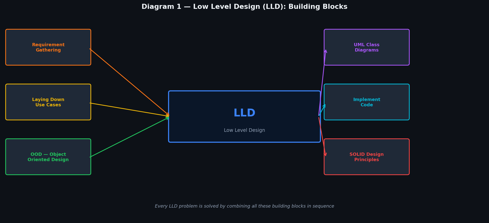
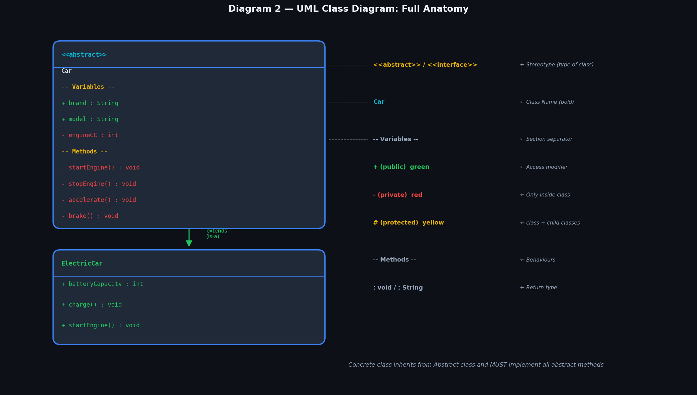
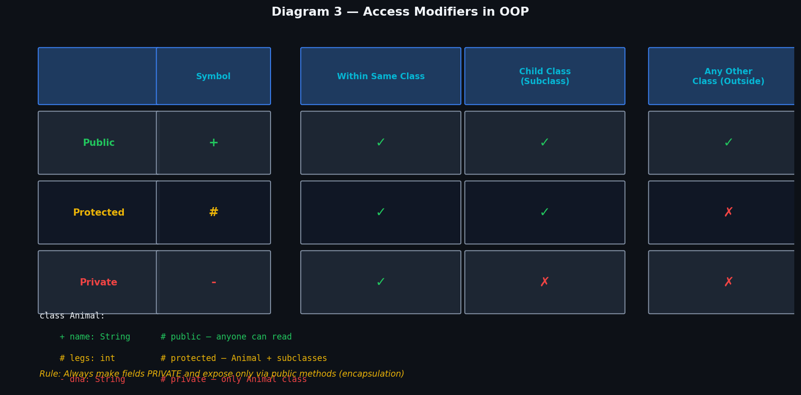
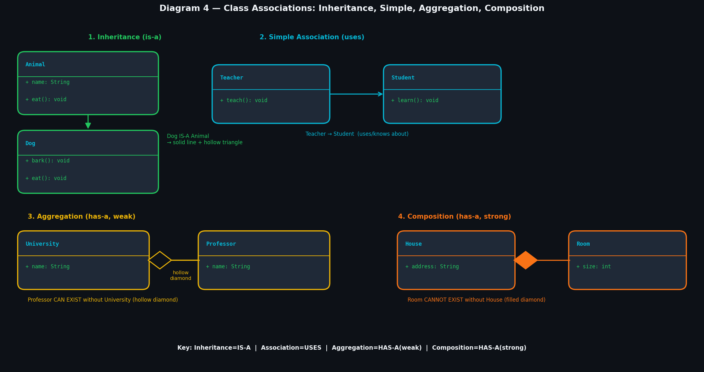
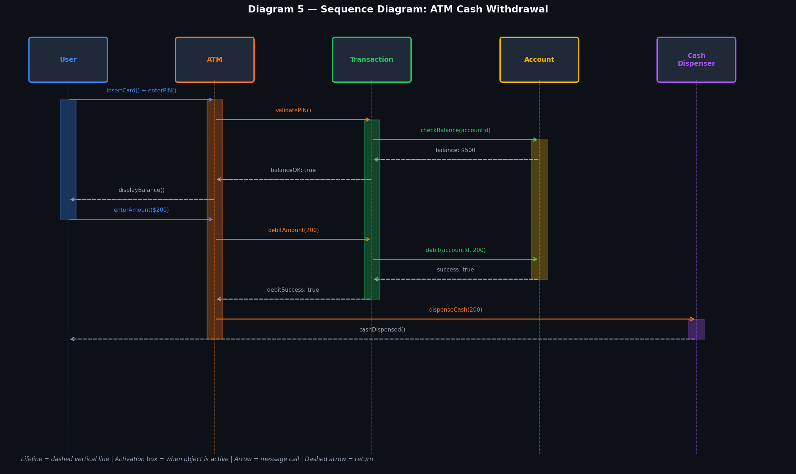
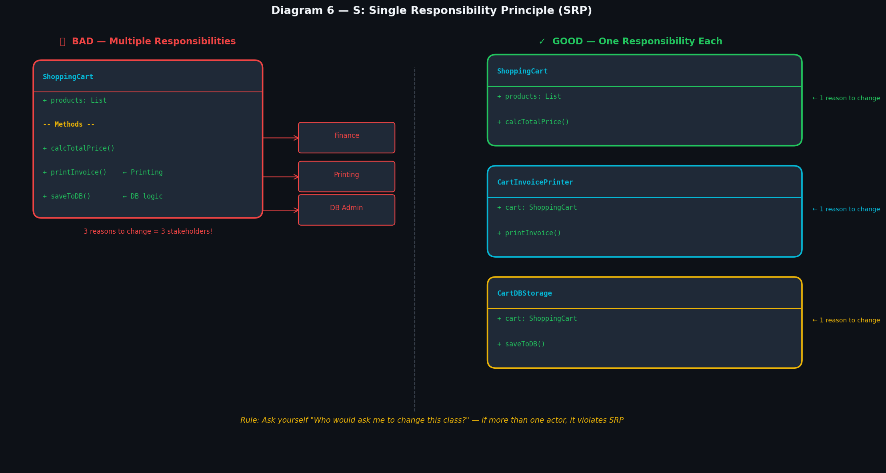
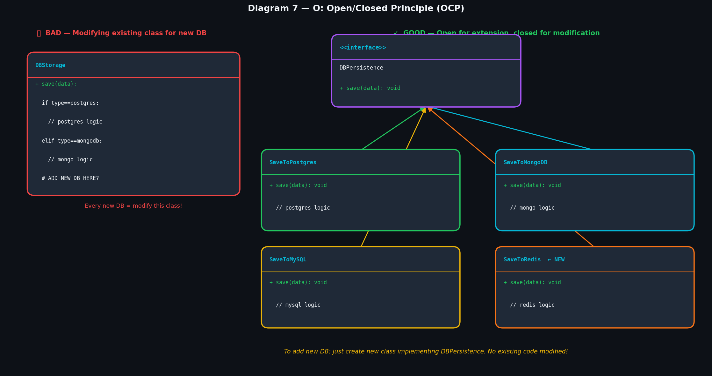
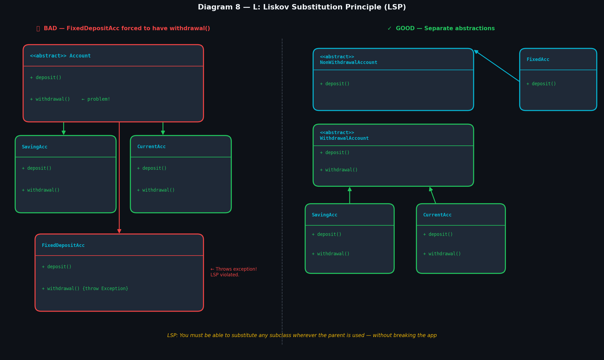
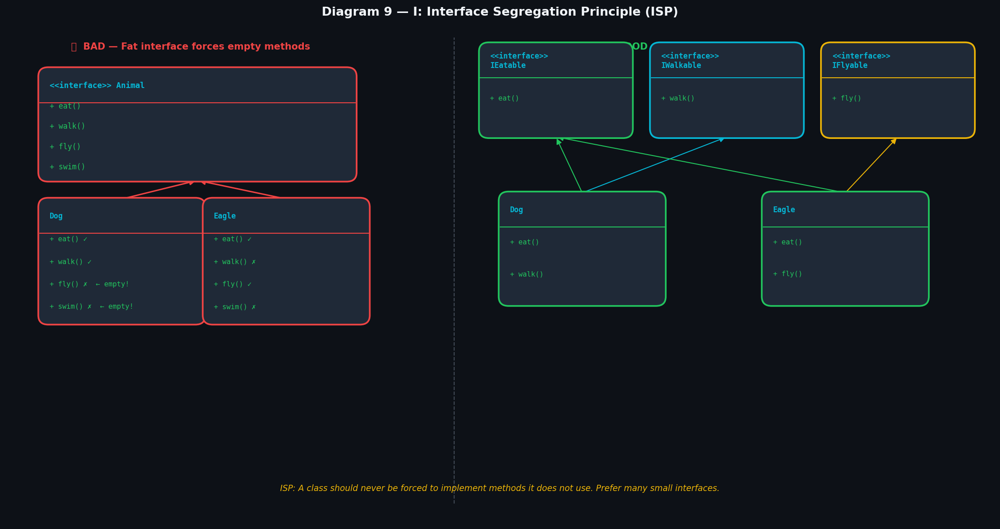
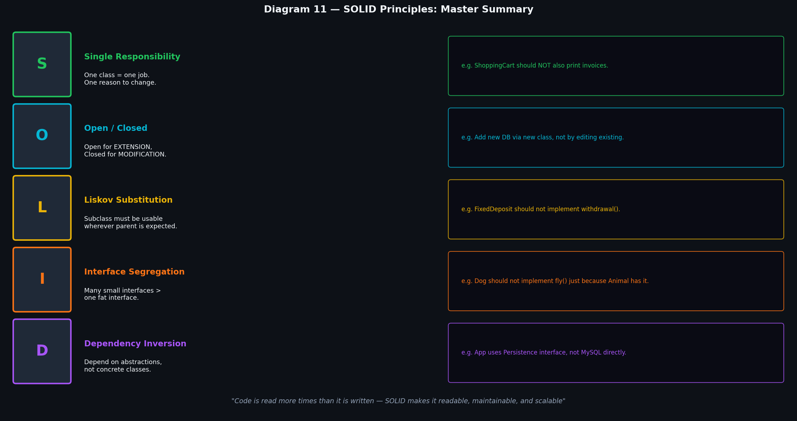

# Low Level Design (LLD) — Complete Notes

> **From your handwritten notes + enriched theory, examples & diagrams.**  
> After reading this, you will not need any other resource.

---

## Table of Contents

| # | Topic |
|---|-------|
| 1 | [What is LLD?](#1-what-is-lld) |
| 2 | [Object Oriented Design (OOD)](#2-object-oriented-design-ood) |
| 3 | [UML — Class Diagram](#3-uml--class-diagram) |
| 4 | [Access Modifiers](#4-access-modifiers) |
| 5 | [Associations](#5-associations) |
| 6 | [Sequence Diagram](#6-sequence-diagram) |
| 7 | [SOLID — S: Single Responsibility Principle](#7-solid--s-single-responsibility-principle) |
| 8 | [SOLID — O: Open/Closed Principle](#8-solid--o-openclosed-principle) |
| 9 | [SOLID — L: Liskov Substitution Principle](#9-solid--l-liskov-substitution-principle) |
| 10 | [SOLID — I: Interface Segregation Principle](#10-solid--i-interface-segregation-principle) |
| 11 | [SOLID — D: Dependency Inversion Principle](#11-solid--d-dependency-inversion-principle) |
| 12 | [SOLID Master Cheatsheet](#12-solid-master-cheatsheet) |

---

## 1. What is LLD?

**LLD (Low Level Design)** refers to designing the small components of an application — how classes are structured, how they interact, and how they are coded.

Think of it this way:
- **HLD (High Level Design)** = Architecture of the whole city (roads, zones, districts)
- **LLD (Low Level Design)** = Blueprint of a single building (rooms, walls, doors, wiring)

### Building Blocks of LLD

> 

Every LLD problem is solved by following these steps in order:

```
Step 1: Requirement Gathering     ← understand what needs to be built
Step 2: Laying Down Use Cases     ← what actions can different users perform?
Step 3: OOD (Object Oriented Design) ← identify classes and their relationships
Step 4: UML Class Diagrams        ← visually represent the design
Step 5: SOLID Principles          ← make the design maintainable and scalable
Step 6: Implement Code            ← write the actual code
```

---

## 2. Object Oriented Design (OOD)

**OOD** is the technique of modelling a real-world problem using object-oriented concepts (classes, objects, inheritance, etc.).

### NVT — Noun Verb Technique

The most common way to identify classes and behaviours from a problem statement:

| Word Type | Maps To | Example |
|-----------|---------|---------|
| **Noun** | Class / Object | "A `User` logs into the `ATM`" → `User`, `ATM` are classes |
| **Verb** | Method / Behaviour | "logs into", "withdraws" → `login()`, `withdraw()` methods |

### How to Apply NVT

**Problem statement:** *"A customer can place an order. The system saves the order and sends an invoice."*

```
Nouns  → Customer, Order, System, Invoice         → These become CLASSES
Verbs  → place, save, send                        → These become METHODS
```

Result:
```
Class: Customer  → placeOrder()
Class: Order     → save()
Class: Invoice   → send()
```

### Steps in OOD

```
1. Read the problem statement
2. Apply NVT to find nouns (classes) and verbs (methods)
3. Represent the system using classes
4. Define relationships among classes (inheritance, association, etc.)
5. Define responsibilities of each class
```

---

## 3. UML — Class Diagram

**UML (Unified Modeling Language)** is a standardised visual language to describe a software system. It is not code — it is a diagram that all developers across all languages can understand.

### Types of UML Diagrams

```
UML Diagrams
├── Structural (Static)   → How things ARE arranged
│   └── Class Diagram     ← most important for LLD
└── Behavioural (Dynamic) → How things BEHAVE over time
    └── Sequence Diagram  ← most important for LLD
```

### Class Diagram — Full Anatomy

> 

A class in UML is drawn as a rectangle with **3 sections**:

```
┌──────────────────────────┐
│   <<abstract>>           │  ← Stereotype (optional tag)
│   ClassName              │  ← Section 1: CLASS NAME (bold)
├──────────────────────────┤
│   + brand : String       │  ← Section 2: ATTRIBUTES / VARIABLES
│   - engineCC : int       │     format: [modifier] name : dataType
├──────────────────────────┤
│   + startEngine() : void │  ← Section 3: METHODS / BEHAVIOURS
│   - brake() : void       │     format: [modifier] name() : returnType
└──────────────────────────┘
```

### Stereotypes (Tags above class name)

| Stereotype | Meaning |
|------------|---------|
| `<<abstract>>` | Cannot be instantiated directly; must be extended |
| `<<interface>>` | Only method signatures, no implementation |
| `<<enum>>` | A fixed set of constants |

### Real Example — `Car` Class

```
┌───────────────────────────────┐
│   <<abstract>>                │
│         Car                   │
├───────────────────────────────┤
│   + brand   : String          │
│   + model   : String          │
│   - engineCC: int             │
├───────────────────────────────┤
│   - startEngine() : void      │
│   - stopEngine()  : void      │
│   - accelerate()  : void      │
│   - brake()       : void      │
└───────────────────────────────┘
         ▲
         │  extends (is-a)
┌─────────────────────┐
│    ElectricCar      │
├─────────────────────┤
│ + batteryLevel: int │
├─────────────────────┤
│ + charge(): void    │
│ + startEngine():void│  ← overrides abstract method
└─────────────────────┘
```

---

## 4. Access Modifiers

> 

Access modifiers control **who can see and use** a variable or method.

| Symbol | Modifier | Same Class | Child Class | Outside Class | UML Color |
|--------|----------|:----------:|:-----------:|:-------------:|-----------|
| `+` | **Public** | YES | YES | YES | Green |
| `#` | **Protected** | YES | YES | NO | Yellow |
| `-` | **Private** | YES | NO | NO | Red |

### Why This Matters

```java
class BankAccount {
    - double balance;        // PRIVATE: only BankAccount can access

    + void deposit(double amount) {   // PUBLIC: anyone can call
        balance += amount;            // can access private balance here (same class)
    }

    # double getInterestRate() {      // PROTECTED: BankAccount + subclasses
        return 0.04;
    }
}
```

If `balance` were public, any class could do `account.balance = 999999` — bypassing all business rules. Private + public methods = **Encapsulation**.

### Golden Rule

> **Make all attributes PRIVATE. Expose them only through public methods (getters/setters).** This is the core of Encapsulation.

---

## 5. Associations

**Associations** describe the relationship between classes. There are 4 types.

> 

---

### 5.1 Inheritance (IS-A)

**What it is:** A child class inherits all properties and methods of a parent class.  
**UML symbol:** Solid line with a **hollow triangle** arrowhead pointing to parent.  
**Keyword:** `extends` (class) or `implements` (interface)

```
Animal ◁──────── Dog
```

```java
class Animal {
    String name;
    void eat() { System.out.println("eating"); }
}

class Dog extends Animal {    // Dog IS-A Animal
    void bark() { System.out.println("woof!"); }
}

// Dog inherits eat() from Animal automatically
Dog d = new Dog();
d.eat();   // works!
d.bark();  // works!
```

**When to use:** When you have a genuine IS-A relationship. Dog IS-A Animal. Car IS-A Vehicle. ElectricCar IS-A Car.

> **Caution:** Do NOT use inheritance just to reuse code. Use it only when there is a true IS-A relationship. Otherwise use Composition.

---

### 5.2 Simple Association (USES)

**What it is:** One class uses or knows about another class, but neither owns the other.  
**UML symbol:** Simple arrow `→`  
**Keyword:** A field or parameter of another class type

```
Teacher ──────→ Student
```

```java
class Teacher {
    void teach(Student s) {   // Teacher uses Student, doesn't own it
        s.learn();
    }
}
```

**When to use:** When two classes interact but neither is part of the other.

---

### 5.3 Aggregation (HAS-A, Weak)

**What it is:** A "whole-part" relationship where the **part can exist independently** of the whole.  
**UML symbol:** Line with a **hollow diamond** at the "whole" side.  
**Keyword:** HAS-A, but the part survives if whole is destroyed.

```
University ◇──────── Professor
```

```java
class University {
    List<Professor> professors;   // University HAS Professors

    University(List<Professor> profs) {
        this.professors = profs;  // Professors passed in from outside
    }
}

// If University is deleted, Professor still exists
```

**Real example:** A `Playlist` aggregates `Songs`. If you delete the playlist, the songs still exist.

---

### 5.4 Composition (HAS-A, Strong)

**What it is:** A "whole-part" relationship where the **part CANNOT exist without the whole**.  
**UML symbol:** Line with a **filled/solid diamond** at the "whole" side.  
**Keyword:** HAS-A, and the part dies with the whole.

```
House ◆──────── Room
```

```java
class House {
    List<Room> rooms;

    House() {
        rooms = new ArrayList<>();
        rooms.add(new Room("Bedroom"));   // Room created INSIDE House
        rooms.add(new Room("Kitchen"));
    }
    // When House object is destroyed, Room objects are destroyed too
}
```

**Real example:** A `Human` and `Heart`. The heart cannot exist independently of the human body.

### Aggregation vs Composition — Quick Comparison

| Feature | Aggregation | Composition |
|---------|------------|-------------|
| Symbol | Hollow diamond ◇ | Filled diamond ◆ |
| Part's independence | Part CAN exist alone | Part CANNOT exist alone |
| Example | University & Professor | House & Room |
| Object creation | Part created outside, passed in | Part created inside the whole |

---

## 6. Sequence Diagram

A **Sequence Diagram** shows the **order of interactions between objects** over time. It answers: "Who calls who, and in what order?"

> 

### Key Elements

```
┌─────────┐          ┌─────────┐
│  User   │          │   ATM   │          ← Objects (participants)
└────┬────┘          └────┬────┘
     │                    │               ← Lifeline (dashed vertical line)
     │   insertCard()     │
     │ ─────────────────> │               ← Message (solid arrow = synchronous call)
     │                    │
     │                ┌───┴───┐           ← Activation Box (object is active/processing)
     │                │ active│
     │                └───┬───┘
     │   cardAccepted()   │
     │ <─ ─ ─ ─ ─ ─ ─ ─ ─│               ← Return (dashed arrow)
```

### Messages: Sync vs Async

| Type | Description | Arrow |
|------|-------------|-------|
| **Synchronous** | Caller WAITS for response before proceeding | `────>` solid |
| **Asynchronous** | Caller does NOT wait, continues immediately | `- - ->` dashed |
| **Return** | Response going back to caller | `< - - -` dashed return |

### How to Draw a Sequence Diagram (Step by Step)

**Step 1:** Identify the use case. Example: *ATM Cash Withdrawal*

**Step 2:** Identify all objects/participants involved:
- `User`, `ATM`, `Transaction`, `Account`, `CashDispenser`

**Step 3:** Draw lifelines for each object horizontally across the top, then draw interactions as arrows going left-to-right (or right-to-left for returns), top-to-bottom (time flows downward).

### Full ATM Example Walkthrough

```
User          ATM           Transaction     Account      CashDispenser
 |             |                |              |               |
 |─insertCard()─>|              |              |               |
 |─enterPIN()──>|              |              |               |
 |             |─validatePIN()─>|             |               |
 |             |               |─checkBalance()>|             |
 |             |               |              |<─balance:$500─|
 |             |               |<─balanceOK───|               |
 |<─displayBalance()──────────|               |               |
 |─enterAmount($200)──────────>|              |               |
 |             |─debitAmount()─>|             |               |
 |             |               |─debit(200)──>|               |
 |             |               |<─success:true|               |
 |             |─────────────────────────────dispenseCash(200)>|
 |<───────────────────────────cash dispensed───────────────────|
```

---

## 7. SOLID — S: Single Responsibility Principle

> 

**Definition:** A class/module/function should have **only ONE reason to change**, meaning it should serve only one actor or stakeholder.

In simple words: **One class = one job.**

### Why It Matters

If a class has multiple responsibilities, a change for one stakeholder can accidentally break the feature of another stakeholder.

### Problem Example — Employee Class

```java
class Employee {
    // CEO asks for this
    public int calSalary() { ... }

    // HR asks for this
    public int calHours() { ... }

    // Technical Dept asks for this
    public void saveEmployeeData() { ... }
}
```

- CEO wants `calSalary()` changed
- HR wants `calHours()` changed
- Both live in same class
- Changing `calHours()` for HR could accidentally break `calSalary()` for CEO

**3 actors = 3 reasons to change = SRP VIOLATION**

### Another Example — ShoppingCart

```java
// BAD — 3 responsibilities in 1 class
class ShoppingCart {
    List<Product> products;

    double calcTotalPrice() { ... }  // Finance team's concern
    void printInvoice() { ... }      // Printing team's concern
    void saveToDB() { ... }          // DB Admin's concern
}
```

```java
// GOOD — one class per responsibility
class ShoppingCart {
    List<Product> products;
    double calcTotalPrice() { ... }     // Finance only
}

class CartInvoicePrinter {
    ShoppingCart cart;
    void printInvoice() { ... }         // Printing only
}

class CartDBStorage {
    ShoppingCart cart;
    void saveToDB() { ... }             // DB Admin only
}
```

### How to Check SRP

Ask yourself: **"Who would ask me to change this class?"**
- If only ONE type of person/team → SRP is satisfied
- If MORE than one type → extract responsibilities into separate classes

---

## 8. SOLID — O: Open/Closed Principle

> 

**Definition:** A class should be **open for extension** but **closed for modification**.

In simple words: **Add new features by adding new code, not by changing existing code.**

### Real-World Analogy

Think of a USB port. You can plug in new devices (extension) without modifying the port itself (closed for modification). The USB standard is fixed, but you can create infinitely many new USB devices.

### Problem Example — Adding a New Database

```java
// BAD — every new DB requires modifying this class
class DBStorage {
    void save(String type, Object data) {
        if (type.equals("postgres")) {
            // postgres logic
        } else if (type.equals("mongodb")) {
            // mongodb logic
        }
        // Adding MySQL = modify this class again! Risky!
    }
}
```

### Solution — OCP

```java
// Interface = the "closed" contract
interface DBPersistence {
    void save(Object data);
}

// Each new DB = new class (open for extension)
class SaveToPostgres implements DBPersistence {
    public void save(Object data) { /* postgres logic */ }
}

class SaveToMongoDB implements DBPersistence {
    public void save(Object data) { /* mongo logic */ }
}

// Adding MySQL? Just add a new class. Existing code unchanged!
class SaveToMySQL implements DBPersistence {
    public void save(Object data) { /* mysql logic */ }
}
```

### Key Insight

OCP is achieved through:
- **Interfaces / Abstract Classes** — define the contract
- **Polymorphism** — swap implementations without changing the caller

> If your colleague says "I need to add a new feature" and your reply is "we need to modify the existing class", OCP is being violated.

---

## 9. SOLID — L: Liskov Substitution Principle

> 

**Definition:** Objects of a subclass should be **substitutable for objects of their parent class** without altering the correctness of the program.

In simple words: **If S is a subtype of T, then objects of type T may be replaced with objects of type S without breaking anything.**

### The Barbara Liskov Test

Wherever you use the parent class, you should be able to drop in a child class and the program should still work correctly.

### Problem Example — Bank Account

```java
// Parent class
abstract class Account {
    abstract void deposit(double amount);
    abstract void withdrawal(double amount);  // <- problem here
}

class SavingAccount extends Account {
    void deposit(double amount) { balance += amount; }
    void withdrawal(double amount) { balance -= amount; }  // OK
}

class CurrentAccount extends Account {
    void deposit(double amount) { balance += amount; }
    void withdrawal(double amount) { balance -= amount; }  // OK
}

// PROBLEM: Fixed Deposit does NOT support withdrawal!
class FixedDepositAccount extends Account {
    void deposit(double amount) { balance += amount; }
    void withdrawal(double amount) {
        throw new Exception("Cannot withdraw from FD before maturity!");
        // LSP VIOLATED — substituting FixedDepositAccount breaks the program
    }
}
```

```java
// This code would BREAK if Account is a FixedDepositAccount
void processWithdrawal(Account acc, double amount) {
    acc.withdrawal(amount);  // crashes if acc is FixedDepositAccount!
}
```

### Solution — Separate Abstractions

```java
// Split the base class into two meaningful abstractions

abstract class NonWithdrawalAccount {
    abstract void deposit(double amount);     // Only deposit
}

abstract class WithdrawalAccount extends NonWithdrawalAccount {
    abstract void withdrawal(double amount);  // Deposit + withdrawal
}

// FixedDeposit only extends NonWithdrawal — cannot accidentally call withdrawal
class FixedDepositAccount extends NonWithdrawalAccount {
    void deposit(double amount) { balance += amount; }
    // No withdrawal() method — clean and safe!
}

class SavingAccount extends WithdrawalAccount {
    void deposit(double amount) { balance += amount; }
    void withdrawal(double amount) { balance -= amount; }
}

class CurrentAccount extends WithdrawalAccount {
    void deposit(double amount) { balance += amount; }
    void withdrawal(double amount) { balance -= amount; }
}
```

### LSP Violation Warning Signs

- Subclass throws `UnsupportedOperationException` or similar
- Subclass overrides a method to do nothing (empty body)
- You write `if (obj instanceof SubClass)` checks in code

---

## 10. SOLID — I: Interface Segregation Principle

> 

**Definition:** Many client-specific interfaces are better than one general-purpose interface. **A client should not be forced to implement methods it does not need.**

In simple words: **Split fat interfaces into smaller, focused ones.**

### Problem Example — Fat Interface

```java
// BAD — One fat interface for all animals
interface Animal {
    void eat();
    void walk();
    void fly();    // Does a Dog fly? No!
    void swim();   // Does an Eagle swim? No!
}

class Dog implements Animal {
    void eat() { /* OK */ }
    void walk() { /* OK */ }
    void fly() { /* EMPTY — Dog can't fly! ISP violated */ }
    void swim() { /* EMPTY — Dog doesn't swim */ }
}
```

### Solution — Segregated Interfaces

```java
// GOOD — Small, focused interfaces
interface IEatable {
    void eat();
}

interface IWalkable {
    void walk();
}

interface IFlyable {
    void fly();
}

interface ISwimmable {
    void swim();
}

// Each class only implements what it actually needs
class Dog implements IEatable, IWalkable {
    void eat() { /* OK */ }
    void walk() { /* OK */ }
    // No fly() or swim() — clean!
}

class Eagle implements IEatable, IFlyable {
    void eat() { /* OK */ }
    void fly() { /* OK */ }
}

class Duck implements IEatable, IWalkable, IFlyable, ISwimmable {
    // Duck CAN do all — implements all 4
}
```

### Your Notes Example — Bank Account Interfaces

This is exactly what was applied in LSP:

```java
interface NonWithdrawalAccount {
    void deposit(double amount);
}

interface WithdrawalAccount {
    void deposit(double amount);
    void withdrawal(double amount);
}

// FixedDeposit only gets deposit — not forced to have withdrawal
class FixedDepositAccount implements NonWithdrawalAccount { ... }
```

### How to Know When to Apply ISP

Ask: "Is there any method in this interface that some implementing class has to leave empty or throw an exception for?"  
If YES → split the interface.

---

## 11. SOLID — D: Dependency Inversion Principle

> 

**Definition:** High-level modules should not depend on low-level modules. Both should depend on **abstractions**. Abstractions should not depend on details; details should depend on abstractions.

In simple words: **Code to an interface, not an implementation.**

### The Two Rules

1. High-level module (Application) should NOT directly use low-level module (MySQL, MongoDB)
2. Both should depend on an **abstraction (interface)**

### Problem Example — Direct Dependency

```java
// BAD — Application directly depends on concrete classes
class Application {
    MySQLDB   sql = new MySQLDB();    // High-level depending on Low-level!
    MongoDB   mg  = new MongoDB();

    void saveData(Object data) {
        sql.save(data);   // tightly coupled
    }
}

// Adding PostgreSQL = modify Application class!
```

### Solution — Depend on Abstraction

```java
// The abstraction (interface)
interface Persistence {
    void save(Object data);
}

// Low-level details implement the abstraction
class SaveToMySQL implements Persistence {
    public void save(Object data) { /* mysql logic */ }
}

class SaveToMongoDB implements Persistence {
    public void save(Object data) { /* mongo logic */ }
}

class SaveToPostgres implements Persistence {
    public void save(Object data) { /* postgres logic */ }
}

// High-level Application depends ONLY on Persistence interface
class Application {
    Persistence db;   // Type is the interface!

    Application(Persistence db) {   // Injected from outside
        this.db = db;
    }

    void saveData(Object data) {
        db.save(data);   // Doesn't care which DB it is!
    }
}

// Usage — swap DB with zero code change in Application
Application app1 = new Application(new SaveToMySQL());
Application app2 = new Application(new SaveToMongoDB());
Application app3 = new Application(new SaveToPostgres()); // Just works!
```

### How DIP Is Achieved in Practice

This is done through **Dependency Injection (DI)**:

| Type | How |
|------|-----|
| Constructor Injection | Pass dependency via constructor (most common) |
| Setter Injection | Set dependency via a setter method |
| Framework Injection | Spring, Angular inject automatically |

### Connection to Other Principles

DIP ties everything together:
- OCP needs DIP — you extend via new classes, injected through the interface
- ISP + DIP — small interfaces make injection clean and precise
- LSP + DIP — any implementation can be injected because all follow the contract

---

## 12. SOLID Master Cheatsheet

> 

```
S — Single Responsibility   → One class = one job = one reason to change
O — Open / Closed           → Extend via new classes, never modify existing
L — Liskov Substitution     → Subclass must be usable wherever parent is used
I — Interface Segregation   → Many small interfaces > one big fat interface
D — Dependency Inversion    → Depend on interface/abstraction, not concrete class
```

### How SOLID Principles Connect

```
DIP provides the structure (abstractions/interfaces)
    ↓
ISP keeps those interfaces small and focused
    ↓
LSP ensures subclasses honour the interface contract
    ↓
OCP lets you add implementations without modifying callers
    ↓
SRP ensures each class has one clear, focused responsibility
```

### Quick Violation Check

| Principle | Red Flag |
|-----------|----------|
| SRP | Your class has methods used by multiple different teams |
| OCP | Adding a feature requires editing an existing class |
| LSP | A subclass throws `UnsupportedOperationException` |
| ISP | A class implements an interface but some methods are empty |
| DIP | You see `new ConcreteClass()` inside a high-level class |

### Full Code Structure (All SOLID Applied)

```java
// ISP: small interfaces
interface IDepositable {
    void deposit(double amount);
}
interface IWithdrawable {
    void withdrawal(double amount);
}

// OCP + DIP: abstract persistence
interface Persistence {
    void save(Object data);
}
class SaveToPostgres implements Persistence { ... }  // OCP: extend, don't modify
class SaveToMongoDB   implements Persistence { ... }

// LSP: correct hierarchy
abstract class NonWithdrawalAccount implements IDepositable { }
class FixedDepositAccount extends NonWithdrawalAccount { ... }  // LSP: no withdrawal

abstract class WithdrawalAccount implements IDepositable, IWithdrawable { }
class SavingAccount  extends WithdrawalAccount { ... }  // LSP: full contract
class CurrentAccount extends WithdrawalAccount { ... }

// SRP: separate classes per concern
class AccountService {                        // SRP: business logic only
    private Persistence db;                   // DIP: depends on abstraction
    AccountService(Persistence db) { this.db = db; }
    void save(NonWithdrawalAccount acc) { db.save(acc); }
}

class AccountReportPrinter {                  // SRP: printing only
    void print(NonWithdrawalAccount acc) { ... }
}
```

---

## Diagram Placement Guide

| Diagram File | Place After Section |
|---|---|
| `01_lld_overview.png` | Section 1 — What is LLD (Building Blocks) |
| `02_uml_class_anatomy.png` | Section 3 — UML Class Diagram |
| `03_access_modifiers.png` | Section 4 — Access Modifiers |
| `04_associations.png` | Section 5 — Associations |
| `05_sequence_diagram_atm.png` | Section 6 — Sequence Diagram |
| `06_solid_srp.png` | Section 7 — Single Responsibility |
| `07_solid_ocp.png` | Section 8 — Open/Closed Principle |
| `08_solid_lsp.png` | Section 9 — Liskov Substitution |
| `09_solid_isp.png` | Section 10 — Interface Segregation |
| `10_solid_dip.png` | Section 11 — Dependency Inversion |
| `11_solid_summary.png` | Section 12 — SOLID Cheatsheet (LAST) |

---

## Revision Cheatsheet (Read Before Any LLD Interview)

```
LLD = OOD + UML + SOLID

OOD:
  NVT — Nouns = Classes, Verbs = Methods
  Represent system as classes
  Define relationships and responsibilities

UML Class Diagram:
  3 sections: ClassName | Variables | Methods
  + public (green), - private (red), # protected (yellow)
  <<abstract>> = cannot instantiate, <<interface>> = only signatures

Associations:
  IS-A  = Inheritance (hollow triangle ▷)
  USES  = Simple Association (arrow →)
  HAS-A (weak)   = Aggregation (hollow diamond ◇)
  HAS-A (strong) = Composition (filled diamond ◆)

Sequence Diagram:
  Objects as boxes at top, lifelines going down
  Solid arrow = call, Dashed arrow = return
  Activation box = when object is busy

SOLID:
  S — 1 class = 1 reason to change
  O — Extend via new class, not modify old
  L — Subclass fully honours parent's contract
  I — Small focused interfaces, not fat ones
  D — Depend on interface, inject concrete via DI
```

---

*"Good design is not about writing complex code — it's about writing code that is easy to change."*
